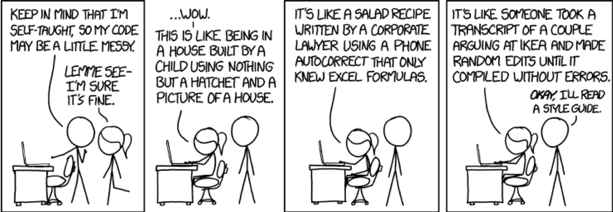
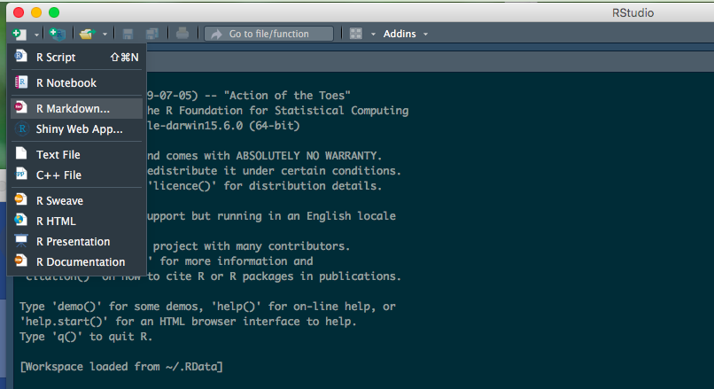
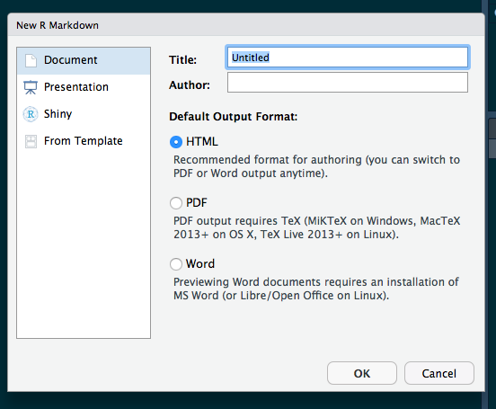
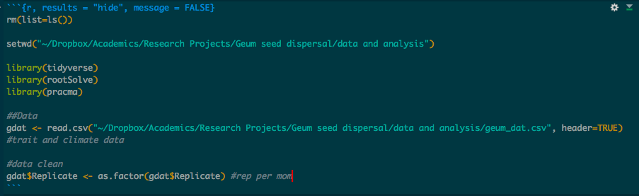
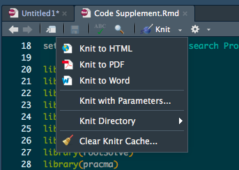

```{r setup, include=FALSE}
knitr::opts_chunk$set(echo = FALSE)

```
---


## Readings

\textbf{Required for class:} 
  
  - [\textcolor{teal}{Carey \& Papin (2018) Ten Simple Rules for Biologists Learning to Program. \textit{PLOS Computational Biology}.}](https://journals.plos.org/ploscompbiol/article?id=10.1371/journal.pcbi.1005871)
  
  - [\textcolor{teal}{Schnell (2015) Ten Simple Rules for a Computational Biologist’s Laboratory Notebook. \textit{PLOS Computational Biology}.}](https://journals.plos.org/ploscompbiol/article?id=10.1371/journal.pcbi.1004385)

\bigskip\textbf{Optional:}

  - R for Data Scientists - [\textcolor{teal}{Online}](https://r4ds.had.co.nz/) or [\textcolor{teal}{Hard Copy}](https://www.amazon.com/Data-Science-Transform-Visualize-Model/dp/1491910399)
  
  - [\textcolor{teal}{R Markdown}](https://rmarkdown.rstudio.com/)

  - [\textcolor{teal}{R Markdown Cheat Sheet}](https://rstudio.com/wp-content/uploads/2016/03/rmarkdown-cheatsheet-2.0.pdf)

*Thanks to Dr. Bobbi Carothers (Wash U) for ideas and code from an R-Ladies STL workshop on [\textcolor{teal}{Reproducible Research}](https://rladies.org/event/reproducible-research-in-r/)*
 

---

## Why Care About Clean Code?

Ever inherit a project and have *no* idea how the data were managed and/or analyses performed?
\bigskip

Ever come back to your own project after a few months and have no recollection of what you did or why you did it, even after looking at your own code?

\bigskip
In this lecture we'll be talking about ways to help others and future-you through:

- Literate Programming

- Clear Code Formatting

  

## Clean Coding

There are lots of ways to code the same thing.  Using clean code conventions means we can avoid this...
\bigskip

```{r, out.width='100%', fig.align='center', fig.cap=''}

```

\bigskip

In order to make sure your code is FAIR, you want to make sure it is clean, readable, and well annotated. So how do we do that?  


## Tip #1: Use White Space to Separate Processes

Bad:


```r
tvtest <- lmer(sqrt(tv) ~ Region * log(DD5_TOT) + (1|Population/Sample_ID) + (1|Year), data=tvdat, REML=FALSE) summary(tvtest) 
r.squaredGLMM(tvtest) ggplot(tvdat, aes(x=log(DD5_TOT),y=sqrt(tv),col=Region))+geom_point(aes(col=Region),
size=3)+geom_point(shape=1,size=3,colour='black')+geom_smooth
(aes(col=Region),method='lm')+xlab(bquote('log(Degree Days above' ~5^o~C*')'))+ylab('sqrt(Terminal Velocity (m/s))')

```

\bigskip
Better:


```r
tvtest <- lmer(sqrt(tv) ~ Region * log(DD5_TOT) + (1|Population/Sample_ID) + (1|Year), data=tvdat, REML=FALSE)
summary(tvtest) r.squaredGLMM(tvtest) 

ggplot(tvdat, aes(x=log(DD5_TOT), y=sqrt(tv),col=Region))+geom_point(aes(col=Region),
size=3)+geom_point(shape=1,size=3,colour='black')+geom_smooth(aes(col=Region),method='lm')
+xlab(bquote('log(Degree Days above' ~5^o~C*')'))+ylab('sqrt(Terminal Velocity (m/s))')


```

## Tip #2: Limit Line Length to Reduce Scrolling

```r
tvtest <- lmer(sqrt(tv) ~ Region * log(DD5_TOT) + 
(1|Population/Sample_ID) + (1|Year), data=tvdat, 
REML=FALSE) summary(tvtest) r.squaredGLMM(tvtest) 

ggplot(tvdat, aes(x=log(DD5_TOT), y=sqrt(tv),
col=Region))+geom_point(aes(col=Region),size=3)+
geom_point(shape=1,size=3,colour='black')+
geom_smooth(aes(col=Region),method='lm')
+xlab(bquote('log(Degree Days above' ~5^o~C*')'))+
ylab('sqrt(Terminal Velocity (m/s))')


```


## Tip #3: Use Indentation to Group Code Together


```r
tvtest <- lmer(sqrt(tv) ~ Region * log(DD5_TOT) + 
    (1|Population/Sample_ID) + (1|Year), data=tvdat, 
    REML=FALSE) 
summary(tvtest) 
r.squaredGLMM(tvtest) 

ggplot(tvdat, aes(x=log(DD5_TOT), y=sqrt(tv),
    col=Region))+
  geom_point(aes(col=Region),size=3)+
  geom_point(shape=1,size=3,colour='black')+
  geom_smooth(aes(col=Region),method='lm')+
  xlab(bquote('log(Degree Days above' ~5^o~C*')'))+
  ylab('sqrt(Terminal Velocity (m/s))')


```

## Tip #4: Use Meaningful Names for Objects


Bad:


```r
g$SM10_21[g$SM10_21==-99] &lt;- NA
prop.table(table(g$SM10_21))
```

\bigskip
Better: replace `g` with `GEUM_DATA` and `SM10_21` with `seed_mass`.


```r
GEUM_DATA$seed_mass[GEUM_DATA$seed_mass==-99] &lt;- NA
prop.table(table(GEUM_DATA$seed_mass))
```


## Tip #5: Consistent Formatting for Multi-Part Names

- The classics include: dot.case, camelCase, or snake_case

- Variations include lower camelCase, upper CamelCase, UPPER_SNAKE_CASE and so on

- Consider using one format for functions, another for dataframes, and a third for variable names

\bigskip
```r
find.mode(GEUM_DATA$seed_mass)
```
Here, the function is dot case, the data frame is upper snake case, and the variable name is lower snake_case


\bigskip
\scriptsize{\textit{Note that some formats might not work in certain software packages.}}


## Tip #6: Add Metadata to File Names

- Include metadata (e.g. date and project name) in file names. 

    1. **Machine readable** (no spaces in the file name)
    
    2. **Works with default ordering** (numbers refer to dates - yymmdd, use leading zeros where necessary. This is extremely helpful in code file names for versioning)
    
    3. **Human readable** (makes sense)

\bigskip
- Examples:

    * 17_02_03_raw_GeumTraitData.csv
    
    * 17_02_05_clean_GeumTraitData.csv
    
## Tip #7: Write a Prolog to Introduce Code


```r
# PROLOG   ##########################################

# PROJECT: NAME OF PROJECT 
# PURPOSE: MAJOR POINT(S) OF WHAT I DO WITH DATA HERE
# DIR:     list directory(-ies) for files here
# DATA:    list dataset file names here, e.g.,
#            filename.correctextention 
#            somewebaddress.com 
# AUTHOR:  AUTHOR NAME(S) 
# CREATED: MONTH dd, YEAR 
# LATEST:  MONTH dd, YEAR 
# NOTES:   indent additional lines under each heading, 
#            Use case system to keep things clear -
#            UPPER CASE FOR INFO, lower case for notes
#            
#          Include changes made for this version

# PROLOG   ##########################################
```


## Tip #8: Annotate to Clarify Code Purpose

Use comments to:

- Explain the reason for the code (if needed)
- Explain functionality or choices that are not obvious 
- Identify places to return to code to fix

\bigskip
Avoid using comments to:

- Explain poorly named objects


\bigskip
\bigskip
```r
# Calculate avg wind speed and convert km/h into m/s 
wind_avg <- ddply(wind, .(measurement), summarize, 
     wind_average = (mean(value)*1000)/3600)   
```


## Tip #9: Clear Your Code History at the Start of Each File

**Always** be sure to include `rm(list=ls())` at the start of each code file, before you enter in libraries or datasets.  This code clears the working memory so you don't accidentally have something named, for example, `test` in the system that you think is your current `test` but is really a file called `test` from a different analysis.


\bigskip
**I can not emphasize this practice enough**


## R Markdown

- Create polished documents detailing data, analyses and figures, etc.

- Merge prose, code, analyses all in one document. 
  - great for use as a metadata file. Cleanly describes your work for publications or data storage. 
  - great when trying to be FAIR

- Final document is in a non-proprietary format (.pdf or .html) that can be shared publically (as opposed to simply providing people with R code)

- More attractive and more easily shared than syntax/code files


## R Markdown

Open up RStudio, then open up a new R Markdown document.

```{r, out.width='100%', fig.align='center', fig.cap=''}

```


## R Markdown

Then choose what type of document you want to create.  You can see there are a lot of options.  I created these slides in RMarkdown, and there is a new option to create powerpoint slides in Markdown that you can then edit in Powerpoint.  You can even write your entire manuscript in Markdown if you want!

```{r, out.width='60%', fig.align='center', fig.cap=''}

```


## R Markdown Syntax

You need to create a title for each document using YAML (Yet Another Markdown Language).  These differ depending on the type of document you want to create.  You can use the internet to find options for personalizing your document.  You'll notice the headers for my slides look like this:

```yaml
---
title: "Best Coding Practices"
subtitle: "Lecture 2: Coding Tips"
author:  "Lauren Sullivan"
date: "Module: Data Management, Visualization 
      & Reproducibility"
output: beamer_presentation
mainfont: Calibri 
---
```

*Note: I put things under the incorrect type so I could get the titles and subtitles I wanted.*


## Code Chunks

The code that you want R to run goes in "chunks" that are wrapped in backticks  with `{r}` at the end of the top wrapper. You can set options for how you want R to handle each chunk (e.g. do you want to display code, results, warning messages, etc). Check out the [\textcolor{teal}{R Markdown Cheat Sheet}](https://rstudio.com/wp-content/uploads/2016/03/rmarkdown-cheatsheet-2.0.pdf) for some of the many options for your code chunks.

```{r, out.width='100%', fig.align='center', fig.cap=''}

```

## Text options

Everything written outside of the chunks will **not** be evaluated by R and will display as normal text.

\bigskip
There are many options for syntax here as well.  Check the RMarkdown Cheat Sheet for some of the many options.


## Final Output

When you're ready to create an output file, you "knit" it:

\bigskip
```{r, out.width='70%', fig.align='center', fig.cap=''}

```


## My Thoughts


*My general code usage:* I use all the "clean coding" techniques above while I'm working on a non-finished project. I really like to use Markdown files once I have completed a project so I know what I did and how I did it in a super clean way.  [\textcolor{teal}{Here's an example}](https://journals.plos.org/plosone/article/file?id=10.1371/journal.pone.0195129.s003&type=supplementary) of a supplement I created for a paper in Markdown.


