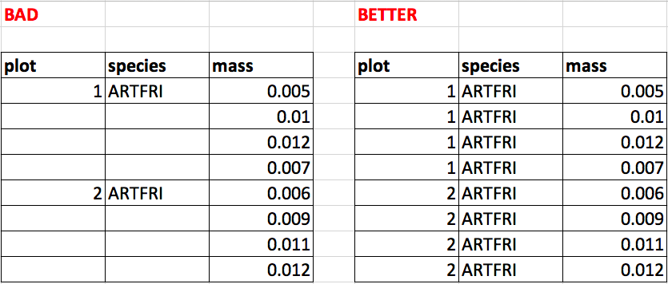
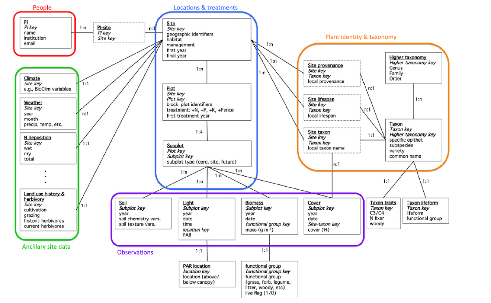

```{r setup, include=FALSE}
knitr::opts_chunk$set(echo = FALSE)

```
---


## Readings

\textbf{Required for class:}

  - NA

\bigskip\textbf{Optional:}

  - [\textcolor{teal}{Lind, E.M. (2016) Unified Data Management for Distributed Experiments: A Model for Collaborative Grassroots Scientific Networks. \textit{Ecological Informatics}. 23:231-236.}](https://www.sciencedirect.com/science/article/pii/S1574954116301133)

  - [\textcolor{teal}{Hart et al. (2016) Ten Simple Rules for Digital Data Storage. \textit{Plos Computational Biology}.}](https://journals.plos.org/ploscompbiol/article?id=10.1371/journal.pcbi.1005097)

  - [\textcolor{teal}{Borer, E.T. et al. (2009) Some Simple Guidelines for Effective Data Management. \textit{Bulletin of the Ecological Society of America}. 90(2):205-214.}](https://esajournals.onlinelibrary.wiley.com/doi/full/10.1890/0012-9623-90.2.205)


  
## Why Manage Data?

- Allows you to **quality control** your data more easily.
- Helps you stay **organized** through the whole process of file management, script creation, version control, backups, etc.
- Enables **reproducibility**.  You always want to be able to recreate figures and analyses from the data that produced them.  Even 3 years later.
- Helps you **share** your data more easily for future meta-analyses, etc.  This allows for larger understanding of your field.


## Organization is Key to Data \& Project Management

For each R project/manuscript, you will want to have a set of folders. Here is a suggestion, but there are many options.

\bigskip

  - Data
  - Data Wrangling
  - Analysis
  - Graphics
  - Documents
  - ReadMe


## Folder Structure in Detail
\scriptsize
  - Data
    - raw data (read-only, pristine backup, not to be touched)
    - tidy data (intermediate and final R datasets)
  - Data Wrangling
    - DataAcquisition.R - script for compiling all data files into a single, usable dataset.
  - Analysis
  - Graphics
  - Documents
    - Manuscript folder
    - Literature folder
  - ReadMe
    - metadata
    - write down the driving questions and purposes of the project and other notes.

  
\textit{\textcolor{purple}{\scriptsize{Note: Your code will stay cleaner if you use many smaller scripts, e.g. one for all analyses, one for all figures \textbf{OR} one for each analysis and the associated figures}}}


## Tips for Entering Raw Data for R Analysis


- No spaces in column headers
- Note units either in column header or in associated metadata
- R is case sensitive so keep column headers in a case structure  (e.g. snake_case, dot.case)
- The difference between “0” and “NA” and a blank cell all tells you something
- Fill all columns


```{r, out.width='75%', fig.align='center', fig.cap=''}

```


## Relational Data

When thinking about how to enter your data...

  - Store data as smaller units (hierarchical and by type) and link through code. 
  - For example: store site level data in one file, and plot level data in another. Then link these datasets through code.
    - This helps avoid confusion and repetition
    - Great for large, interconnected datasets, especially those that can change
    - Data management systems play well with data in this format (e.g. Tidy, SQL)
    - Can be linked as 1:1, many to one (n:1), or one to many (1:n)


## An Extreme Example of Relational Data


```{r, out.width='105%', fig.align='center', fig.cap=' From Lind (2016) Ecological Informatics'}

```

## Git and GitHub
 
 GitHub is a great resource for managing data and code. If you are interested, there are lots of great resources out there.  Here are a few.
 
   - [\textcolor{teal}{Perez-Riverol, Y. et al. (2016) Ten Simple Rules for Taking Advantage of Git and GitHub. \textit{PLOS Computational Biology}.}](https://journals.plos.org/ploscompbiol/article?id=10.1371/journal.pcbi.1004947)
  
   - [\textcolor{teal}{GitHub Guides}](https://guides.github.com/activities/hello-world/) 
   
  


