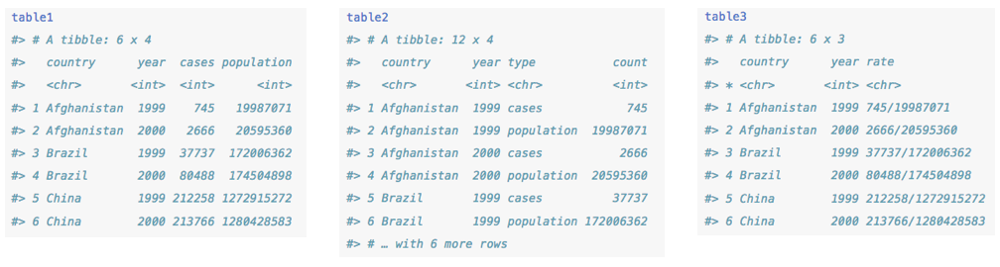
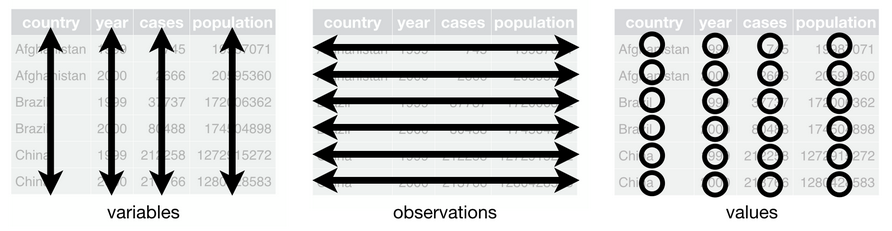
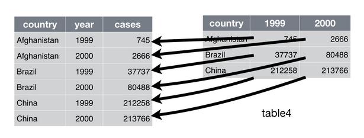
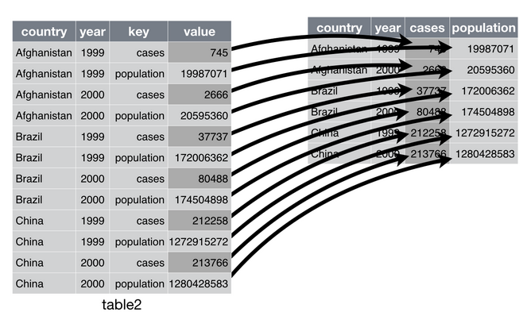

```{r setup, include=FALSE}
knitr::opts_chunk$set(echo = FALSE)

library(tidyverse)

```
---


## Readings

\textbf{Required for class:}

  - NA

\bigskip\textbf{Optional:}

  - [\textcolor{teal}{Tidyverse}](https://www.tidyverse.org/)

  - [\textcolor{teal}{Grolemund \& Wickham (2017) \textit{R for Data Science. - Tidy Data with tidyr}}](https://r4ds.had.co.nz/tidy-data.html)

  - [\textcolor{teal}{Data Import::Cheat Sheet - for readr and tidyr}](https://rawgit.com/rstudio/cheatsheets/master/data-import.pdf)

---

## Data Manipulation Goals

- Perform all manipulation in R
- Preserves data integrity
- This will take a lot of time at first but is worth the effort
- Remember Google is your friend!
    

##  Tidy Data


```{r, out.width='90%', fig.align='center', fig.cap=''}
knitr::include_graphics('../images/R_pipeline.png')
```


## Tidy Data

- There are lots of ways to represent the same set of data in tables, but not all are tidy.

```{r, out.width='100%', fig.align='center', fig.cap=''}

```

*This is a dataset of tuberculosis cases in 1999 and 2000 from several countries from the World Health Organization. All examples can be found within the Tidyverse package.  If you load the tidyverse library, and type in table1 for example, the first table will show up.*


## Tidy Rules

- Three interrelated rules make a dataset tidy:

1. Each variable must have its own column.
2. Each observation must have its own row.
3. Each value must have its own cell.

```{r, out.width='100%', fig.align='center', fig.cap=''}

```


## Which Dataset is Tidy?


```{r, out.width='100%', fig.align='center', fig.cap=''}

```


## Why is Tidy Data Useful?

- It helps to pick a consistent way to store data.
- R is a vectorized language, so when you put variables in columns, R's at its best.


## How to Create Tidy Data

- Most often, data does not start out as tidy because it is organized in a format that's easy for collection and entry. Thus we must tidy our data.

\bigskip

- Two important functions to learn:  

1.  **`pivot_longer()`** - when some of the column names are not the names of variables but the *values* of the variables. 
  
    - Wide to Long data
    
2.  **`pivot_wider()`** - when an observation is scattered across multiple rows.
  
    - Long to Wide data


## `pivot_longer()`

Column names are not the names of variables but the *values* of the variables. \textcolor{red}{*Here for example, 1999 and 2000 are both values of the variable year*}

\footnotesize
```{r, echo=TRUE}
table4a
```
```{r, out.width='75%', fig.align='center', fig.cap=''}

```


## `pivot_longer()`

\scriptsize
```{r, echo=TRUE, eval=FALSE}
table4a %>%
  pivot_longer(c("1999", "2000"), names_to = "year", values_to = "cases")
```
\normalsize

- In the tidyverse, you can combine multiple operations with the "pipe", or `%>%`.
- This makes your code clean and more human-readable if you translate `%>%` to "then".
    -   The code above would read, "take `table4a`, then pivot the columns `1999` and `2000` into one longer column named `year`, and its values should be called `cases`."  


## `pivot_longer()`

\scriptsize
```{r, eval=TRUE, echo=FALSE}
table4a 
```

```{r, eval=TRUE, echo=TRUE}
table4a %>%
  pivot_longer(c("1999", "2000"), names_to = "year", values_to = "cases")
```


\footnotesize
The `names_to` is the name of the new column that will form from multiple old ones. 

The `values_to` are the observations that will fill this new column.


## `pivot_longer()`

This is what just happened. Wide to long data.

```{r, out.width='100%', fig.align='center', fig.cap=''}

```


## `pivot_wider()`

Observation is scattered across multiple rows. \textcolor{red}{*Here for example, data from Afghanistan in 1999 is in multiple rows*}

\footnotesize
```{r, echo=TRUE}
print(table2, n = 8, width = Inf)
```


## `pivot_wider()`

\tiny
```{r, eval=TRUE, echo=FALSE}
print(table2, n = 8, width = Inf)
```

```{r,  echo=TRUE}
pivot_wider(table2, names_from = type, values_from = count) %>% 
  print(n = 4, width = Inf)
```

\footnotesize
The `names_from` is the column with the variables that will spread to 2 columns. 

The `values_from` is the column of values that will spread into those 2 columns.


## `pivot_wider()`

This is what just happened. Long to wide data

```{r, out.width='100%', fig.align='center', fig.cap=''}

```


## `separate()`

Pulls apart one column into multiple columns wherever a separator appears.

\scriptsize
```{r, eval=TRUE, echo=FALSE}
print(table3, n = 4, width = Inf)
```

```{r,  echo=TRUE}
table3 %>% separate(rate, into = c("cases", "population"), sep = "/")
```


## `separate()`

If you look carefully, the resulting tibble from the previous set of operations resulted in two new columns that were both *characters* because the original column was a character before the separation. Therefore you should have the function convert to a better type of data using `convert = TRUE`.

\bigskip
\scriptsize
```{r,  echo=TRUE}
table3 %>% separate(rate, into = c("cases", "population"), sep = "/",
                    convert = TRUE)
```


## `unite()`

Turns two columns into one. The default for `sep` is an underscore (_), so if you want something different you must specify.

\scriptsize
```{r, eval=TRUE, echo=FALSE}
print(table5, n = 4, width = Inf)
```

```{r,  echo=TRUE}
table5 %>% unite(new, century, year, sep = "")
```


## Missing Values

Manipulating your data brings up the importance of missing values. These can either be...

1. **Explicit** - flagged with an `NA`
2. **Implicit** - not present in the data


\tiny
```{r,  echo=TRUE}
frogs <- tibble(
  year     = c(2019, 2019, 2019, 2019, 2018, 2018, 2018),
  individual  = c(1,    2,    3,    4,    2,    3,    4),
  mass     = c(2.88, 3.51, 1.95,   NA, 2.72, 2.17, 3.32))
```

\scriptsize
```{r, eval=TRUE, echo=FALSE}
frogs
```


## Missing Values

In our case here, you can make implicit missing values become explicit by pivoting the years into the columns

\footnotesize
```{r, eval=TRUE, echo=TRUE}
frogs %>% 
  pivot_wider(names_from = year, values_from = mass)

```


## Missing Values

Or, if these missing values are not important, you can turn these explicit values into implicit ones by using `values_drop_na = TRUE`.

\footnotesize
```{r, eval=TRUE, echo=TRUE}
frogs %>%
  pivot_wider(names_from = year, values_from = mass) %>%
  pivot_longer(names_to = "year", values_to = "mass", '2018':'2019', 
               values_drop_na =  TRUE)
```
\normalsize
FYI this is another way to write: `pivot_longer( c('2018','2019'),names_to = "year", values_to = "mass", '2018':'2019', values_drop_na =  TRUE)`


## Missing Values

You can also make missing values explicit with `complete()`

\footnotesize
```{r, eval=TRUE, echo=TRUE}
frogs %>%
  complete(year, individual)
```


