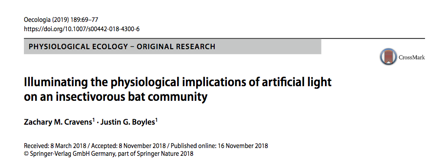

```{r setup, include=FALSE}
knitr::opts_chunk$set(echo = FALSE)

library(tidyverse)

```
---


## Data Manipulation Goals -- Reminder

Once we have tidy data, we may need to update its format, create new variables, filter out other variables, etc.
\bigskip

- Perform all manipulation in R
    - Preserves data integrity
    - This will take a lot of time at first but is worth the effort
    - Remember Google is your friend!


## Data Transformation with dplyr


```{r, out.width='90%', fig.align='center', fig.cap=''}
knitr::include_graphics('../images/R_pipeline.png')
```


## Useful transformation functions

- `filter()`
- `arrange()`
- `select()`
- `mutate()` and `transmute()`
- `summarize()`


---


This lecture we will be using partial [\textcolor{teal}{data}](https://datadryad.org/stash/dataset/doi:10.5061/dryad.dd627hd) from a study by [\textcolor{teal}{Cravens and Boyle (2019)}](https://link.springer.com/content/pdf/10.1007/s00442-018-4300-6.pdf) on the morphological data of bats. 

```{r, out.width='100%', fig.align='center', fig.cap=''}

```

## Eastern Red Bat morphology data

\scriptsize
```{r,  echo=TRUE, warning=FALSE, message=FALSE}
bats <- read_csv("../data/bats.csv")
bats[1:10,]
```


## `filter()`

Subsets observations based on their values. The first argument is the dataframe to filter, and the following arguments are the expressions for how you want to filter. So say we only want to look at female bats.

\scriptsize
```{r,  echo=TRUE, message=FALSE}
filter(bats, sex == "F")
```


## `filter()`

Or we only want to look at male bats with a mass above 15g.

\scriptsize
```{r,  echo=TRUE, message=FALSE}
filter(bats, sex == "M", mass > 15)
```


## `filter()`

If we want to use the `%>%` we don't have to specify the dataframe.

\scriptsize
```{r,  echo=TRUE, message=FALSE}
bats %>% filter(sex == "M", mass > 15)
```


## Logical Operators

You can use `filter()` combined with Boolean operators to select various sets. 

  - `&` is "and", `|` is "or", `!` is "not"
  - Note: `filter()` excludes rows with `NA` for the variables specified.
  

```{r, out.width='80%', fig.align='center', fig.cap='Boolean operators. The left circle is x, the right circle is y, and the shaded region indicates the given subset selected.'}
knitr::include_graphics('../images/logicals.png')
```


## `filter()` with Boolean

So say you want the set of male bats with mass > 15g. You can also write this with boolean operators.  

\scriptsize
```{r,  echo=TRUE, message=FALSE}
bats %>% filter(sex == "M" & mass > 15)
```


## `filter()` with Boolean

Or say you want the set of bats that are adult females

\scriptsize
```{r,  echo=TRUE, message=FALSE}
bats %>% filter(sex == "F" & age == "A")
```


## `filter()` with Boolean

Or you want the set of bats that either have condition "NR" or "L"

\scriptsize
```{r,  echo=TRUE, message=FALSE}
bats %>% filter(condition == "NR" | condition == "L")
```


## `arrange()`

Used to sort your tibbles into the orders you want.
  
  - You can arrange by more than one column, and this will help break ties when they occur.
  
\scriptsize
```{r,  echo=TRUE, message=FALSE}
bats %>% arrange(avg_temp, condition, RFA)
```


## `arrange()`

As you may have noticed, `arrange()` sorts by both ascending numerical and alphabetical order, but you can flip this to descending order with `desc()`.
  
  - `arrange()` always puts `NA`'s at the end, no matter if your sort in ascending or descending order.

\scriptsize
```{r,  echo=TRUE, message=FALSE}
bats %>% arrange(desc(avg_temp), desc(condition), desc(RFA))
```


## `select()`

If you want to select certain columns, use `select()`. For example, select the columns for sex, moonlight and mass.

\scriptsize
```{r,  echo=TRUE, message=FALSE}
bats %>% select(sex, moonlight, mass)
```


## `mutate()` and `transmute()`

Mutate always adds a new column at the end of the data. So say you want to know the ratio of each bat's right forearm length (RFA) to its bodymass (mass).

\scriptsize
```{r,  echo=TRUE, message=FALSE}
bats %>% mutate(ratio = RFA / mass)
```


## `mutate()` and `transmute()`

If all you care about is the new variable, use `transmute()`

\scriptsize
```{r,  echo=TRUE, message=FALSE}
bats %>% transmute(ratio = RFA / mass)
```


## Useful Creation Functions

There are a lot of useful functions for creating new variables out there.  I will list some here, but use Google if you are ever looking for something specific.

- Arithmetic operators: `+, -, *, /, ^`
- Logs: `log()` - which is a natural log, `log2()`, `log10()`
- Offsets: `lead()`, `lag()`
- Cumulative: `cumsum()`, `cumprod()`, ..., etc
- Ranking: `min_rank()`, `row_number()`, `percent_rank()`, ..., etc


## `summarize()`

This is a very useful function. And allows you to collapse parts of dataframes into a single row (so summarize your data based on specifications). So say we want to get an average mass of bats  

\scriptsize
```{r,  echo=TRUE, message=FALSE}
bats %>% summarize(avg_mass = mean(mass))
```


## `summarize()`

If you want to summarize by multiple groups, use the `%>%`

\scriptsize
```{r,  echo=TRUE, message=FALSE}
bats %>% 
  group_by(sex) %>%
  summarize(avg_mass = mean(mass))
```

\scriptsize
```{r,  echo=TRUE, message=FALSE}
bats %>% 
  group_by(sex, age) %>%
  summarize(avg_mass = mean(mass))
```


## `summarize()`

Here are some of the many functions that can be useful with `summarize()`


- Exploratory statistics: `mean(x)`, `median(x)`, `sd(x)`, `IQR(x)`
- Measures of rank or position: `min(x)`, `quantile(x, c(0.05, 0.95))`, `max(x)`, `first(x)`, `nth(x, 2)`, `last(x)`
- Counts: `n()` - size of current group, `sum(x)` (try `sum(~is.na(x)` to make sure you don't include `NA`'s), `n_distinct(x)` - the number of unique elements


---

## Combine these functions to explore your data! 

Summarize by group and arrange by mass

\scriptsize
```{r,  echo=TRUE, message=FALSE}
bats %>% 
  group_by(sex, age, condition) %>%
  summarize(avg_mass = mean(mass)) %>%
  arrange(desc(avg_mass))
```

---

## Combine these functions to explore your data! 

Find all groups bigger than a threshold

\scriptsize
```{r,  echo=TRUE, message=FALSE}
bats %>% 
  group_by(sex, age) %>%
  filter(mass > 15)
```


