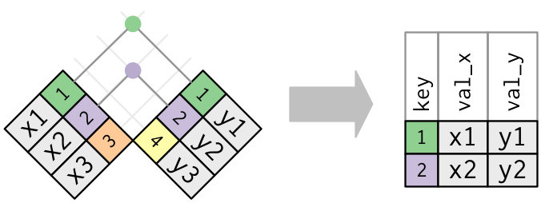

```{r setup, include=FALSE}
knitr::opts_chunk$set(echo = FALSE)

library(tidyverse)
library(nycflights13)

```
---

## Relational Data

As we mentioned previously, it is good practice to maintain smaller datasets and then merge them together through code. Using multiple tables of data is called *Relational Data* because we are interested in the relations between datasets, not individual ones.

Relations are always built between pairs of tables. And to do this work we need some terminology.

\bigskip

- **Mutating joins**: adds a new variable to one data frame from matching observations in another
- **Filtering joins**: filters observations from one data frame based on if they match an observation from another data frame.
- **Set operations**: treats observations as if they were set elements.


## Relational Data with dplyr


```{r, out.width='90%', fig.align='center', fig.cap=''}
knitr::include_graphics('../images/R_pipeline.png')
```


---

In this lecture we will use the `library(nycflights13)` from [\textcolor{teal}{R for Data Science}](https://r4ds.had.co.nz/). This library contains data on flights in and out of NYC.

\scriptsize
```{r, eval=FALSE, echo=TRUE, warning=FALSE, message=FALSE}
library(nycflights13)
 
airlines  # describes all airlines in NYC

airports  # describes the airports flights go to/from

planes    # describes each plane

weather   # weather at each NYC airport each hour

```

## For More Information

```{r, out.width='42%', fig.align='center'}
knitr::include_graphics('../images/Rfordatascience.png')
```

[\textcolor{teal}{R for Data Science.}](https://r4ds.had.co.nz/)
  

## Relational data for nycflights13

```{r, out.width='100%', fig.align='center', fig.cap=''}
knitr::include_graphics('../images/relational-nycflights.png')
```


## Relational data for nycflights13

```{r, out.width='50%', fig.align='center', fig.cap=''}
knitr::include_graphics('../images/relational-nycflights.png')
```

- `flights` connects to `planes` via a single variable, `tailnum`.

- `flights` connects to `airlines` through the `carrier` variable.

- `flights` connects to `airports` in two ways: via the `origin` and `dest` variables.

- `flights` connects to `weather` via `origin` (the location), and `year`, `month`, `day` and `hour` (the time).


## Keys

The terminology used by *R for Data Science* for a variable (or set of variables) that connects each pair of tables.

- There are three types of keys

    1. *Primary Key* - uniquely identifies an observation in its own table. Here, `planes$tailnum` uniqely identifies each plane in the `planes` table.
    
    2. *Foreign Key* - uniquely identifies an observation in another table. Here, `flights$tailnum` appears in the `flights` table where it matches each flight to a unique plane in `planes`.

    3. *Surrogate Key* - sometimes datasets do not contain a primary key, so you must make one. Here, `flights$tailnum` is not a primary key because the same plane appears multiple times per day at the airport. Create one using, for example, `mutate()` and `row_number()`. **This then becomes a *primary key*.**

\footnotesize
A *primary key* that corresponds to a *foreign key* is a relation.  This builds the 1:1, 1:n, or n:1 relationships we mentioned previously.


## Mutating Joins

Mutating joins combine variables from two tables. 

\bigskip
Let's make `flights` smaller so we can better see our data.

\scriptsize
```{r, eval=TRUE, echo=TRUE, warning=FALSE, message=FALSE}
flights2 <- flights %>% 
              select(year:day, hour, origin, dest, tailnum, carrier)
flights2

```


## Mutating Joins

To add the full name of the airline to `flights2`, you combine `airlines` with `flights2` with `left_join()`.

\scriptsize
```{r, eval=TRUE, echo=TRUE, warning=FALSE, message=FALSE}
flights2 %>%
  select(-origin, -dest) %>% 
  left_join(airlines, by = "carrier")
```  
  

## Joins, How Do They Work?

```{r, eval=TRUE, echo=FALSE, warning=FALSE, message=FALSE}
x <- tribble(
  ~key, ~val_x,
     1, "x1",
     2, "x2",
     3, "x3"
)
y <- tribble(
  ~key, ~val_y,
     1, "y1",
     2, "y2",
     4, "y3"
)
```

Imagine you have two datasets, x (on the left) and y (on the right), and they each have *key* variables (colored column). The following diagram shows all potential matches with the grid lines

```{r, out.width='25%', fig.align='center', fig.cap=''}
knitr::include_graphics('../images/join-setup2.png')
```

However the only possible matches are indicated with colored dots. The resulting dataset demonstrates that in this case all variables are joined, and some observations are lost.

```{r, out.width='50%', fig.align='center', fig.cap=''}

```


## Inner Joins

Inner joins match pairs of observations based on equal key variables, but they lose observations without matches.
  
- You specify the key variable with `by`.

```{r, out.width='50%', fig.align='center', fig.cap=''}

```

\scriptsize
```{r, eval=TRUE, echo=TRUE, warning=FALSE, message=FALSE}

x %>% 
  inner_join(y, by = "key")

```


## Outer Joins

Outer joins also match observations based on key variables, but **do not** lose observations.

- There are three types of outer joins.

  1. A **left join** keeps all observations in `x`.
  2. A **right join** keeps all observations in `y`.
  3. A **full join** keeps all observations in `x` and `y`.
  
  
In all cases, unmatched observations are filled with `NA`.


## Outer Joins

```{r, out.width='50%', fig.align='center', fig.cap=''}
knitr::include_graphics('../images/join-outer.png')
```


## Duplicate Keys

Sometimes keys are not unique. There are two possibilities here.

1. One table has duplicate keys (a 1:n relationship)

```{r, out.width='50%', fig.align='center', fig.cap=''}
knitr::include_graphics('../images/join-one-to-many.png')
```


\scriptsize
```{r, eval=TRUE, echo=FALSE, warning=FALSE, message=FALSE}
x <- tribble(
  ~key, ~val_x,
     1, "x1",
     2, "x2",
     2, "x3",
     1, "x4"
)
y <- tribble(
  ~key, ~val_y,
     1, "y1",
     2, "y2"
)
```

\scriptsize
```{r, eval=TRUE, echo=TRUE, warning=FALSE, message=FALSE}
left_join(x, y, by = "key")
```


## Duplicate Keys

2. Both tables have duplicate keys. This is often an error because neither table has a unique identifier.

```{r, out.width='40%', fig.align='center', fig.cap=''}
knitr::include_graphics('../images/join-many-to-many.png')
```


\scriptsize
```{r, eval=TRUE, echo=FALSE, warning=FALSE, message=FALSE}
x <- tribble(
  ~key, ~val_x,
     1, "x1",
     2, "x2",
     2, "x3",
     3, "x4"
)
y <- tribble(
  ~key, ~val_y,
     1, "y1",
     2, "y2",
     2, "y3",
     3, "y4"
)
```

\scriptsize
```{r, eval=TRUE, echo=TRUE, warning=FALSE, message=FALSE}
left_join(x, y, by = "key")
```


## Defining the Key Columns

*Natural joins*, or `by = NULL` uses all variables that are in both tables. The `flights` and `weather` table have `year`, `month`, `day`, `hour`, and `origin` in common.

\tiny
```{r, eval=TRUE, echo=TRUE, warning=FALSE, message=TRUE}

flights2 %>%
  left_join(weather)

```


## Defining the Key Columns

You can join by a *character vector* with `by = "x"`. Try joining `flights` and `planes` by `tailnum`.


\tiny
```{r, eval=TRUE, echo=TRUE, warning=FALSE, message=TRUE}

flights2 %>%
  left_join(planes, by = "tailnum")

```

\footnotesize
You can see that both datasets had a `year` column but they had different values, so the resulting variables are `year.x` and `year.y`.


## Defining the Key Columns

A *named character vector*, for example `by = c("a" = "b")` allows you to match variable `a` in table `x` to variable `b` in table `y`. Note: the variables from `x` will always be used in the output.


\tiny
```{r, eval=TRUE, echo=TRUE, warning=FALSE, message=TRUE}

flights2 %>% 
  left_join(airports, c("dest" = "faa"))

```


## Filtering Joins

Filtering joins only affect observations, not variables.

- `semi_join(x, y)` **keeps** observations in `x` with a match in `y`.

```{r, out.width='40%', fig.align='center', fig.cap=''}
knitr::include_graphics('../images/join-semi.png')
```

- `anti_join(x, y)` **drops** observations in `x` with a match in `y`.

```{r, out.width='40%', fig.align='center', fig.cap=''}
knitr::include_graphics('../images/join-anti.png')
```

## `semi_join()`

So say you have a table of the top destinations (`top_dest`) and you want to know what flights go to those destinations.

\scriptsize
```{r, eval=TRUE, echo=FALSE, warning=FALSE, message=FALSE}
top_dest <- flights %>%
  count(dest, sort = TRUE) %>%
  head(10)
```

\scriptsize
```{r, eval=TRUE, echo=TRUE, warning=FALSE, message=TRUE}
trips <- flights %>%
          semi_join(top_dest)
trips[,1:7]
```


## `anti_join()`

Anti-joins are useful for figuring out mismatches. So say you want to know the `flights` that do not have a match in `planes`.

\scriptsize
```{r, eval=TRUE, echo=TRUE, warning=FALSE, message=TRUE}
mismatch <- flights %>%
          anti_join(planes, by = "tailnum")
mismatch[,1:7]
```


## Set Operations

Set operations work with complete rows, and compare the values of every variable. For set operations, it is assumed that `x` and `y` have the same variables, and treat all observations as sets.

- `intersect(x, y)` returns only observations in both `x` and `y`.
- `union(x, y)` returns unique observations in `x` and `y`.
- `setdiff(x, y)` returns observations in `x`, but not `y`.


Say you have these datsets.

\scriptsize
```{r, eval=TRUE, echo=TRUE, warning=FALSE, message=FALSE}
df1 <- tribble(
  ~x, ~y,
   1,  1,
   2,  1
)
df2 <- tribble(
  ~x, ~y,
   1,  1,
   1,  2
)
```

## Set Operations


\tiny
```{r, eval=TRUE, echo=TRUE, warning=FALSE, message=FALSE}
intersect(df1, df2)

union(df1, df2)  #note we get 3 rows, not 4.

setdiff(df1, df2)

setdiff(df2, df1)
```


