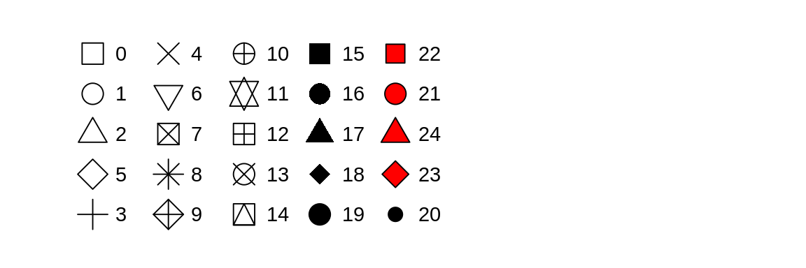

```{r setup, include=FALSE}
knitr::opts_chunk$set(echo = FALSE)

library(tidyverse)

```
---

## Exploratory Data Analysis

Visually exploring your data is often called Exploratory Data Analysis (EDA)

  - Helps you figure out what is going on.
  - Gives you a clearer picture of if your data entry and analyses are correct. 
  - Allows you to feel confident with analyses.
  - Not a formal process, simply whatever you like to do to examine your data.


## EDA with ggplot2


```{r, out.width='90%', fig.align='center', fig.cap=''}
knitr::include_graphics('../images/R_pipeline.png')
```


## Let's do some EDA on our Bats Data

\scriptsize
```{r,  echo=TRUE, warning=FALSE, message=FALSE}
bats <- read_csv("../data/bats.csv")
bats[1:10,]
```


## Summary Tables

\scriptsize
```{r,  echo=TRUE, warning=FALSE, message=FALSE}
summary(bats)
```


## Look at Your Data - Boxplots

\scriptsize
```{r,  echo=TRUE, warning=FALSE, message=FALSE, fig.height=3.5, fig.width=6}

ggplot(data = bats)+
  geom_boxplot(aes(x = sex, y = mass))+
  theme_bw()+
  theme(text = element_text(size=18))
  
```

## Look at Your Data - Boxplots

\scriptsize
```{r,  echo=TRUE, warning=FALSE, message=FALSE, fig.height=3.5, fig.width=6}

ggplot(bats)+
  geom_boxplot(aes(x = condition, y = RFA))+
  theme_bw()+
  theme(text = element_text(size=18))+
  coord_flip()
  
```


## Look at Your Data - Boxplots (re-ordered)

\scriptsize
```{r,  echo=TRUE, warning = FALSE, message = FALSE, fig.height=3, fig.width=6}

bats$condition<-factor(bats$condition, levels = 
                        c("L", "P","PL", "TD", "NR"))

ggplot(bats)+
  geom_boxplot(aes(x = condition, y = RFA))+
  theme_bw()+
  theme(text = element_text(size=16))+
  coord_flip()


```

## Look at Your Data - Scatterplots

\scriptsize
```{r,  echo=TRUE, warning=FALSE, message=FALSE, fig.height=3.5, fig.width=6}

ggplot(bats)+
  geom_point(aes(x = mass, y = RFA))+
  theme_bw()+
  theme(text = element_text(size=18))
  
```

## Look at Your Data - Scatterplots

\scriptsize
```{r,  echo=TRUE, warning=FALSE, message=FALSE, fig.height=3.5, fig.width=6}

ggplot(bats)+
  geom_point(aes(x = mass, y = RFA, color = sex), size = 2)+
  theme_bw()+
  theme(text = element_text(size=18))
  
```


## Look at Your Data - Scatterplots

\scriptsize
```{r,  echo=TRUE, warning=FALSE, message=FALSE, fig.height=3.5, fig.width=6}

ggplot(bats)+
  geom_point(aes(x = mass, y = RFA, color = sex, shape = age), size = 2)+
  theme_bw()+
  theme(text = element_text(size=18))
  
```


## Point Shapes

```{r, out.width='150%', fig.align='center', fig.cap=''}

```


## Look at Your Data - Scatterplots \+ Facets

\scriptsize
```{r,  echo=TRUE, warning=FALSE, message=FALSE, fig.height=3.5, fig.width=6}

ggplot(bats, aes(x = mass, y = RFA))+
  geom_point(shape = 1)+
  facet_wrap(~condition, nrow=2)+
  theme_bw()+
  theme(text = element_text(size=18))
  
```


## Look at Your Data - Scatterplots \+ Trends

\scriptsize
```{r,  echo=TRUE, warning=FALSE, message=FALSE, fig.height=3.5, fig.width=6}

ggplot(bats, aes(x = mass, y = RFA))+
  geom_point(shape = 1)+
  geom_smooth(method = lm, se = TRUE)+
  facet_wrap(~condition, nrow=2)+
  theme_bw()+
  theme(text = element_text(size=18))
  
```


## Look at Your Data - Distributions

`geom_histogram()` - allows you to see the distribution of your continuous data

\scriptsize
```{r,  echo=TRUE, warning=FALSE, message=FALSE, fig.height=4}

ggplot(bats)+
  geom_histogram(aes(x = mass), binwidth=.5)+
  theme_bw()+
  theme(text = element_text(size=18))
  
```


## Look at Your Data - Distributions

`geom_freqpoly()` - same calculations as `geom_histogram()` but displays as lines instead of bars.

\scriptsize
```{r,  echo=TRUE, warning=FALSE, message=FALSE, fig.height=4}

ggplot(bats)+
  geom_freqpoly(aes(x = mass), binwidth = 0.5)+
  theme_bw()+
  theme(text = element_text(size=18))
  
```


## Look at Your Data - Distributions

`geom_freqpoly()` - helpful if you want to look at multiple distributions at once.

\scriptsize
```{r,  echo=TRUE, warning=FALSE, message=FALSE, fig.height=4}

ggplot(bats)+
  geom_freqpoly(aes(x = mass, color = sex), binwidth = 0.5)+
  theme_bw()+
  theme(text = element_text(size=18))
  
```


## Look at Your Data - Distributions

`geom_density()` - normalizes your data instead of counts.

\scriptsize
```{r,  echo=TRUE, warning=FALSE, message=FALSE, fig.height=4}

ggplot(bats)+
  geom_density(aes(x = mass, fill = sex), alpha = 0.5)+
  theme_bw()+
  theme(text = element_text(size=18))
  
```

