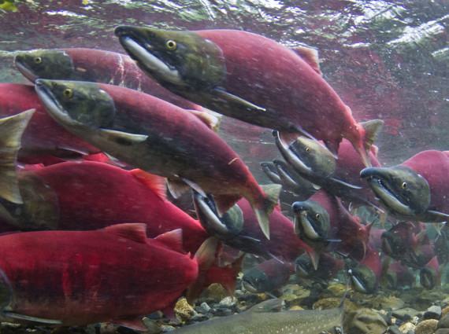
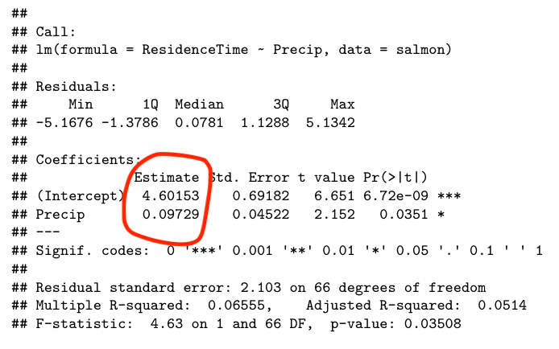

```{r setup, include=FALSE}
knitr::opts_chunk$set(echo = FALSE)

rm(list=ls())
library(tidyverse)

```
---


## Readings

\textbf{Required for class:}

  - NA

\bigskip\textbf{Optional:}

  - [\textcolor{teal}{Crawley, M. \textit{Statistics: An Introduction Using R}}](https://www.amazon.com/Statistics-Introduction-Michael-J-Crawley/dp/1118941098/ref=dp_ob_title_bk)

  - [\textcolor{teal}{Bolker, B. \textit{Ecological Models and Data in R - Ebook version}}](https://ms.mcmaster.ca/~bolker/emdbook/book.pdf)


## On to statistical analysis.


```{r, out.width='90%', fig.align='center', fig.cap=''}
knitr::include_graphics('../images/R_pipeline.png')
```


## Data

A [\textcolor{teal}{dataset}](http://people.stat.sfu.ca/~cschwarz/Stat-Ecology-Datasets/) looking at salmon residence time in streams and how that varies with sex, age, year and preciptiation.


```{r, out.width='90%', fig.align='center', fig.cap=''}

```

## Data

This dataset has multiple types of X variables (both categorical and continuous) and a single Y variable so we can look at different types of linear models.

\scriptsize
```{r, eval=TRUE, echo=FALSE, warning=FALSE, message=FALSE}

salmon <- read_csv("../data/salmon.csv")
salmon

```


## General Linear Models

*General Linear Models* refer to linear regression models that have a continuous dependent variable (Y) and a single or series of independent variables (X's) that can be either continuous or categorical. *They all assume normal distributions.* These models can have specific names depending on their type, but are all linear models.


- **Regression** - continuous Y, 1 continuous X. `lm()`
- **ANOVA** - continuous Y, categorical X. `aov()`
- **Multiple Linear Regression** - continuous Y, multiple continuous X. `lm()`
- **ANCOVA** - continuous Y, at least 1 continuous X and at least 1 categorical X. `lm()`


## General Linear Models - Assumptions


1.  Relationships are (all) linear 

    - *For regressions only*
    
2.  (Multivariate) Normal distributions of error variance $\epsilon$
3.  Equal variance (aka - Homoscedasticity)
    
    - ANOVA's are pretty robust to this
4.  Independence of observed samples


## Normality Assumption

How are the data distributed?

\bigskip
\scriptsize
```{r, eval=TRUE, echo=FALSE, warning=FALSE, message=FALSE, fig.height = 6}

ggplot(salmon)+
  geom_histogram(aes(x = ResidenceTime), binwidth = 1)+
  theme_bw()+
  theme(text = element_text(size=18))

```

## Normality Assumption

Try a **normal Q-Q plot**

\bigskip
\scriptsize
```{r, eval=TRUE, echo=FALSE, warning=FALSE, message=FALSE, fig.height = 6}

qqnorm(salmon$ResidenceTime)
qqline(salmon$ResidenceTime)

```


## Normality Assumption

Try a **Shapiro-Wilk Test**

- $H_0$: Data are not different from a normal distribution
- $H_a$: Data are different from a normal distribution

\bigskip
\scriptsize
```{r, eval=TRUE, echo=TRUE, warning=FALSE, message=FALSE, fig.height = 6}

shapiro.test(salmon$ResidenceTime)

```


## Regression - Experimental Design 


**Dependent variable (Y) is continuous, independent variable (X) is continuous.**

$Y_{i} = \beta_0 + \beta_iX_i + \epsilon$ ($\beta_0$ is the intercept, $\beta_i$ is the slope coefficient and $\epsilon$ is the error)

\smallskip
$H_0$: no relationship between X and Y

\bigskip
Some Questions...

\bigskip

- How does elevation (X) alter a plant's seed production (Y)?
- How does temperature (X) alter a lizard's metabolic rate (Y)?
- How does the year (X) influence the average global temperature (Y)?


## Regression

Does residence time within a stream depend on the amount of precipitation?

\bigskip
\scriptsize
```{r, eval=TRUE, echo=FALSE, warning=FALSE, message=FALSE, fig.height = 6}

ggplot(salmon)+
  geom_point(aes(x = Precip, y = ResidenceTime))+
  theme_bw()+
  theme(text = element_text(size=18))+
  labs(x="Precipitation (cm)", y = "Residence Time in Streams")


```

## Regression

Does residence time within a stream depend on the amount of precipitation?


\scriptsize
```{r, eval=TRUE, echo=TRUE, warning=FALSE, message=FALSE, fig.height = 6}

test_reg <- lm(ResidenceTime ~ Precip, data = salmon)
summary(test_reg)

```


## Regression

$Y_{i} = \beta_0 + \beta_iX_i + \epsilon$ 


Y = 4.6015 + 0.0973X + $\epsilon$

\bigskip
```{r, out.width='90%', fig.align='center', fig.cap=''}

```


## Residuals

Residual plots show you the difference between your observed data ($y$), and the expected, or fitted value ($\hat{y}$).

$Residual = y - \hat{y}$

\scriptsize
```{r, eval=TRUE, echo=TRUE, warning=FALSE, message=FALSE, fig.height = 6}

test_reg_resid <- resid(test_reg)
```

```{r, eval=TRUE, echo=FALSE, warning=FALSE, message=FALSE, fig.height = 5}

plot(salmon$Precip, test_reg_resid, 
    ylab="Residuals", xlab="Individual") 
abline(0, 0)  

```


## Residuals

$Residual = y - \hat{y}$

\bigskip

```{r, eval=TRUE, echo=FALSE, warning=FALSE, message=FALSE, fig.height = 5}

salmon$predicted <- predict(test_reg)
salmon$residuals <- residuals(test_reg)


ggplot(salmon, aes(x = Precip, y = ResidenceTime)) +
  geom_smooth(method = "lm", se = FALSE, color = "lightgrey") +
  geom_segment(aes(xend = Precip, yend = predicted), alpha = .2) +

  # > Color adjustments made here...
  geom_point(aes(color = residuals)) +  # Color mapped here
  scale_color_gradient2(low = "blue", mid = "white", high = "red") +  # Colors to use here
  guides(color = FALSE) +
  # <

  geom_point(aes(y = predicted), shape = 1) +
  theme_bw()

```


## ANOVA - Experimental Design 

**Dependent variable (Y) is continuous, independent variable (X) is categorical.**

$Y_{ij} = \mu + \alpha_i + \epsilon_{ij}$ ($\mu$ is the grand mean, $\alpha_i$ is the $i^{th}$ group mean and $\epsilon_{ij}$ is the error)

\smallskip
$H_0$: no difference among groups


\bigskip
Some Questions...

- How does a diet treatment (X) alter an animal's growth rate (Y)?
- How do nutrient additions (X) alter plant species diversity (Y)?
- How does sex of an organism (X) alter it's feeding behavior (Y)?
- How does plant family (X) alter a plant's SLA (Y)?


## ANOVA vs t-test

For 2 groups of equal size, ANOVA's and t-tests give you the same result.

\tiny
```{r, eval=TRUE, echo=TRUE, warning=FALSE, message=FALSE, fig.height = 6}

x <- c("m", "m", "m", "m", "m", "f", "f", "f", "f", "f")
y <- c(5,4,4,3,3,7,5,7,6,6)

t.test(y ~ x)

anova(lm(y ~ x))

```


## ANOVA 

Is residence time within a stream a function of the age of the fish?

\bigskip
\scriptsize
```{r, eval=TRUE, echo=FALSE, warning=FALSE, message=FALSE, fig.height = 6}

ggplot(salmon)+
  geom_boxplot(aes(x = Age, y = ResidenceTime))+
  theme_bw()+
  theme(text = element_text(size=18))+
  labs(x="Sex", y = "Residence Time in Streams")


```


## ANOVA

Is residence time within a stream a function of the age of the fish?

\bigskip

\scriptsize
```{r, eval=TRUE, echo=TRUE, warning=FALSE, message=FALSE}

test_aov <- aov(ResidenceTime ~ Age, data = salmon)
summary(test_aov)


```


## ANOVA - Post Hoc Test

But this only tells you that age significantly predicts residence time.  Which groups are different from each other?

\bigskip
\bigskip

\scriptsize
```{r, eval=TRUE, echo=TRUE, warning=FALSE, message=FALSE}

TukeyHSD(test_aov)


```


## Multiple Linear Regression - Experimental Design 

**Dependent variable (Y) is continuous, multiple independent variables (X) that are all continuous.**

$Y_{i} = \beta_0 + \beta_1X_{1i} + \beta_2X_{2i} + ... + \epsilon$ 

-  $\beta_i$ are **partial regression coefficients** - the effect of $X_i$ while holding all other $X$ constant

\smallskip
$H_0$: no difference among slopes

\bigskip
Some Questions...

- How does elevation (X1) and temperature (X2) alter a plant's seed production (Y)?
- How does temperature (X1) and humidity (X2) alter a lizard's metabolic rate (Y)?
- How does the year (X1) and atmospheric CO2 level (X2) influence the average global temperature (Y)?


## Multiple Linear Regression

Does residence time within a stream depend on the amount of precipitation and the year?


\scriptsize
```{r, eval=TRUE, echo=FALSE, warning=FALSE, message=FALSE, fig.height = 6}

ggplot(salmon, aes(x = Precip, y = ResidenceTime, color = as.factor(Year)))+
  geom_point(cex = 2)+
  geom_smooth(method = lm)+
  theme_bw()+
  theme(text = element_text(size=18))+
  labs(x = "Precipitation (cm)", y = "Residence Time in Streams", color = "Year")

```


## Multiple Linear Regression

Does residence time within a stream depend on the amount of precipitation and the year?
\bigskip

\tiny
```{r, eval=TRUE, echo=TRUE, warning=FALSE, message=FALSE, fig.height = 6}

test_mreg <- lm(ResidenceTime ~ Year + Precip, data = salmon)
summary(test_mreg)

```


## ANCOVA - Experimental Design 


**Dependent variable (Y) is continuous, multiple independent variables (X), where at least one is continuous and one is categorical.**

$Y_{ij} = \mu + \alpha_i + \beta_{within} (X_{ij} - \overline{X_i}) + \epsilon_{ij}$ 

\smallskip
$H_0$: no difference among slopes, no difference among groups.

- First compares slopes, then compares groups while holding effects of covariates constant.

Some Questions...

- How does elevation (X1) and nutrient addition (X2) alter a plant's seed production (Y)?
- How does temperature (X1) and the sex of an individual (X2) alter lizard's metabolic rate (Y)?
- How does the year (X1) and atmospheric CO2 level (X2) and habitat type (X3) influence plant biomass (Y)?


## ANCOVA


Does residence time within a stream depend on the amount of precipitation, the year, and the sex of the fish?
\bigskip

\tiny
```{r, eval=TRUE, echo=TRUE, warning=FALSE, message=FALSE, fig.height = 6}

test_mreg <- lm(ResidenceTime ~ Precip + Year + Sex , data = salmon)
summary(test_mreg)

```


## ANCOVA

Does residence time within a stream depend on the amount of precipitation, the year, and the sex of the fish?

\bigskip 

\scriptsize
```{r, eval=TRUE, echo=FALSE, warning=FALSE, message=FALSE, fig.height = 5.5}

ggplot(salmon, aes(x = Precip, y = ResidenceTime, color = Sex))+
  geom_point()+
  geom_smooth(method = "lm", se = TRUE)+
  theme(text = element_text(size=18))+
  theme_bw()

```


