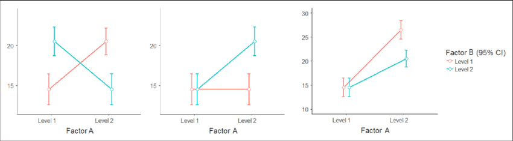

```{r setup, include=FALSE}
knitr::opts_chunk$set(echo = FALSE)

rm(list=ls())
library(tidyverse)

```
---


## Readings

\textbf{Required for class:}

  - NA

\bigskip\textbf{Optional:}

  - [\textcolor{teal}{Crawley, M. \textit{Statistics: An Introduction Using R}}](https://www.amazon.com/Statistics-Introduction-Michael-J-Crawley/dp/1118941098/ref=dp_ob_title_bk)

  - [\textcolor{teal}{Bolker, B. \textit{Ecological Models and Data in R - Ebook version}}](https://ms.mcmaster.ca/~bolker/emdbook/book.pdf)

  - [\textcolor{teal}{Harpole et al. (2011) Nutrient co-limitation of primary producer communities. \textit{Ecology Letters}. 14(9):852-862.}](https://onlinelibrary.wiley.com/doi/full/10.1111/j.1461-0248.2011.01651.x)


## Factorial Experiments


```{r, out.width='90%', fig.align='center', fig.cap=''}

```


## Factorial Experiments


```{r, out.width='90%', fig.align='center', fig.cap=''}

```


## Factorial ANOVA - Experimental Design 


**Dependent variable (Y) is continuous, independent variables (X) are categorial and interacting**

\bigskip

Interactions measure the *joint* effect of main effects A and B

- Identifies if response of A is dependent on level of B

\bigskip
$Y_{ijk} = \mu + \alpha_i + \beta_{j} + (\alpha\beta)_{ij} + \epsilon_{ijk}$ 


\bigskip
Significant interactions: main effects not interpertable **without** clarification.

\bigskip

**Very** common in biology

\bigskip
\footnotesize

*You can add more factors, but it requires a larger sample size (N)*


## What do Interactions Look Like?


```{r, out.width='100%', fig.align='center', fig.cap=''}

```


## How do Factors Add?


```{r, out.width='100%', fig.align='center', fig.cap='Harpole et al. 2011. Ecology Letters'}

```


## Data

Biomass differences for plants with either nitrogen (N), phosphorus (P), both (NP), or neither (C) treatments. 


```{r, out.width='90%', fig.align='center', fig.cap=''}
knitr::include_graphics('../images/biomass_image.jpg')
```

## Experimental Design

Biomass differences for plants with either nitrogen (N), phosphorus (P), both (NP), or neither (C) treatments. 


```{r, out.width='80%', fig.align='center', fig.cap=''}

```


## Data

You can see that the columns `n` and `p` mirror the experimental design in the previous slide. 0's indicate that the treatment is not in that plot, and 1's indicate that the treatment is applied. So control plots are `0-0`, nitrogen plots are `1-0`, phosphorus plots are `0-1`, and nitrogen and phophorous plots are `1-1`.

\bigskip

\scriptsize
```{r, eval=TRUE, echo=FALSE, warning=FALSE, message=FALSE}

biomass <- read_csv("../data/biomass.csv")

biomass %>% arrange(block)


```


## ANOVA


How does the addition of Nitrogen and/or Phosphorous influence the biomass of plants?
\bigskip

\tiny
```{r, eval=TRUE, echo=FALSE, warning=FALSE, message=FALSE, fig.height = 6}

biomass$trt <- factor(biomass$trt, levels =c("C", "N","P", "NP"))

ggplot(biomass, aes(x = trt, y = biomass))+
  geom_boxplot()+
  theme_bw()+
  theme(text = element_text(size=18))+
  labs(x = "Nutrient treatment", y = "Biomass (g)")


```


## ANOVA


Does the addition of Nitrogen, Phosphorous, or Nitrogen and Phosphorous influence the biomass of plants?
\bigskip

\tiny
```{r, eval=TRUE, echo=TRUE, warning=FALSE, message=FALSE, fig.height = 6}

test_aov <- lm(biomass ~ trt , data = biomass)
summary(test_aov)

```

## Factorial ANOVA


Does the interaction of Nitrogen and Phosphorous influence the biomass of plants?
\bigskip

\tiny
```{r, eval=TRUE, echo=TRUE, warning=FALSE, message=FALSE, fig.height = 6}

test_aovf <- lm(biomass ~ n * p , data = biomass)
summary(test_aovf)

```

## Interaction Plot

\scriptsize
```{r, eval=TRUE, echo=FALSE, warning=FALSE, message=FALSE, fig.height = 6}

summary_dat <- biomass %>%
                group_by(n, p, trt) %>%
                summarise(mean_biomass = mean(biomass),
                          sd_biomass = sd(biomass))

ggplot(summary_dat, aes(x = as.factor(n), y = mean_biomass, colour = as.factor(p), group = as.factor(p)))+
  geom_line(lwd = 2, alpha = 0.3)+
  geom_point(size = 4, alpha = 0.5)+
  geom_errorbar(aes(ymin = mean_biomass - sd_biomass,
                    ymax = mean_biomass + sd_biomass), lwd = 2, width = 0.05, alpha = 0.5)+
  theme_bw()+
  theme(text = element_text(size=18))+
  labs(x = "Nitrogen addition", y = "Biomass (g)", colour = "Phosphorous addition")


```


## Higher Order Interactions


`lm(biomass ~ n * p , data = biomass)` is the same thing as `lm(biomass ~ n + p + n:p , data = biomass)`

\bigskip
This matters when you start to get higher order interactions (e.g. more than 2 factors. Because you can start to eliminate the highest interactions if they are not significant via reverse elimination.)

\bigskip

**Start with:** `lm(biomass ~ n * p * k , data = biomass)`

**then:** `lm(biomass ~ n * p * k - n:p:k , data = biomass)`

**then:** `lm(biomass ~ n * p * k - n:p:k - n:p , data = biomass)`

etc.


