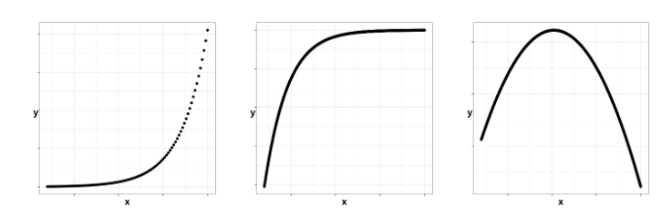

```{r setup, include=FALSE}
knitr::opts_chunk$set(echo = FALSE)

rm(list=ls())
library(tidyverse)
library(stats)  #for nls()
library(bbmle)  #for AICtab()

```


## Readings

\textbf{Required for class:}

  - NA

\bigskip\textbf{Optional:}

  - [\textcolor{teal}{Crawley, M. \textit{Statistics: An Introduction Using R}}](https://www.amazon.com/Statistics-Introduction-Michael-J-Crawley/dp/1118941098/ref=dp_ob_title_bk)

  - [\textcolor{teal}{Bolker, B. \textit{Ecological Models and Data in R - Ebook version}}](https://ms.mcmaster.ca/~bolker/emdbook/book.pdf)

  - [\textcolor{teal}{R-tutorials, Nonlinear Regressions}](https://data-flair.training/blogs/r-nonlinear-regression/)

  - [\textcolor{teal}{Helpful non-linear equations and associated R code}](https://www.statforbiology.com/nonlinearregression/usefulequations#polynomial_fitting_in_r)

## Nonlinear Regression

A nonlinear regression occurs when your data do not follow a linear trend (think: an exponential function, a saturating function, a parabolic function, etc.)


```{r, out.width='100%', fig.align='center', fig.cap=''}

```


## What is the shape of your data?


1. Sometimes you know you have nonlinear or non-normal data and you a-priori know you need to use a non-standard linear model.  For example: 

- Exponential growth.
- Binary response data (survived till the next time point yes/no)
- Count data

\bigskip

2. Sometimes you have data, and you just do not know if you should use a linear or nonlinear model.

## Data

Bacterial colony growth on a medium through time.

\scriptsize
```{r, eval=TRUE, echo=FALSE, warning=FALSE, message=FALSE, fig.height=6}

colony <- read_csv("../data/colony.csv")

ggplot(colony, aes(x = time, y = avg_colony_size))+
  geom_point()+
  theme_bw()+
  theme(axis.title = element_text(face="bold", size=16))+
  labs(x = "Time (days)", y = "Average Colony Size (cm)")

```
\normalsize

Linear? Saturating? Hump-shaped?


## How do you determine the shape of your data?


You can fit $Y$ as a function of $X$, trying several different potential functional types. 

- Then compare your models with AIC to determine which fits best.
    


## $Y$ as a function of $X$

Say we have three potential functions we think might determine the shape of $X$ on $Y$. (You can often find these on Wikipedia!)

- Linear: $Y \sim aX + \epsilon$
\bigskip
- Saturating: $Y \sim \left( \frac{aX}{b + X} \right)+ \epsilon$
\bigskip
- Quadratic: $Y \sim aX^2 + bX + \epsilon$

\bigskip
To do this we need the [\textcolor{teal}{Nonlinear Least Squares function}](https://www.rdocumentation.org/packages/stats/versions/3.6.2/topics/nls) `nls()`. This determines the nonlinear (weighted) least-squares estimates of the parameters of a nonlinear model.


## Running the models

We then run all the models and compare them with AIC.

\scriptsize
```{r, eval=TRUE, echo=TRUE, warning=FALSE, message=FALSE, fig.height=6}
fit_linear <- lm(avg_colony_size ~ time, data = colony)

fit_saturating <- nls(avg_colony_size ~ (a * time)/(b + time), 
                      data = colony, start = list(a = 1 , b = .5))

fit_quad <- nls(avg_colony_size ~ a * time^2 + b * time, 
                data = colony, start = list(a = 0 , b = 0))

AICtab(fit_linear, fit_saturating, fit_quad)
```
\normalsize

So it appears that **of the models we have tried,** the saturating function fits the data the best.


## Always visualize your results

\scriptsize
```{r, eval=TRUE, echo=FALSE, warning=FALSE, message=FALSE, fig.height=8}

ggplot(colony, aes(x = time, y = avg_colony_size))+
  geom_point(aes(cex = 2))+
  geom_line(aes(x = time, y = predict(fit_linear, data.frame(time))), color = "red", lwd = 2)+
  geom_line(aes(x = time, y = predict(fit_saturating, data.frame(time))), color = "orange", lwd = 2)+
  geom_line(aes(x = time, y = predict(fit_quad, data.frame(time))), color = "blue", lwd = 2)+
  theme_bw()+
  theme(axis.title = element_text(face="bold", size=20))+
  labs(x = "Time (days)", y = "Average Colony Size (cm)")+ 
  theme(legend.position = "none")


```
\normalsize


## Running Significance tests

You can pull out the coefficients of your model (here: `a` and `b`).

\scriptsize
```{r, eval=TRUE, echo=TRUE, warning=FALSE, message=FALSE, fig.height=8}
coefficients(fit_saturating)
```
\normalsize


## Running Significance tests


You can test to make sure the coefficients from your `nls()` are different from zero.

\scriptsize
```{r, eval=TRUE, echo=TRUE, warning=FALSE, message=FALSE, fig.height=8}
summary(fit_saturating)
```
\normalsize


## Running Significance tests

You can fit an `lm()` by defining the equation with your parameters, and test for the effect of time on average colony size. But you will have to back transform your results when interpreting (solve for $X$).

\scriptsize
```{r, eval=TRUE, echo=TRUE, warning=FALSE, message=FALSE, fig.height=8}
coeffs <- coefficients(fit_saturating)
colony$a <- as.numeric(coeffs[1])
colony$b <- as.numeric(coeffs[2])

fit_saturating_lm <- lm(avg_colony_size ~ (a * time)/(b + time), 
                        data = colony)

anova(fit_saturating_lm)
```
\normalsize


