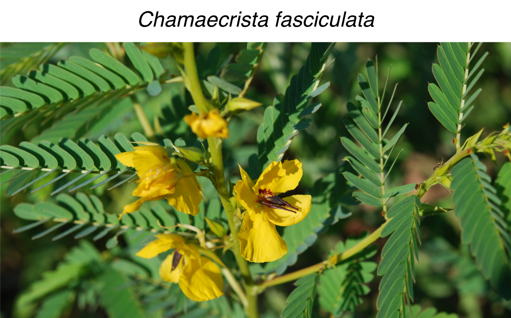
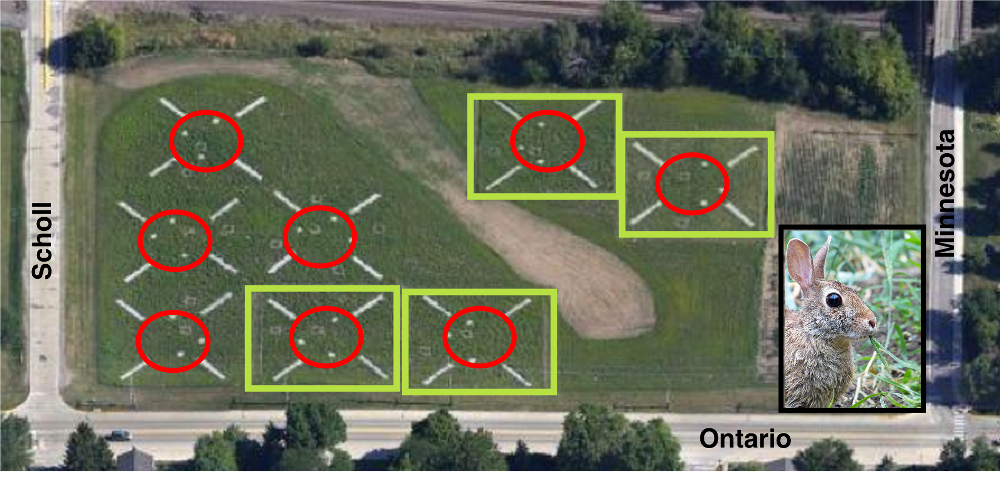
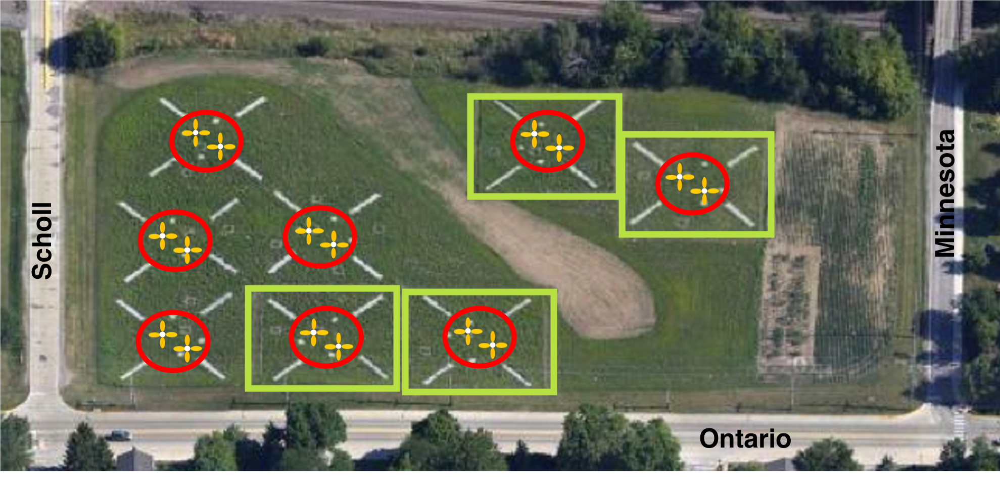
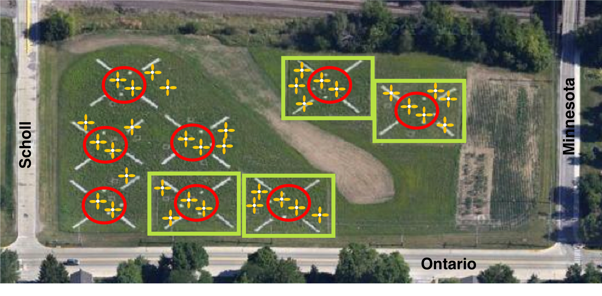

```{r setup, include=FALSE}
knitr::opts_chunk$set(echo = FALSE)

rm(list=ls())
library(tidyverse)
library(stats)  #for nls()
library(bbmle)  #for MLE tests
```


## Readings

\textbf{Required for class:}

  - NA

\bigskip\textbf{Optional:}

  - [\textcolor{teal}{Sullivan et al. 2016 \textit{PLOS ONE}}](https://journals.plos.org/plosone/article?id=10.1371/journal.pone.0147715)

  - [\textcolor{teal}{Bolker, B. \textit{Ecological Models and Data in R - Ebook version}}](https://ms.mcmaster.ca/~bolker/emdbook/book.pdf)

  - [\textcolor{teal}{Brooks-Bartlett, J. \textit{Probability concepts explained: Maximum likelihood estimation}}](https://towardsdatascience.com/probability-concepts-explained-maximum-likelihood-estimation-c7b4342fdbb1)


## What distribution to use?

Sometimes you are in a situation where you have your data, but you do not know what distribution fits your dependent variables ($Y$'s) and thus you don't know what approach to take for the rest of your analysis.

\bigskip

You need a method for determining which distribution fits your data most appropriately.


## Maximum Likelihood

To determine what distribution best fits your data, you need to use maximum likelihood estimation, which allows you to determine the *maximum likelihood estimates* (MLE) of the parameters of the potential distributions you are testing. These parameter estimates define the distribution so it **MOST LIKELY** fits the data.

\bigskip

NOTE: We try to maximize the log of the likelihood. But note that in most cases people *minimize* the negative log-likelihood instead of maximizing the positive log-likelihood.


## Data

Restored prairie experiment to understand how the presence/absence of hervivores alter the movement of the native Partridge Pea (*Chamaecrista fasciculata*) away from source locations. 

```{r, out.width='75%', fig.align='center', fig.cap='From: Sullivan et al. 2016 PLOS ONE'}

```


## Experimental Design

Have experimental units that either allow/deny herbivores access to the restored prairies.

```{r, out.width='100%', fig.align='center', fig.cap=''}

```


## Experimental Design

Plant Partridge Pea in known locations.

```{r, out.width='100%', fig.align='center', fig.cap=''}

```


## Experimental Design

Measure how far away from the sources the new plants move and determine the shape of this distribution.

```{r, out.width='100%', fig.align='center', fig.cap=''}

```


## Graph the $Y$'s to see what shape they take.

```{r, eval=TRUE, echo=FALSE, warning=FALSE, message=FALSE, fig.height = 6}

chafas <- read_csv("../data/chafas.csv")

ggplot(chafas)+
  geom_histogram(aes(distance_.1bins), binwidth = 1)+
  theme_bw()+
  theme(axis.title = element_text(face="bold", size=18),
        legend.text = element_text(size = 18),
        legend.title = element_text(size = 18))+
  labs(x = "Distance (m)", y = "Number moved")


```


## Fit different distributions with MLE - Normal

\scriptsize
```{r, eval=TRUE, echo=TRUE, warning=FALSE, message=FALSE, fig.height = 6}

fit.norm.disc <- mle2(chafas$distance_.1bins~dnorm(mean=mu, sd=s), 
                      start=list(mu=mean(chafas$distance_.1bins), 
                                 s=sd(chafas$distance_.1bins)), 
                      data=chafas)
summary(fit.norm.disc)
```


## Fit different distributions with MLE - Exponential

\scriptsize
```{r, eval=TRUE, echo=TRUE, warning=FALSE, message=FALSE, fig.height = 6}

fit.exp.disc<- mle2(chafas$distance_.1bins~dexp(rate=rate), 
                    start=list(rate=11), data= chafas)
summary(fit.exp.disc)
```


## Fit different distributions with MLE - Poisson

\scriptsize
```{r, eval=TRUE, echo=TRUE, warning=FALSE, message=FALSE, fig.height = 6}

fit.pois.disc<-mle2(chafas$distance_.1bins~dpois(lambda=l),
                    start=list(l=mean(chafas$distance_.1bins)),
                    data= chafas)
summary(fit.pois.disc)
```


## Fit different distributions with MLE - Negative Binomial

\scriptsize
```{r, eval=TRUE, echo=TRUE, warning=FALSE, message=FALSE, fig.height = 6}

fit.nbinom.disc<-mle2(chafas$distance_.1bins~dnbinom(mu=m, size=s),
                      start=list(m=10, s=.1),data= chafas)
summary(fit.nbinom.disc)
```

## Use AIC to determine the difference between models

\scriptsize
```{r, eval=TRUE, echo=TRUE, warning=FALSE, message=FALSE, fig.height = 6}

AICtab(fit.norm.disc, fit.exp.disc, fit.pois.disc, fit.nbinom.disc)
```

## Graph the data and estimated distributions of your data based on likelihood estimates of parameters

\scriptsize
```{r, eval=TRUE, echo=FALSE, warning=FALSE, message=FALSE, fig.height = 7}

mu.mle.norm.disc<-coef(fit.norm.disc)[[1]]
sd.mle.norm.disc<-coef(fit.norm.disc)[[2]]
rate.mle.exp.disc<-coef(fit.exp.disc)[[1]]
lambda.mle.pois.disc<-coef(fit.pois.disc)[[1]]
mu.mle.nbinom.disc<-coef(fit.nbinom.disc)[[1]]
size.mle.nbinom.disc<-coef(fit.nbinom.disc)[[2]]

par(mfrow=c(1,1))
plot(density(chafas$distance_.1bins),xlab='distance',lwd=4,ylim=c(0,.07),xlim=c(0,60), main="fit of various distributions in relation to measured distance data")
curve(dnorm(x,mean=mu.mle.norm.disc,sd=sd.mle.norm.disc),-20,100,col='blue',lwd=2,add=T)
curve(dexp(x,rate=rate.mle.exp.disc),0,100,col='red',lwd=2,add=T)
curve(dpois(x,lambda=lambda.mle.pois.disc),0,100,col='green',lwd=2, add=T)
curve(dnbinom(x,mu=mu.mle.nbinom.disc, size=size.mle.nbinom.disc),0,100,col='orange',lwd=4, lty=2,add=T)
legend(40,0.06,legend=c('data distn','normal distn','exponential distn', 'pois distn', 'negbinom distn'),lty=1,col=c('black','blue','red', "green", "orange"),lwd=c(4,2,2,2,2))

```


