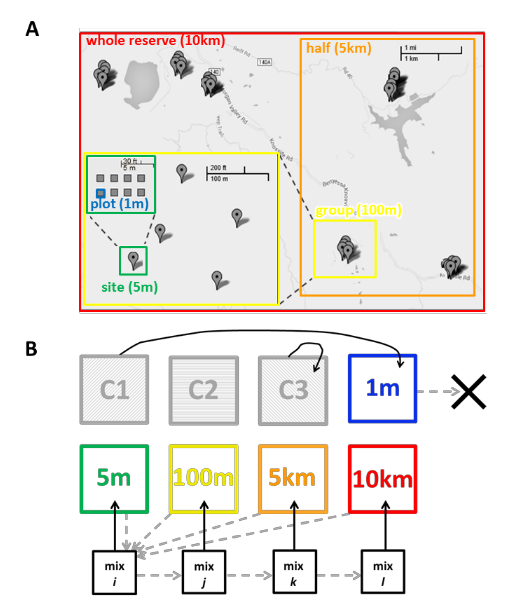
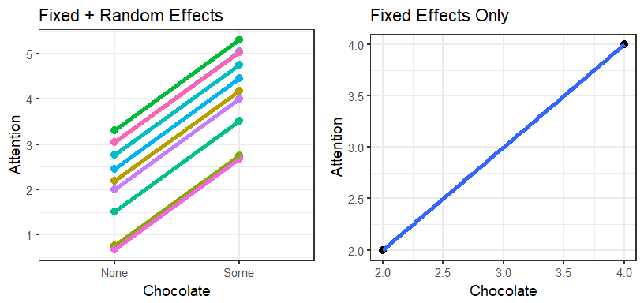
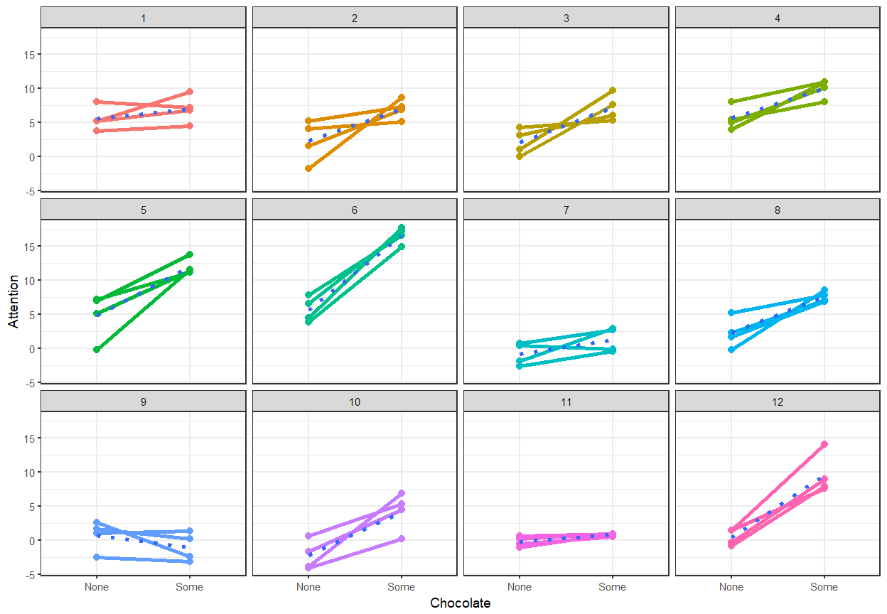
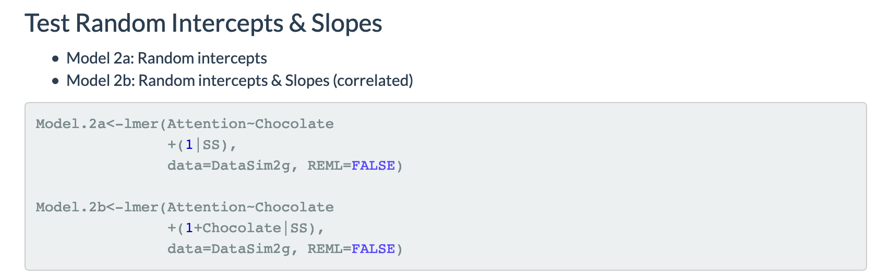
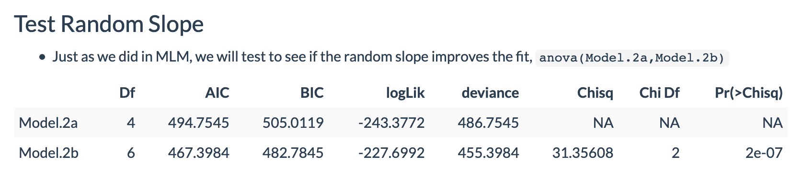
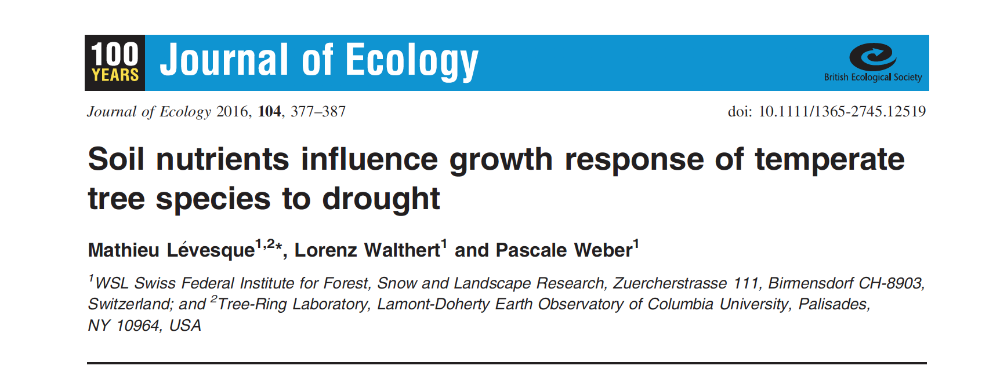
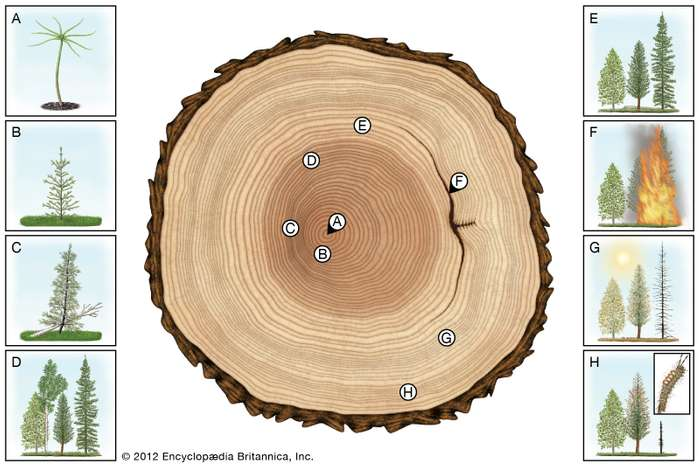

```{r setup, include=FALSE}
knitr::opts_chunk$set(echo = FALSE)

rm(list=ls())
library(tidyverse)
library(stats)  #for nls()
library(bbmle)  #for AICtab()
library(lme4)
library(lmerTest)
library(emmeans)
library(MuMIn)


```

## Readings

\textbf{Required for class:}

  - NA

\bigskip\textbf{Optional:}


- [\textcolor{teal}{Coding Club - Mixed Effects Models}](https://ourcodingclub.github.io/2017/03/15/mixed-models.html)

- [\textcolor{teal}{Dr. Demos Mixed Models}](http://www.alexanderdemos.org/Mixed6.html#mixed:_random_intercepts__slopes)


## Mixed Effects Models

Sometimes our linear models do not work because we do not have independence between all of our data points. For example: 

1.  You want to study how rodent population size varies with seabird density across a series of islands and the islands are different in some way that affects your data (different temperature, nutrient content, predators, etc).
2.  You have different people scoring videos of chimp behavior in response to food rewards and each person scores a bit differently (but is still consistent within their own scoring).
3.  You want to know how different diets affect milk production in cows, and there are with multiple feeding trials on a single animal.
4.  You are interested in the effects of grazing on specific leaf area of plants in the tropics, but some plant families have larger leaves in general than others.


## Mixed Effects Models

*Mixed Effects Models* have both fixed and random effects. 

\bigskip
$Y \sim$ Fixed Effects + Random Effects

\bigskip
By this, we mean that our predictor variables (our $X$ variables) come from a fixed distribution, but the intercepts and/or slopes of our statistical equations are allowed to vary randomly based on our specified random effects.


Practically, I like to think about think about Fixed Effects as the dependent variables that you are interested in, while taking the Random Effects into account. You don't really care so much about random effects - you just want to account for their variability.


## Breaking Down the Examples

1.  You want to study how rodent population size varies with seabird density across a series of islands and the islands are different in some way that affects your data (different temperature, nutrient content, predators, etc).


\bigskip
\bigskip
Rodent Population Size ~ Seabird Density (Fixed) + Islands (Random)


## Breaking Down the Examples

2.  You have different people scoring videos of chimp behavior in response to food rewards and each person scores a bit differently (but is still consistent within their own scoring).


\bigskip
\bigskip

Chimp Behavior ~ Food Reward Type (Fixed) + Person Scoring Videos (Random)


## Breaking Down the Examples

3.  You want to know how different diets affect milk production in cows, and there are with multiple feeding trials on a single animal.

\bigskip
\bigskip

Milk Production ~ Diet (Fixed) + Individual Animal (Random)


## Breaking Down the Examples

4.  You are interested in the effects of grazing on specific leaf area of plants in the tropics, but some plant families have larger leaves in general than others.


\bigskip
\bigskip

Specific Leaf Area ~ Grazing (Fixed) + (Plant Family/Plant Individual) (Random)


## Experimental Design - Blocking

One way to avoid heterogeneity is the use of blocking.

- A set of all treatment plots within an experiment are randomly placed in one of x locations to account for differences in fields. Then block becomes the random effect.

```{r, out.width='40%', fig.align='center', fig.cap='Germain et al. 2017'}

```


## Random Intercepts

Say you are interested in the effect that [\textcolor{teal}{eating chocolate has on attention span.}](http://www.alexanderdemos.org/Mixed6.html#mixed:_random_intercepts__slopes)


```{r, out.width='100%', fig.align='center', fig.cap=''}

```

The overall trend may be that eating some chocolate increases attention, but you can see there is a clear difference in innate attention span among your subjects. 


## Random Slopes

But what if you ran the trials multiple times.  You might find that the slope of the realtionship between chocolate and attention varies as well.

```{r, out.width='75%', fig.align='center', fig.cap=''}

```

Across trials people may vary in how much or how little their attention increases with eating chocolate.


## Libraries

There are several libraries you will need for mixed models.

1.   `library(lme4)` - runs the [\textcolor{teal}{mixed effects models}](https://cran.r-project.org/web/packages/lme4/lme4.pdf)

      - Also works for running generalized linear mixed effects models 'glmer()', and non-linear mixed effects models 'nlmer()'
    
      - If you have complicated variance/covariance structures, consider 'library(nlme)'

2.  `library(lmerTest)` - provides your [\textcolor{teal}{p-value}](https://cran.r-project.org/web/packages/lmerTest/lmerTest.pdf) with Type I, II or III sums of squares.

      
3.  `library(emmeans)` - allows you to specify [\textcolor{teal}{contrasts}](https://cran.r-project.org/web/packages/emmeans/emmeans.pdf)

4.  `library(MuMIn)` - describes conditional and marginal [\textcolor{teal}{variance components}](https://cran.r-project.org/web/packages/MuMIn/MuMIn.pdf) 


## Model Statements

\scriptsize
```{r, eval=FALSE, echo=TRUE, warning=FALSE, message=FALSE, fig.height = 6}
random_intercept <- lmer(Response Variable ~ 
                      Dependent 1 + Dependent 2 + Dependent 3 + 
                      (1|random_intercept), data=your_data, REML=TRUE)


random_slope_intercept <- lmer(Response Variable ~ 
                      Dependent 1 + Dependent 2 + Dependent 3 + 
                      (1 + random_slope|random_intercept),
                      data=your_data, REML=TRUE)

```

\bigskip
\normalsize
**Note:** you use `REML = TRUE` for small sample sizes, as it optimizes your estimates using Restricted Maximum Likelihood  [\textcolor{teal}{(REML)}](https://en.wikipedia.org/wiki/Restricted_maximum_likelihood) instead of Log-likelihood. The log-likelihood estimates are biased low when your sample sizes are small.


## Model Statements - Multiple and Nested Random Effects

Sometimes you have more than one random effect, or random effects are nested, like plot is nested within block.

\bigskip
\scriptsize
```{r, eval=FALSE, echo=TRUE, warning=FALSE, message=FALSE, fig.height = 6}
random_intercept_multi <- lmer(Response Variable ~ 
                      Dependent 1 + Dependent 2 + Dependent 3 + 
                      (1|random_intercept1) + (1|random_intercept2),
                      data=your_data, REML=TRUE)

random_intercept_nested <- lmer(Response Variable ~ 
                      Dependent 1 + Dependent 2 + Dependent 3 + 
                      (1|random_intercept_block/random_intercept_plot),
                      data=your_data, REML=TRUE)

```


## Chocolate Example

For the chocolate and attention example, you could run two models, one with a random intercept, and one with a random slope **and** intercept and find out which fits best.

```{r, out.width='100%', fig.align='center', fig.cap=''}

```


## Chocolate Example
Then compare your model results with `anova(model1, model2)`.

\bigskip
```{r, out.width='100%', fig.align='center', fig.cap=''}

```

\bigskip
The model with both the random intercept and slope (Model2b) fits better based on AIC (and many other comparison tests).

## Type I, II, and III Sums of Squares

Specifying the sums of squares allows you to be specific about how you want to evaluate the `anova()` of your mixed effects model when you have *multiple dependent variables*.

- **Type I sums of squares** are sequential and are evaluated in the order they are written. $Y \sim X_1 + X_2 + X_3 + random$ may not necessarily equal $Y \sim X_3 + X_1 + X_2 + random$, etc.

- **Type III sums of squares** are partial, and basically every term in the model is evaluated in light of every other term, including interactions. So it evaluates all conbinations of $X_1 + X_2 + X_3$.

    - If you have a perfectly balanced factorial design, then this is equivalen to Type III sums of squares.
    
- **Type II sums of squares** are similar to Type III, but they are marginal - they evaluate in the light of all other terms, but not the interaction terms (so just the additive ones)


##  Data

We will be looking at [\textcolor{teal}{tree ring data}](https://besjournals.onlinelibrary.wiley.com/doi/10.1111/1365-2745.12519) and how growth of trees is affected by their climatic and soil conditions.

\bigskip

```{r, out.width='100%', fig.align='center', fig.cap=''}

```


## Tree Rings


```{r, out.width='100%', fig.align='center', fig.cap=''}

```


##  Tree Ring Data

Does the diameter at breast height (dbh), the mean temperature (tmean) and the soil nutrient level (C.N) influence the average tree ring width (trw.mean)?

\bigskip

\scriptsize
```{r, eval=TRUE, echo=TRUE, warning=FALSE, message=FALSE, fig.height = 6}
tree <- read_csv("../data/LME_Data_TreeGrowth_Clim_Soil_Sites.csv")

model_lme <- lmer(trw.mean ~ dbh + tmean + C.N  + (1|site), 
                  data = tree, REML = TRUE)
```

\bigskip
\normalsize
We use site as a random intercept effect in case there is some inherent difference among sites that could obscure the nutrient and climate pattern.


## Tree Ring Results

To get the model results, we use the `anova()` function. Don't forget to specify the type of sums of squares (here, `type = 3`)

\bigskip
\scriptsize
```{r, eval=TRUE, echo=TRUE, warning=FALSE, message=FALSE, fig.height = 6}
anova(model_lme, type = 3)
```

\normalsize
\bigskip
Both dbh and C.N influence tree ring width. So trees with larger dbh tend to have larger rings, and soil with a lower C.N value have smaller rings.


## Variance Components

You can also determine how much of the variance is explained by either the fixed effects alone (marginal - R2m below) or the fixed and random effects (conditional - R2c below).

\bigskip
\scriptsize
```{r, eval=TRUE, echo=TRUE, warning=FALSE, message=FALSE, fig.height = 6}

r.squaredGLMM(model_lme)

```

\bigskip
\normalsize

Here, the fixed effects explain 18\% of the variance, and the fixed and random effects together explain 69\% of the variance.  So in this case, the random effect of site explains a lot of the variance.


## Tree Ring Results

Let's plot the tree ring width against soil nutrient content and demonstrate the random effects. You can see a lot of differences among sites here.

\scriptsize
```{r, eval=TRUE, echo=FALSE, warning=FALSE, message=FALSE, fig.height = 6}

ggplot(tree, aes(x = dbh, y = trw.mean, color = site))+
  geom_point()+
  geom_smooth(aes(x = dbh, y = trw.mean, color = site), method = "lm", se=FALSE)+
  theme_bw()+
  theme(axis.title = element_text(face="bold", size=16))+
  labs(x = "Soil Nutrient Content (C.N ratio)", y = "Average Tree Ring Width")


```


