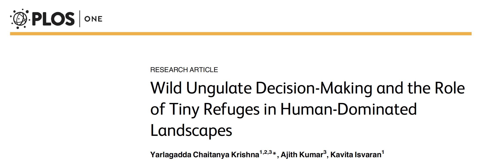

```{r setup, include=FALSE}
knitr::opts_chunk$set(echo = FALSE)

rm(list=ls())
library(tidyverse)
library(lme4)
#library(lmerTest)
#library(emmeans)
library(MuMIn)
library(glmm)


```

---


## Readings

\textbf{Required for class:}

  - NA

\bigskip\textbf{Optional:}

- [\textcolor{teal}{Bolker et al. (2009) Generalized linear mixed models: apractical guide for ecology and evolution. \textit{TREE}.}](http://www.poulsenlabduke.com/uploads/1/9/3/6/19363955/bolker_et_al._2009_tree.pdf)

- [\textcolor{teal}{glmer in lme4}](https://www.rdocumentation.org/packages/lme4/versions/1.1-21/topics/glmer)


## Generalized Mixed Effects Models

When our data are not normal and we have fixed and random effects, we need to used *Generalized* Mixed Effects Models.  The `family` specifications follows the same form as linear models.  Some common types of generalized mixed effects models include:

\bigskip
1.  Poisson - for count data (discrete)
2.  Binomial - for 0/1 data
3.  Inverse Gaussian - for skewed data (continuous)


## Model Statements with `glmer()`

This is part of the `lme4` library.


\bigskip
\bigskip
\scriptsize
```{r, eval=FALSE, echo=TRUE, warning=FALSE, message=FALSE, fig.height = 6}
model_glmer <- glmer(Response Variable ~ 
                     Dependent 1 + Dependent 2 + Dependent 3 + 
                     (1|random_intercept1), data=your_data, 
                     family = your_distribution)

```


##  Data

Let's examine this paper that explores [\textcolor{teal}{ungulate behavior}](https://datadryad.org/stash/dataset/doi:10.5061/dryad.qd740) in response to refuges in urban landscapes in India.

\bigskip

```{r, out.width='100%', fig.align='center', fig.cap=''}

```


## Blackbuck Data

Blackbuck are group-living antelope found on the Indian subcontinent. Krishna et al. hypothesize that in urban settings, blackbuck will be more risk-averse when food availability is high and vice versa.


\bigskip
```{r, out.width='75%', fig.align='center', fig.cap=''}

```


##  Blackbuck Data

Does Blackbuck occurrence (Blackbuck) depend on how open a landscape is (Openness) and it's resource availability as measured by plant biomass (scaled_wt)? The points at which the observations were taken (Pointcode) should be the random intercept.  We should use `family = poisson` here because we have count data.

\bigskip

\scriptsize
```{r, eval=TRUE, echo=TRUE, warning=FALSE, message=FALSE, fig.height = 6}

buck <- read_csv("../data/GLMM_data_Krishna et al. 2016.csv")

model_glm<- glmer(Blackbuck ~ Openness + scaled_wt  + (1|Pointcode), 
                   data = buck, family = poisson)


```


## Blackbuck Results

To get the model results, we use `summary()` for glmer.

\bigskip
\tiny
```{r, eval=TRUE, echo=TRUE, warning=FALSE, message=FALSE, fig.height = 6}
summary(model_glm)
```

The resource availability has a strong effect on blackbuck occurrence, although it is opposite to what was hypothesized. The more resources that are available, the fewer the sightings of blackbuck.


## Variance Components

Again, we can determine the contribution that the fixed and random effects have on the variance explained. 

\bigskip
\scriptsize
```{r, eval=TRUE, echo=TRUE, warning=FALSE, message=FALSE, fig.height = 6}

r.squaredGLMM(model_glm)

```
\bigskip
\normalsize
For GLMM's, you get multiple types of $R^2$ values depending on the method used (e.g. trigamma or lognormal) for the calculations for the binomial family. They should be similar so just state which method you report.

Again, the fixed effects explain a small amount of the variance ($\sim$ 4\%) vs the fixed and random together ($\sim$ 60\%).


## Blackbuck Results

To visualize these results, let's plot the blackbuck occurrence against the scaled biomass data and demonstrate the random effects.

\scriptsize
```{r, eval=TRUE, echo=FALSE, warning=FALSE, message=FALSE, fig.height = 6}

ggplot(buck, aes(x = scaled_wt, y = Blackbuck, color = Pointcode))+
  geom_point()+
  geom_smooth(aes(x = scaled_wt, y = Blackbuck, color = Pointcode), method = "lm", se=FALSE)+
  theme_bw()+
  theme(axis.title = element_text(face="bold", size=16))+
  labs(x = "Scaled Biomass Weight (mg)", y = "Blackbuck Occurrence")


```


## Nonlinear Mixed Effects Models

We are not going to go over these, but I wanted to make you all aware that there are non-linear mixed effects models if your data follows a different functional form that is not linear (e.g. quadratic, parabolic, etc).

\bigskip

For more information, check out the `nlmer()`  [\textcolor{teal}{function}](https://www.rdocumentation.org/packages/lme4/versions/1.1-21/topics/nlmer) 
 in lme4.


