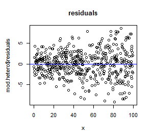

```{r setup, include=FALSE}
knitr::opts_chunk$set(echo = FALSE)

rm(list=ls())
library(tidyverse)
library(bbmle)  #for AICtab()
library(nlme)   #for covariance models in lme
library(lme4)   #for mixed effects models
library(lmerTest) #for mixed effects models
library(glmmTMB)  #for covariance models alternative
library(car) # for Anova() function


```


## Readings

\textbf{Required for class:}

  - NA

\bigskip\textbf{Optional:}

  - [\textcolor{teal}{M. Clark Mixed Models - Extensions for Residual Structure}](https://m-clark.github.io/mixed-models-with-R/extensions.html#residual-structure)

  - [\textcolor{teal}{phylogenetic mixed effects model}](https://datadryad.org/stash/dataset/doi:10.5061/dryad.sj066)


## Residual Structure - Constant

When we have models that assume independence among our data, we assume there is a constant variance across the data and no covariance.

\bigskip
\center
$\bf{y} \sim N(\bf{\mu},\Sigma)$  

$$
\bf{\Sigma} = \begin{bmatrix}
\sigma^2 & 0 & 0 & 0 & 0\\
 0 & \sigma^2 & 0 & 0 & 0\\
 0 & 0 & \sigma^2 & 0 & 0\\
 0 & 0 & 0 & \sigma^2 & 0 \\
 0 &  0 & 0 & 0 & \sigma^2\\
\end{bmatrix}
$$


## Residual Structure - Constant

Imagine the correlation matrix for an entire dataset. Here, you have variance $(\sigma^2)$ for each individual along the diagonal (orange) and there is no covariance among individuals (gray).

```{r, out.width='90%', fig.align='center', fig.cap=''}

```

## Residual Structure - Constant

In this case, when you plot your residuals against your predicted values, the variance is equal (as indicated by the red arrows that approximate the variance), and there is no trend.


```{r, out.width='70%', fig.align='center', fig.cap=''}

```


## Residual Structure - Varying

We can also relax the assumption of equal variance and estimate each separately.  Our covariance matrix (in its simplest form) now looks like this. 

\bigskip


$$
\bf{\Sigma} = \begin{bmatrix}
\sigma_1^2 & 0 & 0 & 0 & 0\\
 0 & \sigma_2^2 & 0 & 0 & 0\\
 0 & 0 & \sigma_3^2 & 0 & 0\\
 0 & 0 & 0 & \sigma_4^2 & 0 \\
 0 &  0 & 0 & 0 & \sigma_5^2\\
\end{bmatrix}
$$

## Residual Structure - Varying


In this case, when you plot your residuals against your predicted values, you see the variance is increasing with increasing x.


```{r, out.width='70%', fig.align='center', fig.cap=''}

```


## Residual Structure - Varying

To make more complicated residual patterns, we need to think about the underlying covariance/correlation.  Let's switch to a correlation structure, but still think about the variances as constant or separately estimated. Here, $\rho$ represents the residual correlation among observations.


$$
\bf{\Sigma} = \sigma_i^2\begin{bmatrix}
1 & \rho_1 & \rho_2 & \rho_3 & \rho_4\\
 \rho_1 & 1 & \rho_5 & \rho_6 & \rho_7\\
 \rho_2 & \rho_5 & 1 & \rho_8 & \rho_9\\
 \rho_3 & \rho_6 & \rho_8 & 1 & \rho_{10} \\
 \rho_4 & \rho_7 & \rho_9 & \rho_{10} & 1\\
\end{bmatrix}
$$

\bigskip
This matrix is "symetric" because you can fold it in half along the diagonal and the $\rho$ values are the same.


## Residual Structure - Varying

So imagine you had 5 measurements and each measurement is correlated with the next one in a sequences, but no others, and that correlation is equal. You might expect the correlation matrix to look something like this.


$$
\bf{\Sigma} = \sigma_i^2\begin{bmatrix}
 1 & 0.06 & 0 & 0 & 0\\
 0.06 & 1 & 0.06 & 0 & 0\\
 0 & 0.06 & 1 & 0.06 & 0\\
 0 & 0 & 0.06 & 1 & 0.06 \\
 0 & 0 & 0 & 0.06 & 1\\
\end{bmatrix}
$$


## Residual Structure - Varying

In this case, we are saying that measurements within individuals are correlated by the same ammount (by 0.06 - blue) but there is no covariance across individuals (gray).  

```{r, out.width='80%', fig.align='center', fig.cap=''}

```


Differences in $\sigma_i^2$ across time could be multiplied by the covariances that are constant within each individual.


## Structured Residuals Example

Let's try to understand this with an example. We have a dataset on individual [\textcolor{teal}{mystery snails}](https://aquaticarts.com/pages/mystery-snail-care-guide), the biomass consumed for each snail over the course of 6 months, and their sex. We want to find out if male or female snails consume more biomass and if this is dependent on month sampled.


```{r, out.width='50%', fig.align='center', fig.cap=''}

```


## Snail Data

\scriptsize
```{r, eval=TRUE, echo=FALSE, warning=FALSE, message=FALSE, fig.height=6}

snails <- read_csv("../data/snails.csv")
snails


```
\normalsize


## Analysis - Mixed Effects Model

One way to model this is with a mixed effects model.

\bigskip
\scriptsize
```{r, eval=TRUE, echo=TRUE, warning=FALSE, message=FALSE, fig.height=6}

mod_lme <- lmer(biomass ~ sex + month + (1|individual), 
                  data = snails, REML = TRUE)
Anova(mod_lme, type = 3)

```
\normalsize
\bigskip
So it seems that male and female snails consume different amounts of biomass, and there is a significant relationship with month and biomass consumed.


## Analysis - Random Effects Model

\scriptsize
```{r, eval=TRUE, echo=FALSE, warning=FALSE, message=FALSE, fig.height=7}
colors <- c("#d55e00", "#56b4e9")

ggplot(snails, aes(x = month, y = biomass, color = sex))+
  geom_jitter( width=.02, alpha=1/3)+
  geom_smooth(aes(x = month, y = biomass, color = sex), method = "lm", 
              se=FALSE)+
  theme_bw()+
  theme(axis.title = element_text(face="bold", size=16))+
  labs(x = "Month", y = "Biomass")+
  scale_color_manual(values=colors)+ 
  theme(legend.text=element_text(size=14), legend.title=element_text(size=16))


```

## Residual correlation?

But we know that there could be different variance structure through time, as months may differ for these snails. 

```{r, eval=TRUE, echo=FALSE, warning=FALSE, message=FALSE, fig.height=6}
plot(snails$month, residuals(mod_lme))

```
Here we clearly see that there are differences in our residuals across months.


## Residual structure

So there is clearly residual structure despite having equal correlation within individuals. So we will need to specify our $\sigma_i^2$'s differently.


$$
\bf{\Sigma} = \sigma_i^2\begin{bmatrix}
 1 & 0.06 & 0 & 0 & 0\\
 0.06 & 1 & 0.06 & 0 & 0\\
 0 & 0.06 & 1 & 0.06 & 0\\
 0 & 0 & 0.06 & 1 & 0.06 \\
 0 & 0 & 0 & 0.06 & 1\\
\end{bmatrix}
$$


## Analysis - `lme()` with weights

To more appropriately deal with the correlation in time across months, you can parameterize weights in a mixed effects model using `lme()` that has slightly different formatting that `lme4()`.

- The way `lme4()` runs under the hood makes it very difficult to include weights, so when you want to account for a correlation structure, use `lme()`. This will allow the model to estimate a different variance for each month.

Check out [\textcolor{teal}{this page}](https://www.rdocumentation.org/packages/nlme/versions/3.1-131/topics/lme) for documentation on how to specify the `weights` argument, and [\textcolor{teal}{this page}](https://www.rdocumentation.org/packages/nlme/versions/3.1-131/topics/varClasses) for the different type of classes of `weights`.

- In our case we will want to use `varIdent` because this allows for different variances according to the level of a classification factor (or here, month).


## Analysis - `lme()` with weights

Here, we are going to specify our `weights = varIdent()` using [\textcolor{teal}{this page}](https://www.rdocumentation.org/packages/nlme/versions/3.1-131/topics/varIdent). We will specify our starting variance (`v`) as 1, and the grouping factor (`g`) as the month.

- Again notice the slightly different form for a mixed effects model in `lme()` vs what we used last time with `lme4()`.

\bigskip
\bigskip
\scriptsize
```{r, eval=TRUE, echo=TRUE, warning=FALSE, message=FALSE, fig.height=6}
mod_corr_month <- lme(biomass ~ sex + month, 
                      data = snails, 
                      random = ~1|individual,
                      weights = varIdent(form = ~1|month))
```


## Analysis - Results

\tiny
```{r, eval=TRUE, echo=FALSE, warning=FALSE, message=FALSE, fig.height=6}
summary(mod_corr_month)
```

## Analysis - Results

So here you again see that males consume less biomass than females, and that there is a positive increase in biomass consumed through time. However you also see that there are different parameters estimated for each month.

\bigskip
Note: With `lme()`, you will some times need to look up your p-values with a table (remember those?). Here, we would need a [\textcolor{teal}{table of t-values}](https://www.sjsu.edu/faculty/gerstman/StatPrimer/t-table.pdf), and you want the one-tailed row.

\bigskip
For example, in our case for sex you have: t-value = -4.15, and DF = 198. 

- So your p-value < 0.0005


## Residual estimates

With this formulation, you get your residual values in standard deviation instead of variance, and as you can see your variance decreases, but the actual values are not provided.

\bigskip
\scriptsize
```{r, eval=TRUE, echo=TRUE, warning=FALSE, message=FALSE, fig.height=6}
summary(mod_corr_month$modelStruct)
```


## Residual estimates

To get actual estimates of your residuals, you will want to scale them and square them to get them on the variance scale.

\bigskip
\bigskip
\tiny
```{r, eval=TRUE, echo=TRUE, warning=FALSE, message=FALSE, fig.height=6}

(c(1.0000000, coef(mod_corr_month$modelStruct$varStruct, unconstrained=F))*mod_corr_month$sigma)^2
```

<!-- ## Alternatives -->

<!-- One alternative that's pretty new is `glmmTMB`.  You can find more information [\textcolor{teal}{here}](https://cran.r-project.org/web/packages/glmmTMB/vignettes/glmmTMB.pdf).  I'm not an expert with this by any means, but this is how you would code our example with `glmmTMB()`. **Note:** Here I'm using "month_name" for the correlation which is a character, not a number. -->

<!-- \bigskip -->
<!-- \bigskip -->
<!-- \scriptsize -->
<!-- ```{r, eval=TRUE, echo=TRUE, warning=FALSE, message=FALSE, fig.height=6} -->

<!-- #devtools::install_github("glmmTMB/glmmTMB/glmmTMB") -->

<!-- # snails$month_name <- as.factor(snails$month_name) -->
<!-- # snails -->


<!-- mod_corr_month2 <- glmmTMB(biomass ~ sex + month + -->
<!--                              (1|individual) + -->
<!--                              diag(0 + month | individual), -->
<!--                              family = gaussian(), -->
<!--                              data = snails) -->


<!-- ``` -->

<!-- ## Alternatives -->

<!-- Run this on your own to see the full model output. -->

<!-- \tiny -->
<!-- ```{r, eval=TRUE, echo=TRUE, warning=FALSE, message=FALSE, fig.height=6} -->

<!-- summary(mod_corr_month2) -->

<!-- ``` -->


<!-- ## Alternatives -->

<!-- To get your residual estimates, try this: -->

<!-- \bigskip -->
<!-- \tiny -->
<!-- ```{r, eval=TRUE, echo=TRUE, warning=FALSE, message=FALSE, fig.height=6} -->

<!-- vc_glmmtmb <- VarCorr(mod_corr_month2) -->
<!-- vc_glmmtmb <- attr(vc_glmmtmb$cond$individual.1, 'stddev')^2 + sigma(mod_corr_month2)^2 -->
<!-- vc_glmmtmb -->

<!-- ``` -->


