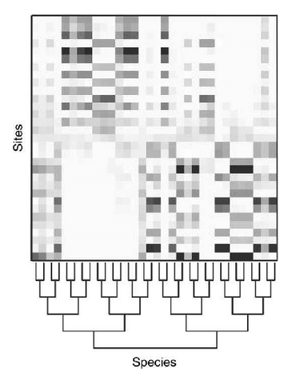

```{r setup, include=FALSE}
knitr::opts_chunk$set(echo = FALSE)

rm(list=ls())
library(tidyverse)
library(bbmle)  #for AICtab()
library(nlme)   #for covariance models in lme
library(lme4)   #for mixed effects models
library(lmerTest) #for mixed effects models
library(glmmTMB)  #for covariance models alternative
library(colorednoise) #for generating autocorrelation


snails <- read_csv("../data/snails.csv")

```

---


## Readings

\textbf{Required for class:}

  - NA

\bigskip\textbf{Optional:}

  - [\textcolor{teal}{M. Clark Mixed Models - Extensions for Residual Structure}](https://m-clark.github.io/mixed-models-with-R/extensions.html#residual-structure)

  - [\textcolor{teal}{Dormann et al. (2007) Methods to account for spatial autocorrelation in the analysis of species distributional data: a review. \textit{Ecography}}](https://www.whoi.edu/cms/files/DormannEcography30_57164.pdf)

  - [\textcolor{teal}{J. Shah 2019. Time Series - ARMA Models in R}](https://rpubs.com/JSHAH/481706)


## Autocorrelation

When data are not correlated, and there is no covariance between points, then there is no autocorrelation in data.  Data are said to be "random" and this is also called white noise. This is the assumption of most models.

\bigskip
```{r, eval=TRUE, echo=FALSE, warning=FALSE, message=FALSE, fig.height=5}

t <- 200
whitenoise <- colored_noise(timesteps = t, mean = 0.5, sd = 0.03, phi = 0)
x <- seq(1,t,1)

dat <- data.frame(cbind(x, whitenoise))


ggplot(dat, aes(x=x, y=whitenoise))+
  geom_point()+
  geom_line()+
  theme_bw()+
  theme(axis.title = element_text(face="bold", size=14))+
  labs(x = "Dimension (space/time/etc)", y = "Data Value")

```


## Positive Autocorrelation

If data are positively autocorrelated, that means that data that are close in time/space/etc are more likely to be **similar**. This is also called red noise.

\bigskip

```{r, eval=TRUE, echo=FALSE, warning=FALSE, message=FALSE, fig.height=5}

t <- 200
rednoise <- colored_noise(timesteps = t, mean = 0.5, sd = 0.03, phi = 0.8)
x <- seq(1,t,1)

dat <- data.frame(cbind(x, rednoise))


ggplot(dat, aes(x=x, y=rednoise))+
  geom_point()+
  geom_line()+
  theme_bw()+
  theme(axis.title = element_text(face="bold", size=14))+
  labs(x = "Dimension (space/time/etc)", y = "Data Value")

```


## Negative Autocorrelation

If data are negatively autocorrelated, that means that data that are close in time/space/etc are more likely to be **dissimilar**. This is also called blue noise.

\bigskip

```{r, eval=TRUE, echo=FALSE, warning=FALSE, message=FALSE, fig.height=5}

t <- 200
bluenoise <- colored_noise(timesteps = t, mean = 0.5, sd = 0.03, phi = -0.8)
x <- seq(1,t,1)

dat <- data.frame(cbind(x, bluenoise))


ggplot(dat, aes(x=x, y=bluenoise))+
  geom_point()+
  geom_line()+
  theme_bw()+
  theme(axis.title = element_text(face="bold", size=14))+
  labs(x = "Dimension (space/time/etc)", y = "Data Value")

```


## Autocorrelation

In our work, we will most likely have to account for positive autocorrelation, as it is common for data to be correlated through space or time.  So when analyzing data through time (or space) we need to think about how to account for this autocorrelation.

- Average daily temperature
- Likelihood of rainfall events
- Moisture content in the soil
- Disease spread across the country


## ARMA models

A common to deal with autocorrelation is through autoregressive (AR) and moving-average (MA) models termed ARMA.

- **AR** *Autoregression*. A model that uses the dependent relationship between an observation and some number of lagged observations. (Makes predictions using previous values of the dependent variable)

- **MA** *Moving Average*. A model that uses the dependency between an observation and a residual error from a moving average model applied to lagged observations. (Makes predictions using the series mean and previous errors)


\bigskip
Basic autocorrelation models we will think about will be either autoregressive **AR**, or autoregressive moving-average **ARMA** models.


## Stationarity

AR and MA models assume **stationarity** of your time-series data (or space-series).  There are three requirements of stationarity

1.  The mean of the series should be constant, not a function of time/space
2.  The variance of th series should be homoscedastic (not a function of time/space)
3.  The covariance of the $i_{th}$ term and the $(i + m)_{th}$ term should not be a function of time.

If data are not stationary, you can detrend (e.g use log()).  We will assume all our data is stationary for this course.


## Note about Autocorreation in Time/Space

There are many many great ways to investigate time/space series data, such as using the current time series to forecast future predictions of the data. ([\textcolor{teal}{See this}](https://rpubs.com/JSHAH/481706) for useful R functions for forecasting with time series data). 

\bigskip
In this course we will only be covering the very basics of accounting for autocorrelation in time/space. We will talk about how to take this correlation into account within a mixed effects model. 


## Positive Autocorrelation

Ok, so let's get back to our positive autocorrelation. Let's consider the case where data that are closer in time are more likely to be similar than those farther in time. This is identical for space, FYI but we will use time as an example.

\bigskip

```{r, eval=TRUE, echo=FALSE, warning=FALSE, message=FALSE, fig.height=5}

t <- 200
rednoise <- colored_noise(timesteps = t, mean = 0.5, sd = 0.03, phi = 0.8)
x <- seq(1,t,1)

dat <- data.frame(cbind(x, rednoise))


ggplot(dat, aes(x=x, y=rednoise))+
  geom_point()+
  geom_line()+
  theme_bw()+
  theme(axis.title = element_text(face="bold", size=14))+
  labs(x = "Dimension (space/time/etc)", y = "Data Value")

```


## Revisiting the Snail Example

So if we go back to our Mystery Snail example, we remember that there were 6 measurements of biomass consumption through time per individual. It may be more likely that the measurements closer in time are more likely to be more similar to each other than those farther in time.


```{r, out.width='90%', fig.align='center', fig.cap=''}
knitr::include_graphics('../images/../images/corr_AR.png')
```

## Correlations with Mixed Models in `lme()`

You can look at [\textcolor{teal}{this page}](https://www.rdocumentation.org/packages/nlme/versions/3.1-131/topics/lme) for documentation on how to specify the `correlation` argument, and [\textcolor{teal}{this page}](https://www.rdocumentation.org/packages/nlme/versions/3.1-131/topics/corClasses) for the different type of classes of `correlations`. Here you will most likely want to use `corAR1` or `corARMA`. We will use the former here, but try the later on your own.

\bigskip
\bigskip
\scriptsize
```{r, eval=TRUE, echo=TRUE, warning=FALSE, message=FALSE, fig.height=5}
mod_corr <- lme(biomass ~ sex + month, 
                data = snails, 
                random = ~1|individual,
                correlation = corAR1(form = ~month))

```

## Model Output

\tiny
```{r, eval=TRUE, echo=FALSE, warning=FALSE, message=FALSE, fig.height=5}
summary(mod_corr)
```


## Phylogeny

Taking into account the phylogeny of your data is another form of correlation. It's more complicated because we need to think more deeply about matrices and how to work with them. So we will come back to this in our multivariate unit.

```{r, out.width='35%', fig.align='center', fig.cap='From: Ives and Helmus 2011'}

```


## Additional thoughts

If you have a correlation structure or weights similar to what we have discussed this week that you want to use for a linear model without random effects, use `gls()`. [\textcolor{teal}{RDocumentation here. }](https://www.rdocumentation.org/packages/nlme/versions/3.1-1/topics/gls?)


