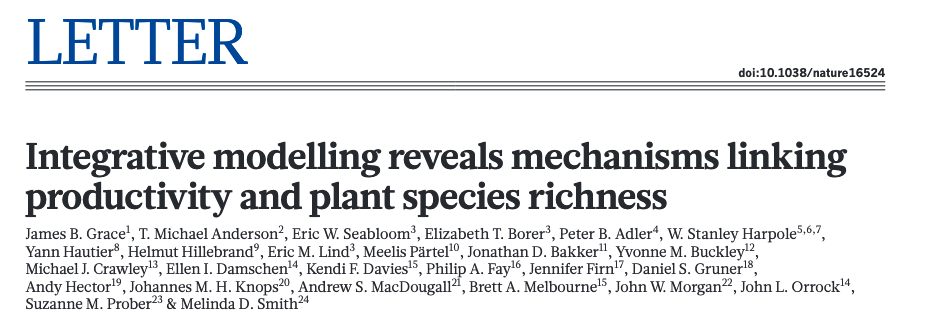

```{r setup, include=FALSE}
knitr::opts_chunk$set(echo = FALSE)

rm(list=ls())
library(tidyverse)
library(bbmle)  #for AICtab()
library(nlme)   #for covariance models in lme
library(lme4)   #for mixed effects models
library(lmerTest) #for mixed effects models
library(glmmTMB)  #for covariance models alternative
library(car) # for Anova() function

```


## Readings

\textbf{Required for class:}

  - NA

\bigskip\textbf{Optional:}

  - [\textcolor{teal}{Prabhakaran, S. r-statistics.co - Model Selection Approaches}](http://r-statistics.co/Model-Selection-in-R.html)

  - [\textcolor{teal}{Grace et al. (2016). Integrative modelling reveals mechanisms linking productivity and plant species richness. Nature}](https://www.nature.com/articles/nature16524#Sec8)


## Model Selection

Sometimes you have a lot of predictor variables and you want to find out which ones you should keep in the model that best predict your response variable.  For example, you have a lot of environmental variables and you want to know what is affecting a biological factor.

 - You have a lot of water variables that describe a stream and you want to know how that affects the invertebrate abundance.

 - You have a lot of plant chemistry data and you want to know what variables predict protein content in seeds.


## Model Selection

This often occurs when you do not have a hypothesis but you have a lot of data and you want to know what is significant.

\bigskip

*Note: Some reviewers will not like this because it can feel like data dredging. But if it makes sense for your research question, you just need to justify it.*  


## Stepwise Regression

Stepwise regression is a way to do model selection where you put in a bunch of additive variables into a linear model, and the `step()` function in the `stats` library uses backward selection (by default) to iteratively search through all variables and determine which ones have the most power. 

The iterations occur by dropping one variable at a time and then all models are tested against each other with AIC.  The variable that produces the smallest AIC score when dropped is then dropped for the next round and so on until there is no more significant drop in AIC.

## Nutrient Network 

Let's try an example with the Nutrient Network, examining how different plant factors (e.g. richness and productivity) respond to various environmental factors (e.g. temperature, preciptitation, nitrogen, carbon, soil fertility, etc.)

\bigskip

```{r, out.width='90%', fig.align='center', fig.cap=''}

```


## Plant Species Richness

\scriptsize
```{r, eval=TRUE, echo=TRUE, warning=FALSE, message=FALSE, fig.height=6}
nutnet <- read_csv("../data/nutnet.csv")

hist(nutnet$richness, breaks = 15)

```

## Plant Productivity

\scriptsize
```{r, eval=TRUE, echo=TRUE, warning=FALSE, message=FALSE, fig.height=6}

hist(log(nutnet$productivity), breaks = 15)

```


## Stepwise Regression

\scriptsize
```{r, eval=TRUE, echo=TRUE, warning=FALSE, message=FALSE, fig.height=6}

richness <- nutnet[,-c(1,3)]
productivity <- nutnet[,-c(1:2)]

productivity[1:5,]

```


## Stepwise Regression

\tiny
```{r, eval=FALSE, echo=TRUE, warning=FALSE, message=FALSE, fig.height=6}

richness_lm <- lm(log(richness) ~ ., data = richness)
richness_selectedMod <- step(richness_lm)

```

\tiny
```{r, eval=TRUE, echo=TRUE, include = FALSE, warning=FALSE, message=FALSE, fig.height=6}

richness_lm <- lm(log(richness) ~ ., data = richness)
richness_selectedMod <- step(richness_lm)

```
\tiny
```{r, eval=TRUE, echo=TRUE, warning=FALSE, message=FALSE, fig.height=6}

summary(richness_selectedMod)

```


## Stepwise Regression

\scriptsize
```{r, eval=TRUE, echo=TRUE, warning=FALSE, message=FALSE, fig.height=6}

# all_vifs <- car::vif(selectedMod)
# print(all_vifs)
# 
# ?vif


```

