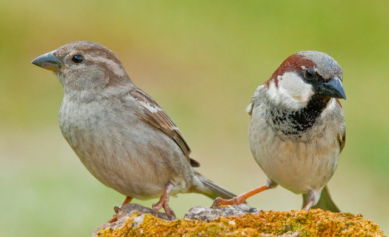

```{r setup, include=FALSE}
knitr::opts_chunk$set(echo = FALSE)

rm(list=ls())
library(tidyverse)
library(PerformanceAnalytics)  #for creating the correlation plots with values on them
library(xtable)  #for pretty correlation tables. - don't use them here but they could be good!
library(car)  #for Anova()


sparrow <- read_csv("../data/sparrow.csv")

```

---


## Readings

\textbf{Required for class:}

  - NA

\bigskip\textbf{Optional:}

- [\textcolor{teal}{Tabachnick and Fidell (2012) Using Multivariate Statistics (6th Edition).}](https://www.pearson.com/us/higher-education/program/Tabachnick-Using-Multivariate-Statistics-6th-Edition/PGM332849.html)


## Multivariate Analysis


There are several ways to look at multivariate patterns from a matrix of **Y**'s.

1.  **Linear models: MANOVA/regression to test patterns**

2.  Ordination: PCA, nMDS, etc to visulazie patterns

3.  Permutation tests: PERMANOVA to test patterns


## Multivariate GLM

All of our previous linear models (e.g.: ANOVA, regression, ANCOVA, etc) we can run as a general linear model (GLM) with multivariate data.

\bigskip

\begin{table}[ht]
 \scriptsize
 \centering
 \begin{tabular}{l l l l l l} 
 \hline %inserts double horizontal lines
 & 1 Cat. X & >1 Cat. X & 1 Cont. X & >1 Cont. X & Both \\ [0.5ex] 
 %heading
 \hline % inserts single horizontal line
 & & & & &  \\
 \textbf{1 Cont.} &  ANOVA & Factorial &  Regression  &  Multiple  & ANCOVA \\
 \textbf{Y} &   &  ANOVA  &  &   Regression &  \\ [2.5ex]
\textbf{>1 Cont.} &  MANOVA & Factorial & Multivariate & Multivariate & MANCOVA \\ 
\textbf{Y}  &   & MANOVA & Regression & Multiple &  \\ 
 &   &  &  & Regression &  \\ [0.5ex] 
 \hline
 \end{tabular}
 \end{table}


## Sparrow Data

Data from Bumpus (1898) - where he measured ~136 sparrows after a bad February storm.  Half the birds were dead.  Bumpus wanted to investigate natural selection and determine if there was a difference between dead or alive birds.

```{r, out.width='90%', fig.align='center', fig.cap=''}

```


## Sparrow Data

Data includes: sex, age, survived (TRUE/FALSE), total length (TL), wing extent (AE), mass (WT), beak-head length (BHL), humerus length (HL), femur length (FL), tibiotarsal length (TTL), skull weight (SW), sternum-keel length (SKL).

\bigskip
\scriptsize
```{r, eval=TRUE, echo=TRUE, warning=FALSE, message=FALSE, fig.height=6}
sparrow
```


## Scale Data

You will want to make sure your data are all on similar scales. You can see here that we have some values in mm and some in g, which are on different orders of magnitude and can make analyses tricky.

- A simple way to scale your data is to simply log everything.

\bigskip
\scriptsize
```{r, eval=TRUE, echo=TRUE, warning=FALSE, message=FALSE, fig.height=6}
sparrow_log <- log(sparrow[,4:12])
sparrow <- cbind(sparrow[,1:3], sparrow_log)
sparrow[1:9, 1:8]
```


## Plot the Correlations

\scriptsize
```{r, eval=TRUE, echo=TRUE, warning=FALSE, message=FALSE, fig.height=6}
pairs(sparrow[,4:12])
```


## Plot the Correlations with Values

\scriptsize
```{r, eval=TRUE, echo=TRUE, warning=FALSE, message=FALSE, fig.height=6}
chart.Correlation(sparrow[,4:12], histogram = TRUE, pch = 19)
```


## Create a Correlation Table


\scriptsize
```{r, eval=TRUE, echo=TRUE, warning=FALSE, message=FALSE, fig.height=6}
scorr <- round(cor(sparrow[,4:12]),3)

#Hides Upper Triangle (You hide lower triangle with lower.tri())
upper<-scorr
upper[upper.tri(scorr)]<-""
upper<-as.data.frame(upper)
upper

```


\bigskip
\bigskip
\normalsize
Check out [\textcolor{teal}{this website}](http://www.sthda.com/english/wiki/elegant-correlation-table-using-xtable-r-package) for code.


## MANOVA

Used when there is one (or more) categorical X variables (or groups), and more than one Y variable. MANOVA's compare variation within groups to varaition between groups.

\bigskip
MANOVA assumptions include:

1. Multivariate Normal distributions of error variance within groups. To test for this multivariate normality, you can use `m.shapiro.test()` in the `mvnormtest` package.
2.  Equal variance (aka - Homoscedasticity)
3.  Equal co-variance within groups.


## MANOVA

How does sex of the birds alter their total length (TL), wing extent (AE), and femur length (FL)?

\bigskip
\scriptsize
```{r, eval=TRUE, echo=TRUE, warning=FALSE, message=FALSE, fig.height=6}
sparrow.man <- manova(cbind(TL, AE, FL) ~ sex, data = sparrow)
summary(sparrow.man, test.statistic = "F", type = 3)
```

\bigskip
\normalsize
Note: `manova()` uses Pillai's trace as a test statistic (falls between 0-1), which is converted to an F statistic. A larger Pillai's value = a larger F statistic, which is more likely to reject $H_0$.


## MANOVA

See which specific Y results differ.

\bigskip
\scriptsize
```{r, eval=TRUE, echo=TRUE, warning=FALSE, message=FALSE, fig.height=6}
summary.aov(sparrow.man)
```


## Factorial MANOVA

How does sex and survival of the birds alter their total length (TL), wing extent (AE), and femur length (FL)?

\bigskip
\scriptsize
```{r, eval=TRUE, echo=TRUE, warning=FALSE, message=FALSE, fig.height=6}
sparrow.Fman <- manova(cbind(TL, AE, FL) ~ sex * survived, data = sparrow)
summary(sparrow.Fman)
```


## Plot the Data

**This figure does not take into account co-variation!**
\bigskip

```{r, eval=TRUE, echo=FALSE, warning=FALSE, message=FALSE, fig.height=6}
colors <- c("#d55e00", "#56b4e9")

ggplot(sparrow, aes(x = sex, y = TL, color = survived))+
  geom_boxplot()+
  theme_bw()+
  theme(text = element_text(size=18))+
  scale_color_manual(values=colors)+
  labs(x = "Sex", y = "Total Length (mm)")
```


## Multivariate Regression
Used when there is one (or more) continuous X variables, and more than one Y variable.

\bigskip
Multivariate regression assumptions include:


1.  Relationships are all linear
2.  Multivariate Normal distributions of error variance
3.  Equal variance (aka - Homoscedasticity)
4.  Absence of multicollinearity (Tabachnick \& Fidell (2012) suggest no correlation above $r=0.9$).


## Multivariate Regression - Allometry

Does the total length of a bird relate to its other size characteristics?

\bigskip
\scriptsize
```{r, eval=TRUE, echo=TRUE, warning=FALSE, message=FALSE, fig.height=6}
summary(manova(cbind(AE, WT, BHL, HL, FL, TTL, SW, SKL) ~ TL,
               data = sparrow))
```

\normalsize
There is evidence for allometry - there is a significant relationship between total length and the rest of the body variables.

  - But plotting this is difficult because of so many Y's!


## Plotting the Data

Visualize multivariate regression with summary variables (here with regression PC1 - we will talk about this soon).

\bigskip
```{r, eval=TRUE, echo=FALSE, warning=FALSE, message=FALSE, fig.height=6}
Y <- sparrow[,5:12]
TL <- sparrow[,4]
PC1<-prcomp(Y)$x[,1]
plot(TL, PC1, pch=21, cex=1.25, bg="black")
```


## MANCOVA
Used when there is one (or more) continuous X variables, one (or more) categorical X variables, and more than one Y variable.

\bigskip
MANCOVA assumptions include:


1.  Relationships are all linear
2.  Multivariate Normal distributions of error variance within groups
3.  Equal variance (aka - Homoscedasticity)
4.  Absence of multicollinearity
5.  No relationship between covariates (continuous X's) and groups (categorical X's)


## MANCOVA

How does a bird's overall body size depend on it's sex * survival (groups), and its total length (covariate)?

\bigskip
\scriptsize
```{r, eval=TRUE, echo=TRUE, warning=FALSE, message=FALSE, fig.height=6}
summary(manova(cbind(AE, WT, BHL, HL, FL, TTL, SW, SKL) ~ TL + sex * survived,
               data = sparrow))
```

\bigskip
\normalsize

Total length is a significant predictor of overall bird body size, males and females tend to have different body sizes, and those that survived and those that didn't have different body sizes.


## Plotting the Data


Visualizing this multivariate model is even more difficult! But try it with the TL ~ PC1 + groups.

\bigskip
```{r, eval=TRUE, echo=FALSE, warning=FALSE, message=FALSE, fig.height=6}
dat <- data.frame(cbind(TL, PC1, sparrow[,1:3]))

ggplot(dat)+
  geom_point(aes(x=TL, y=PC1, color = sex, shape = survived, linetype = survived), size =3)+
  geom_smooth(aes(x=TL, y=PC1, color = sex, shape = survived, linetype = survived), method = "lm", se=FALSE)+
  scale_color_manual(values=colors)+
  theme_bw()+
  theme(axis.title = element_text(face="bold", size=16))+
  labs(x = "log(Total Length)", y = "PC1")


```


