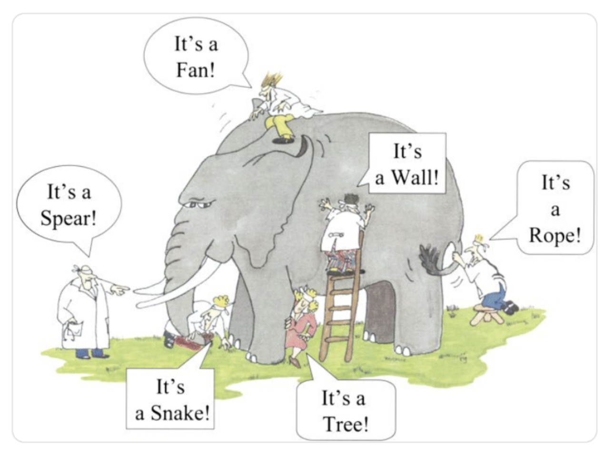
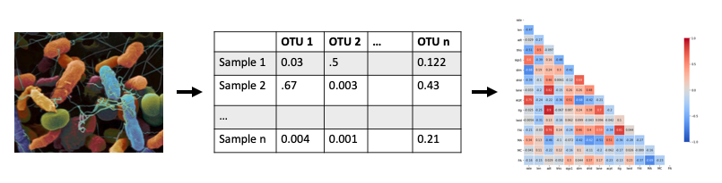
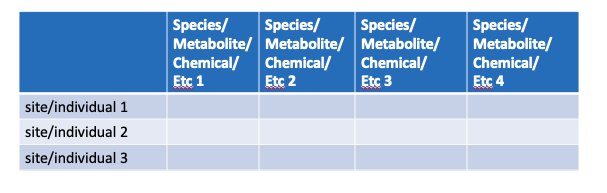
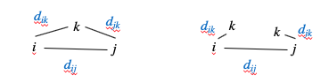
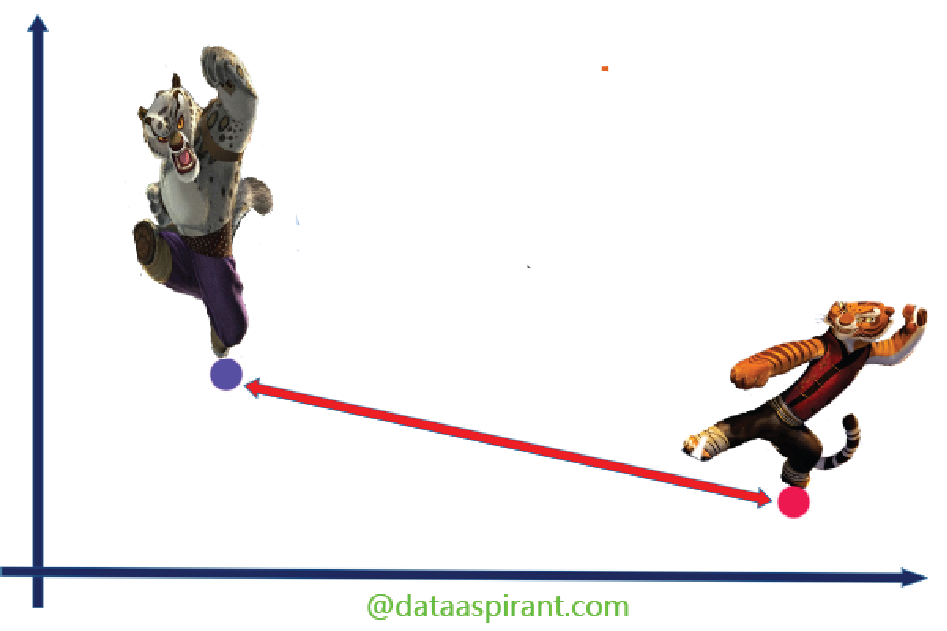
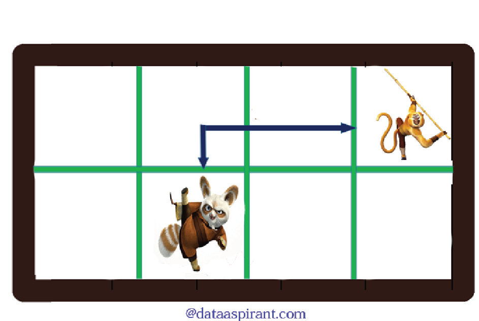
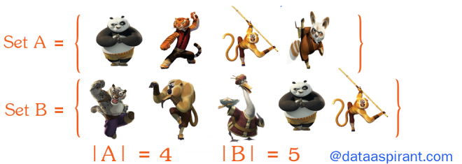
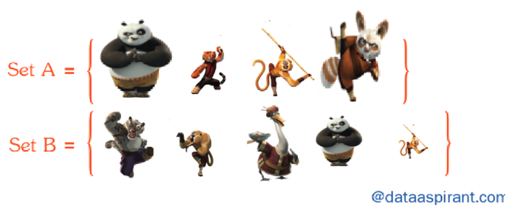

```{r setup, include=FALSE}
knitr::opts_chunk$set(echo = FALSE)

rm(list=ls())
library(tidyverse)
library(scatterplot3d)  # for 3D point figure.
library(vegan)  # for distance matrices


sparrow <- read_csv("../data/sparrow.csv")

```
---


## Readings

\textbf{Required for class:}

  - NA

\bigskip\textbf{Optional:}

- [\textcolor{teal}{Legendre, P. and Gallagher, E.D. (2001) Ecologically meaningful transformations for ordination of species data. \textit{Oecologia}.}](https://link.springer.com/content/pdf/10.1007/s004420100716.pdf)

- [\textcolor{teal}{Strecker, A. L. and Brittain, J. T. (2017) Increased habitat connectivity homogenizes freshwater communities: historical and landscape perspectives. \textit{Journal of Applied Ecology}.}](https://besjournals.onlinelibrary.wiley.com/doi/full/10.1111/1365-2664.12882)


## Multivariate Analysis


There are several ways to look at multivariate patterns from a matrix of **Y**'s.

1.  Linear models: MANOVA/regression to test patterns

2.  **Ordination: PCA, nMDS, etc to visualize patterns**

3.  Permutation tests: PERMANOVA to test patterns


## Ordination

Use ordination techniques when you have a matrix of Y data and you want to explore the multi-dimensional aspects of the **Y**'s.

This type of data exploration is common in:

1.  Community ecology (simultaneous response of multiple members within a community)
  
    -  Composition of plants within quadrats
    -  Composition of aquatic organisms within a sample
    -  Composition of microbes in a sample (using genetic data)
    
2.  Morphometrics

    -  Complex shape of a sample  (e.g. skull, limb, etc)
    
3.  Chemical/Molecular makeup

    -  Composition of metabolites within a tissue sample
    -  Composition of proteins in a sample
    


## Pattern Description

Trying to describe the whole pattern of the data, not just a piece of the data


```{r, out.width='90%', fig.align='center', fig.cap=''}

```


##  Pattern Description

To try to understand the data in mult-dimensional space, we start by describing the "distance" between these data points using a distance matrix. 

\bigskip
\scriptsize
```{r, eval=TRUE, echo=FALSE, warning=FALSE, message=FALSE, fig.height=6}
scatterplot3d(sparrow[5:7])
```


## Data -> Distance -> Statistics

```{r, out.width='100%', fig.align='center', fig.cap=''}

```


## General Data Structure

```{r, out.width='100%', fig.align='center', fig.cap=''}

```

\bigskip

To be able to translate this type of data into any sort of analysis, we need to figure out a way to relate each observation (row) to each other.  So we use **Distance Matrices.**


## Properites of Distance Measures

1.  Minimum distance = 0. 
  
    - This occurs when two observations have exactly the same composition
    - $Y_{ij} = Y_{ik}$. ($i$ = species composition, $k,j$ = sites)
    
2.  If $Y_{ij} \neq Y_{ik}$, then $d_{jk} > 0$.

3.  The distance between two sites is always symmetric.

    - $d_{ij} = d_{ji}$

4.  Triangle inequality

    - If you have three sites, $i,j,k$, then $d_{ij} + d_{jk} \geq d_{ik}$

```{r, out.width='50%', fig.align='center', fig.cap=''}

```

Metric measures satisfy all 4 criteria, semimetric measures (e.g. Bray Curtis) violate \#4.


## Types of Distance Measures


1.  Euclidean Distance - as the crow flies

$$d_{jk} = \sqrt{ \sum(y_{ij} - y_{ik})^2 }$$

```{r, out.width='60%', fig.align='center', fig.cap=''}

```

$d_{jk}$ is the distance between samples $j$ and $k$, and $y_{ij}$ = abundance of species $i$ in sample $j$.


## Types of Distance Measures

2.  Manhattan Distance - city block distance

$$d_{jk} = \sum \left|y_{ij} - y_{ik}\right| $$

```{r, out.width='60%', fig.align='center', fig.cap=''}

```

$d_{jk}$ is the distance between samples $j$ and $k$, and $y_{ij}$ = abundance of species $i$ in sample $j$.


## Types of Distance Measures

3a.  Jaccard Distance - presence/absence (emphasizes rares)

$$d_{jk} = \frac{a + b}{a + b + c} $$


```{r, out.width='80%', fig.align='center', fig.cap=''}

```

$d_{jk}$ is the distance between samples $j$ and $k$, $a$ is the number of species *only* in sample $j$, $b$ is the number of species *only* in sample $k$, and $c$ is the number of species in both samples.


## Types of Distance Measures

3b.  Bray-Curtis Distance - empasizes rare species


$$d_{jk} = \frac{\sum \left|y_{ij} - y_{ik}\right|}{\sum \left(y_{ij} + y_{ik}\right)} $$


```{r, out.width='80%', fig.align='center', fig.cap=''}

```


$d_{jk}$ is the distance between samples $j$ and $k$, and $y_{ij}$ = abundance of species $i$ in sample $j$.


## Types of Distance Measures

4.  Canberra - often used in metabolomics


$$d_{jk} = \frac{1}{\# \text{non-zero entries}} \sum \left( \frac{\left|y_{ij} - y_{ik}\right|}{y_{ij} + y_{ik}}\right) $$


```{r, out.width='80%', fig.align='center', fig.cap=''}

```


$d_{jk}$ is the distance between samples $j$ and $k$, and $y_{ij}$ = abundance of species $i$ in sample $j$.


## Raw Data Transformation

We have our abundance data of multiple Y variables (e.g. species, metabolites, molecules, etc) per sample. But before we compute most types of distances, we need to standardize the data.  

1.  Convert abundance to some function of the abundance

    - presence/absence (0/1)
    - log() - common in metabolomics
    - (abundance)$^{1/4}$ - used when you have **very** skewed, patchy data with lots of zeros (e.g. aquatic invertebrates)
    
2.  Convert to site proportion (i.e. divide by site totals)

    - common in community ecology with Bray-Curtis
    
3.  Standardize by species maximum

    - equalizes contributions from rare and abundant species
    
4.  Classic Wisconsin school (WI double standardization)

    - first by site total, then by site max


## How to decide on transformation.

There are some things to think about when considering transformations.

1.  How much do rare elements "count" vs abundant ones?

    - If you care about rare elements (e.g. species, metabolites, etc), consider presence/absense, dividing by site totals, or choose a measure with absolute values.

2.  Does the total abundance matter?

    - If so, then use site max
    - If not, then divide by site totals
    
    
    
## Toy Example

The data matrix

\scriptsize
```{r, eval=TRUE, echo=FALSE, warning=FALSE, message=FALSE, fig.height=6}
toy <- tribble(
  ~a, ~b,  ~c, ~d, ~e,
  50, 10,  5, 0, 0,
  10,2,1,0,3,
  20,4,4,5,4,
  50,0,0,5,4
)

toy
```


## `library(vegan)` and `decostand()` [\textcolor{teal}{for standardizing.}](https://www.rdocumentation.org/packages/vegan/versions/2.4-2/topics/decostand) 


\scriptsize
```{r, eval=TRUE, echo=TRUE, warning=FALSE, message=FALSE, fig.height=6}
decostand(toy, "total")

decostand(toy, "log")

wisconsin(toy)

```


## `library(vegan)` and `vegdist()` [\textcolor{teal}{for distances.}](https://www.rdocumentation.org/packages/vegan/versions/2.4-2/topics/vegdist) 

```{r, eval=TRUE, echo=FALSE, warning=FALSE, message=FALSE, fig.height=6}
toy.t <- decostand(toy, "total")
toy.p <- decostand(toy, "pa")
```

Euclidean
\scriptsize
```{r, eval=TRUE, echo=TRUE, warning=FALSE, message=FALSE, fig.height=6}
vegdist(toy.t, "eucl")
```

\normalsize
Manhattan
\scriptsize
```{r, eval=TRUE, echo=TRUE, warning=FALSE, message=FALSE, fig.height=6}
vegdist(toy.t, "manhattan")
```

\normalsize
Canberra
\scriptsize
```{r, eval=TRUE, echo=TRUE, warning=FALSE, message=FALSE, fig.height=6}
vegdist(toy.t, "canberra")
```


## `library(vegan)` and `vegdist()` [\textcolor{teal}{for distances.}](https://www.rdocumentation.org/packages/vegan/versions/2.4-2/topics/vegdist) 


\normalsize
Jaccard (with presence/absence standardization)
\scriptsize
```{r, eval=TRUE, echo=TRUE, warning=FALSE, message=FALSE, fig.height=6}
vegdist(toy.p, "jaccard")
```

\normalsize
Bray-Curtis
\scriptsize
```{r, eval=TRUE, echo=TRUE, warning=FALSE, message=FALSE, fig.height=6}
vegdist(toy.t, "bray")

```
\normalsize
Bray-Curtis (with spp total standardization)
\scriptsize
```{r, eval=TRUE, echo=TRUE, warning=FALSE, message=FALSE, fig.height=6}
vegdist(toy.t, "bray")
```


