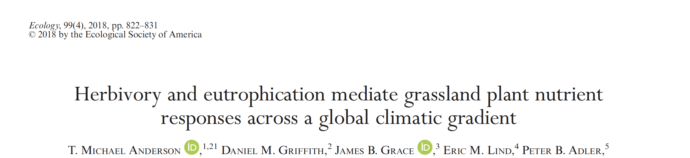
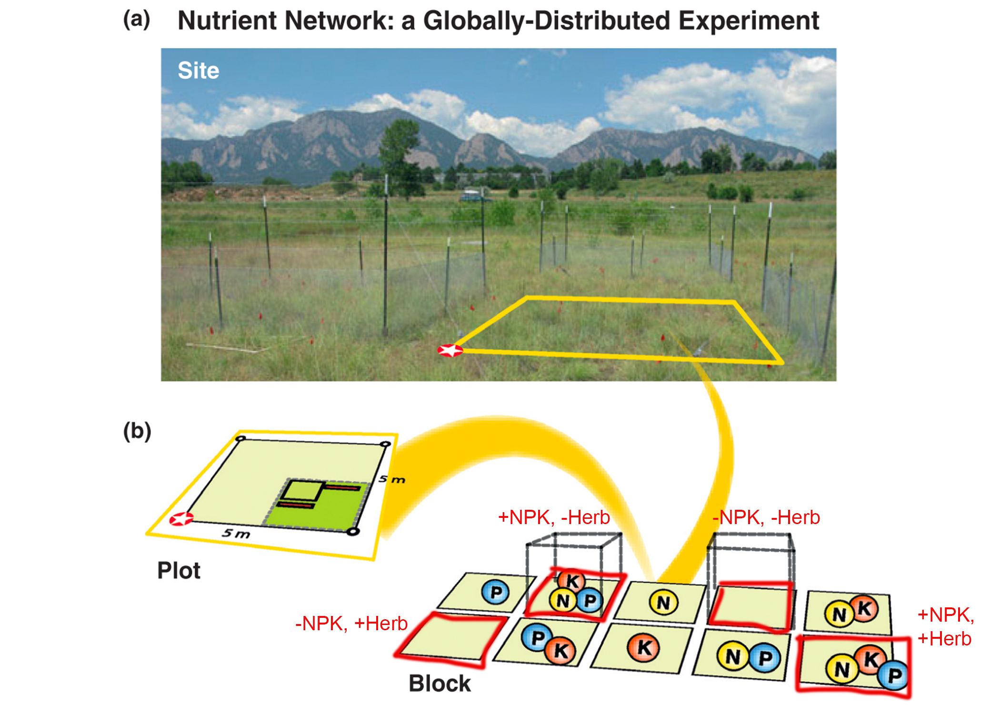
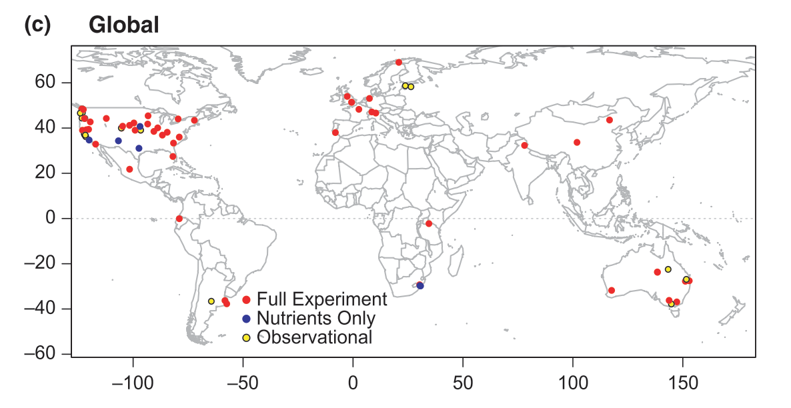
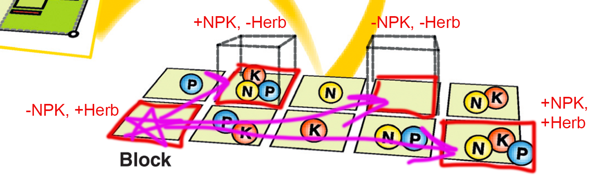

```{r setup, include=FALSE}
knitr::opts_chunk$set(echo = FALSE)

rm(list=ls())
library(tidyverse)
library(scatterplot3d)  # for 3D point figure.
library(vegan)  # for distance matrices
library(reshape2)  #oldschool tidying
library(car)  #for Anova()
library(lme4)
library(lmerTest)


stoich_cover <- read.csv("../data/quantclass_stoich_cover.csv")

```
---


## Readings

\textbf{Required for class:}

  - NA

\bigskip\textbf{Optional:}

- [\textcolor{teal}{Anderson, T. M. (2018) Herbivory and eutrophication mediate grassland plant nutrient responses across a global climatic gradient. \textit{Ecology}.}](https://esajournals.onlinelibrary.wiley.com/doi/full/10.1002/ecy.2175?casa_token=GrLe_bUn97EAAAAA%3AAUqijgKHv3LN1SiY1DW2gknpWqwjKirdUI-C12of9QeFqFByJi074-GSuZPfqGm1O_0677fI-Vfe)


## Distance Matrices and Dissimilarity


**Reminder:** We used distance measures ($d_{jk}$) to define the distance between two points in space, and we used many different ways to calculate these distances (e.g. Euclidean, Jaccard, Canberra, etc).

\bigskip
\bigskip
**Another way to think distance is as dissimilarity:** A distance matrix is a way to represent the difference, or *dissimilarity*, between multi-dimensional sets of data (i.e. two rows of a dataset).


## Toy Example Revisited

\scriptsize
```{r, eval=TRUE, echo=FALSE, warning=FALSE, message=FALSE, fig.height=6}
toy <- tribble(
  ~a, ~b, ~c, ~d, ~e,
  0,10,5,0,0,
  10,2,1,1,3,
  50,0,0,5,4,
  50,0,0,5,4
)
toy

```
\normalsize

\bigskip
Bray-Curtis distance (dissimilarity) matrix
\scriptsize
```{r, eval=TRUE, echo=FALSE, warning=FALSE, message=FALSE, fig.height=6}
toy.t <- decostand(toy, "total")
vegdist(toy.t, "bray")
```

\normalsize

-  Plots 3 and 4 are identical ($Y_{ij} = Y_{ik}$), so distance/ dissimilarity = 0
-  Plots 1 and 3, and 1 and 4 are completely different, so their dissimilarity = 1.
-  Plots 2 and 3 are more similar to each other than plots 2 and 1, thus their distance/dissimilarity is 0.285 vs 0.823


## Dissimilarity as a Dependent Variable

One thing that is useful is to examine how different treatments or environmental factors (etc) alter dissimilarity between plots.

  -  To do this, you need to calculate dissimilarity of communities and then use this as single dependent Y.
  -  This can also be called "turnover" because you are looking at how species change between plots (e.g. a dissimilarity of 1 = complete turnover, dissimilarity of 0 = no turnover).

\bigskip

```{r, out.width='100%', fig.align='center', fig.cap=''}

```


## Experimental Design

How do herbivores and nutrients alter community dissimilarity?


```{r, out.width='80%', fig.align='center', fig.cap='Borer et al. 2014 MEE'}

```


## Experimental Design

\bigskip

```{r, out.width='100%', fig.align='center', fig.cap=''}

```


## Dissimilarity/Turnover Calculations

Calculate the dissimilarity (using Bray-Curtis, standardized by plot totals) for each trt plot to its control within a block.

\bigskip
\bigskip
```{r, out.width='100%', fig.align='center', fig.cap=''}

```


## Dissimilarity/Turnover Calculations

\scriptsize
```{r, eval=TRUE, echo=FALSE, warning=FALSE, message=FALSE, fig.height=6}

results<-matrix(nrow=0,ncol=5)
sites<-as.vector(unique(stoich_cover$site_code))

for(s in 1:length(sites)){
	#s<-2
	temp<-subset(stoich_cover, site_code==sites[s])
	temp$Taxon <- factor(as.character(temp$Taxon))
	head(temp)
	
	years<-as.vector(unique(temp$year))
	
	#years
	for(y in 1:length(years)){
		#y=1
		temp_y <- subset(temp, year==years[y])	
	
		blocks<-as.vector(unique(temp_y$block))

	#blocks
	for(b in 1:length(blocks)){
		#b<-1
		temp_b<-subset(temp_y, block==blocks[b])

		block_cast<-dcast(temp_b, trt~Taxon, value.var="max_cover", fun.aggregate=mean,fill=0)
		
		trans<-cbind(block_cast$trt,decostand(block_cast[,-1],"total"))
		names(trans)[1]<-"trt"
		
		trts<-as.vector(unique(trans$trt))
		#establish the control row
		control<-subset(trans, trt=="Control")

		for(t in 1:length(trts)){
			#t<-2
			comparison<-rbind(control, subset(trans, trt==trts[t]))
			
			distance<-vegdist(comparison[,-1], method = "bray")

			new.row<-c(sites[s],blocks[b],trts[t],years[y], distance[1])
			results<-rbind(results,new.row)
			results
			}
		}
		#	print(s/length(sites))
	}
}

row.names(results)<-NULL
results <- data.frame(results)
names(results) <- c("site_code", "block", "trt","year", "dissimilarity")

head(results)
```


## Dissimilarity ~ Treatment

\scriptsize
```{r, eval=TRUE, echo=FALSE, warning=FALSE, message=FALSE, fig.height=6}
results <- subset(results, trt != "Control")
results <- as_tibble(results, convert = TRUE)
results$dissimilarity <- as.numeric(as.character(results$dissimilarity))
results$year <- as.numeric(as.character(results$year))
```

```{r, eval=TRUE, echo=TRUE, warning=FALSE, message=FALSE, fig.height=6}
model1 <- lmer(dissimilarity ~ trt + (1|year/site_code/block), 
               data = results)
#Anova(model1, test.statistic = "F") - in library(car) 
anova(model1)
```


## Dissimilarity ~ Treatment

\scriptsize
```{r, eval=TRUE, echo=FALSE, warning=FALSE, message=FALSE, fig.height=7}

ggplot(results, aes(x = trt, y = dissimilarity))+
  geom_boxplot()+
  theme_bw()+
  theme(text = element_text(size=18))+
  scale_color_manual(values=colors)+ 
  labs(x = "Treatment", y = "B-C Dissimilarity from Control plots")
```


