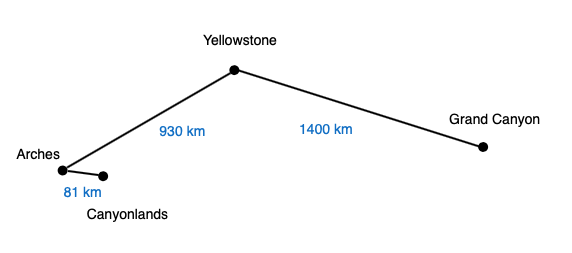

```{r setup, include=FALSE}
knitr::opts_chunk$set(echo = FALSE)

rm(list=ls())
library(tidyverse)
library(vegan)  # for distance matrices


zoop <- read_csv("../data/zooplankton.csv")
env <- read_csv("../data/env.csv")

```
---


## Readings

\textbf{Required for class:}

  - NA

\bigskip\textbf{Optional:}

- [\textcolor{teal}{Strecker, A. L. and Brittain, J. T. (2017) Increased habitat connectivity homogenizes freshwater communities: historical and landscape perspectives. \textit{Journal of Applied Ecology}.}](https://besjournals.onlinelibrary.wiley.com/doi/full/10.1111/1365-2664.12882)

- [\textcolor{teal}{Dr. Philip Dixon}](https://www.stat.iastate.edu/people/philip-dixon)


## Multivariate Analysis


There are several ways to look at multivariate patterns from a matrix of **Y**'s.

1.  Linear models: MANOVA/regression to test patterns

2.  **Ordination: PCA, nMDS, etc to visualize patterns**

3.  Permutation tests: PERMANOVA to test patterns


## So you have a distance matrix, what's next?

1.  Describe variability among replicate sites.

    - Pairwise distances among groups (trts) of sites. 
    
2.  Test hypotheses about composition in a site/sample.

    - Compare pairwise distance between reps within and between groups where you'd expect distances to be different.
    
    
3.  Trends in composition in a site/sample through time.

    - How does composition change through time when you add a treatment?
    
4.  Identify clusters of sites with similar composition ("clustering").

5.  Draw pictures that approximate patterns in the distance matrix ("ordination").
    


## nMDS

Non-metric multidimensional scaling represents data in multdimensional space as accurately as possible with a reduced number of dimensions using optimization techniques so patterns can be easily visualized.

- Unlike PCA (which uses Euclidean distance), nMDS relies on rank orders, or distances, for ordination (this makes it non-metric).

- By using distances to represent differences between sites/samples, you do not have the issues associated with using predictor variables alone (as in PCA).

- This method allows for a variety of data types, and thus is quite flexible!

- Allows you to visualize how environmental gradients influence communities.


## How nMDS Works

```{r, out.width='100%', fig.align='center', fig.cap=''}

```


## How nMDS Works

```{r, out.width='70%', fig.align='center', fig.cap=''}

```

## How nMDS Works

```{r, out.width='90%', fig.align='center', fig.cap=''}

```

## How nMDS Works

```{r, out.width='90%', fig.align='center', fig.cap=''}

```

## How nMDS Works

```{r, out.width='65%', fig.align='center', fig.cap=''}

```


## How nMDS Works

```{r, out.width='50%', fig.align='center', fig.cap=''}

```


## How nMDS Works

No axes in nMDS, so you can flip images. PCA has defined axes so you can't flip them.

```{r, out.width='50%', fig.align='center', fig.cap='', out.extra='angle=65'}

```


## How nMDS Works

Note: points that are close together have a shorter distance between them. This is equivalent to sites/samples being more similar and thus having smaller distances ($d_{ij}$).

```{r, out.width='40%', fig.align='center', fig.cap=''}

```


## The nMDS Process

As I mentioned, nMDS is an iterative process, which occurs over several steps.

1.  Define original data points in multidimensional space based on distances between sites ($d_{ij}$).

2.  Specify the number of reduced dimensions you want
  
    - Typically you shoot for 2 dimensions.
    
3.  Construct an initial configuration of the data.

4.  Compare distances in this intial configuration against calculated distances.

5.  Determine stress on data points.

6.  Correct the position of the points in the dimensional space you have chosen (here 2D) to optimize stress for all points.
  

## nMDS and Stress

**Stress:** is a value that describes the difference between the distance values from multidimensional space calculated from the distance matrix ($d_{ij}$), and the distance between points in the reduced dimension representation.

- nMDS tries to optimize stress.  “Pulling on all points a little bit so no single point is completely wrong, all points are a little off compared to distances”

- We want to reduce stress as much as we can in reduced dimension.  Stress of 5D doesn't help us understand our data well because 5D is hard to understand.


## Data Example

How does increasing connectivity of waterways alter aquatic zooplankton community?

\bigskip
```{r, out.width='100%', fig.align='center', fig.cap=''}
knitr::include_graphics('../images/strecker.png')
```


## Data Example


```{r, out.width='100%', fig.align='center', fig.cap=''}

```


## Data Example


```{r, out.width='100%', fig.align='center', fig.cap=''}

```

## Zooplankton Community Data

Abundance data are normalized by site totals already.
\bigskip

```{r, out.width='100%', fig.align='center', fig.cap=''}

```


## Running an nMDS

To run an nMDS, use the `metaMDS()` function in `library(vegan)`.

  - By default it will include 20 random starts, that's good!
  - You can specify the distance matrix you want with `distance=` (default is Bray-Curtis).
  - The function also allows you to transform your data, and expand on species scores, but you want to do that yourself beforehand with decostand so you know what you are doing.
      - Thus, `autotransform=` and `expand=` should mostly always be FALSE
      - Note, as I mentioned, the data have already been transformed by site totals in our current case.
      
\bigskip
**Note:** when you run an nMDS you want to remove all columns that are not species abundances (e.g. remove site columns, any other treatment or environmental variables, etc.)


## Running an nMDS

\scriptsize
```{r, eval=TRUE, echo=TRUE, results = "hide",  warning=FALSE, message=FALSE, fig.height=6}

zoop.mds2 <- metaMDS(zoop[,-1], k = 2, distance = 'bray', autotransform = F, 
                     expand = F)
```


```{r, out.width='100%', fig.align='center', fig.cap=''}

```


## Plotting an nMDS

This is the biplot - it shows sites (circles), and species (red +). 
  
  - *Remember:* points close together in space are more similar, and points far away are more different.


\scriptsize
```{r, eval=TRUE, echo=TRUE,  warning=FALSE, message=FALSE, fig.height=6}
plot(zoop.mds2)
```


## Plotting an nMDS

Here, `type = "t"` where "t" = text and shows the site and species names. 
\bigskip
\scriptsize
```{r, eval=TRUE, echo=TRUE,  warning=FALSE, message=FALSE, fig.height=6}
plot(zoop.mds2, type = "t")
```


## Plotting an nMDS

If you just want to see the site names use `disp = "sites"`. You can also try `disp = "species"`.

\bigskip
\scriptsize
```{r, eval=TRUE, echo=TRUE,  warning=FALSE, message=FALSE, fig.height=6}
plot(zoop.mds2, disp = "sites", type = "t")
```


## Dimension vs Stress

nMDS is trying to solve a multidimensional problem and represent it in a given number of dimensions (`k`). As you increase your dimension, you will decrease your stress, but increased dimension also makes it more difficult to interpret the cloud of points (`k=2` is understandable because it's 2D).  

  - You want to optimize the number of dimensions vs the amount of stress.

\bigskip
\bigskip
\scriptsize
```{r, eval=TRUE, echo=TRUE, results = "hide",  warning=FALSE, message=FALSE, fig.height=6}

zoop.mds1 <- metaMDS(zoop[,-1], k = 1, distance = 'bray', autotransform = F, 
                     expand = F)
zoop.mds3 <- metaMDS(zoop[,-1], k = 3, distance = 'bray', autotransform = F, 
                     expand = F)
```


## Dimension vs Stress

You can plot the number of dimensions vs stress to make an informed decision.
  
  - <10\% stress is ideal, but that's often not possible, so report your dimension and stress and let readers interpret.
\bigskip

\scriptsize
```{r, eval=TRUE, echo=FALSE,  warning=FALSE, message=FALSE, fig.height=6}
plot(1:3,
     c(zoop.mds1$stress, zoop.mds2$stress, zoop.mds3$stress),
     type='b', ylim=c(0,zoop.mds1$stress), xlab='# dimensions', 
     ylab='Stress')
```

## Adding Environmental Data

You can next find how your environmental variables for all sites plot along the nMDS cloud of points.

To do this, you **must** make sure your data are in the same order.  To me, the easiest way to do this is to merge the composition and environmental datasets and then remove columns when you are running various anlaysis.

\bigskip
\scriptsize
```{r, eval=TRUE, echo=TRUE, warning=FALSE, message=FALSE, fig.height=6}
env[1:8, 1:6]
```

## Merge Environmental Data and rerun nMDS

\scriptsize
```{r, eval=TRUE, echo=TRUE, warning=FALSE, message=FALSE, fig.height=6}
dat <- full_join(zoop, env, by = "site")
dat[1:10,-c(3:45)]
```


## nMDS with Environmental Data

Run the nMDS with "dat", but remove the site names and environmental variables from this dataset.

\bigskip
\scriptsize
```{r, eval=TRUE, echo=TRUE, warning=FALSE, results = "hide", message=FALSE, fig.height=6}
dat.mds2 <- metaMDS(dat[,-c(1, 43:48)], k = 2, distance = 'bray', 
                    autotransform = F, expand = F)
```
\scriptsize
```{r, eval=TRUE, echo=TRUE, warning=FALSE, message=FALSE, fig.height=6}
plot(dat.mds2)
```

## nMDS with Environmental Data

Create an environemntal dataset that's in the same site order as the composition dataset.  FYI: You still don't want plot names.

\bigskip
\scriptsize
```{r, eval=TRUE, echo=TRUE, warning=FALSE, message=FALSE, fig.height=6}
dat.env <- dat[,43:48]
dat.env

```

## nMDS with Environmental Data

Create an environemntal fit to the nMDS data with `envfit()` in `library(vegan)`, and add the environmental variables to the nMDS plot.

  - Not all of this environmental fit code works with non-vegan ordinations.

\bigskip
\scriptsize
```{r, eval=TRUE, echo=TRUE, warning=FALSE, message=FALSE, fig.height=6}
dat.efit <- envfit(dat.mds2, dat.env, na.rm = TRUE)  

# Here you need na.rm = TRUE because not all sites have values for everything.

```


## nMDS with Environmental Data

This is a triplot (has info about sites, species, and environment).

\bigskip
\scriptsize
```{r, eval=TRUE, echo=TRUE, warning=FALSE, message=FALSE, fig.height=6}

plot(dat.mds2, disp = "sites")
plot(dat.efit)

```


## Interpreting Triplots

- Direction of arrows indicates the trend of sites (toward the arrow indicates more of the variable). 
- Length of the arrow indiciates stronger relationship (**but this is not a statistical test!**)

\bigskip
\scriptsize
```{r, eval=TRUE, echo=FALSE, warning=FALSE, message=FALSE, fig.height=6}

plot(dat.mds2, disp = "sites")
plot(dat.efit)

```

## Fun with Triplots

\bigskip
\bigskip

Draw a surface for an environmental variable of interest.

\bigskip

\scriptsize
```{r, eval=TRUE, echo=TRUE, warning=FALSE, message=FALSE, fig.height=6}

ordisurf(dat.mds2, dat.env$surface_temp)

```

## Fun with Triplots

\bigskip

Draw a surface for a species of interest.

\bigskip
\bigskip
\scriptsize
```{r, eval=TRUE, echo=TRUE, warning=FALSE, message=FALSE, fig.height=6}

ordisurf(dat.mds2, dat$Chydorus.spp)

```

## Fun with Triplots


Add convex hulls for groups, added on top of nMDS plots.

\bigskip
\scriptsize
```{r, eval=TRUE, echo=TRUE, warning=FALSE, message=FALSE, fig.height=6}

plot(dat.mds2, disp = "sites")
ordihull(dat.mds2, dat.env$type, label = T)

```


## Fun with Triplots


Draw spider diagrams connecting sites to group centroids.

\bigskip
\scriptsize
```{r, eval=TRUE, echo=TRUE, warning=FALSE, message=FALSE, fig.height=6}

plot(dat.mds2, disp = "sites")
ordispider(dat.mds2, dat.env$type, label = T)

```


