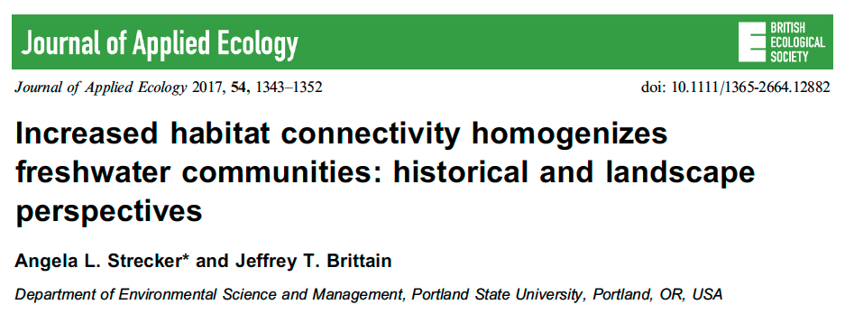

```{r setup, include=FALSE}
knitr::opts_chunk$set(echo = FALSE)

rm(list=ls())
library(tidyverse)
library(vegan)  # for distance matrices
library(goeveg)  # for dim checks
library(rgl)  #for 3D nmds plots
library(vegan3d)  #for 3D nmds plots


zoop <- read_csv("../data/zooplankton.csv")
env <- read_csv("../data/env.csv")
lipo <- read_csv("../data/lipo.csv")

```
---


## Readings

\textbf{Required for class:}

  - NA

\bigskip\textbf{Optional:}

- [\textcolor{teal}{Anderson, M. J. (2001)  A new method for non-parametric multivariate analysis of variance. \textit{Austral Ecology}.}](https://onlinelibrary.wiley.com/doi/full/10.1111/j.1442-9993.2001.01070.pp.x?casa_token=tL9aO4l-h2QAAAAA%3AttzKx1gkUpLrS0CQyQK6Nh1NT9HpgKLugwYidDfKab-y2LNTZK0n6FNtB8cfL5NROgwZSAwHyLDe)

- [\textcolor{teal}{McArdle, B. H. and Anderson, M. J. (2001) Fitting multivariate models to community data: A comment on distance-based redundancy analysis. \textit{Ecology}.}](https://esajournals.onlinelibrary.wiley.com/doi/full/10.1890/0012-9658%282001%29082%5B0290%3AFMMTCD%5D2.0.CO%3B2?casa_token=aESSXZFC_GcAAAAA%3AVQBdYbOlh4AorKL6DwIQIlPmHSbpeKR4JscofvsnzWzjQ46O_1MsCFQ4y3_bcTYQdjsmAtQyz4pI)


## Multivariate Analysis


There are several ways to look at multivariate patterns from a matrix of **Y**'s.

1.  Linear models: MANOVA/regression to test patterns

2.  Ordination: PCA, nMDS, etc to visualize patterns

3.  **Permutation tests: PERMANOVA to test patterns**


## Revisiting our Zooplankton

How does increasing connectivity of waterways alter aquatic zooplankton community?

\bigskip
```{r, out.width='100%', fig.align='center', fig.cap=''}

```


## nMDS figure of Zooplankton Communities

\scriptsize
```{r, eval=TRUE, echo=FALSE,  warning=FALSE, results = "hide", message=FALSE, fig.height=8}
#join environmental and community data
dat <- full_join(zoop, env, by = "site")

#Create metaMDS model in 2 dimensions
dat.mds2 <- metaMDS(dat[,-c(1, 43:48)], k = 2, distance = 'bray', 
                    autotransform = F, expand = F)

#Get just the environmental data
dat.env <- dat[,43:48]

#Create the environmental fit
dat.efit <- envfit(dat.mds2, dat.env, na.rm = TRUE)  

#Create nMDS figure
plot(dat.mds2, disp = "sites")
plot(dat.efit)

```

## Dimension Checks

\scriptsize
```{r, eval=TRUE, echo=TRUE,  warning=FALSE, results = "hide", message=FALSE, fig.height=6}

dimcheckMDS(dat[,-c(1, 43:48)], distance = "bray", k = 6, trymax = 20, 
            autotransform = FALSE)
#in library("goeveg")
```

## 3D nMDS

You can also plot 3D nMDS plots with `library(vegan3d)`. You also need to have `library(rgl)` installed. This figure is interactive!

\bigskip
\scriptsize
```{r, eval=TRUE, echo=TRUE,  warning=FALSE, results = "hide", message=FALSE, fig.height=6}
dat.mds3 <- metaMDS(dat[,-c(1, 43:48)], k = 3, distance = 'bray', 
                    autotransform = F, expand = F)
ordirgl(dat.mds3, type = "t")

```

```{r, out.width='60%', fig.align='center', fig.cap=''}

```


## Relationships between X's and Sites Patterns.

How to determine if there is a relationship between the plotted environmental variables, and site-level community patterns?

1.  Principle Components Analysis (PCA) / Principle Coordinates Analysis (PCoA)

2.  Canonical Correspondence Analysis (CCA) / Redundancy Analysis (RDA)

  - For both, relationships in predictors are also forced to be linear. These are typically non-distance based (but see db-RDA).

3.  Permutational ANOVA (PERMANOVA)

  - Are the relative lengths of the arrows that represent environmental variables in your nMDS plot predictive? 


## Permutational ANOVA (PERMANOVA)

Given a set of site scores (Axis 1, Axis 2, ...) and environmental information at each site, this procedure calculates $R^2$ for Site Scores ~ Environment for each iteration.

- $H_0$ = no correlation (correlation = 0)

\bigskip
PERMANOVA holds the Y data constant and shuffles the X's (environemntal data/trt labels)

```{r, out.width='100%', fig.align='center', fig.cap=''}

```


## Permutational ANOVA (PERMANOVA)

The relative location of the observed $R^2$ to the permuted $R^2$'s indicates association strength.


```{r, out.width='90%', fig.align='center', fig.cap=''}

```


## PERMANOVA with `adonis()`.

Let's examine: community pattern ~ secchi depth + site type.

-  This analysis deals with X's sequentially, so order of terms matters unless data is balanced.


\scriptsize
```{r, eval=TRUE, echo=TRUE,  warning=FALSE,  message=FALSE, fig.height=6}
dat.bray <- vegdist(zoop[,-1], "bray")
adonis(dat.bray ~ secchi + type, data = dat.env )
```


## Blocking in `adonis()`

You can include block effects in `adonis()` with `strata=`. Here, permutations happen within these groups, or blocks.
\bigskip
\scriptsize
```{r, eval=TRUE, echo=TRUE,  warning=FALSE,  message=FALSE, fig.height=6}
adonis(dat.bray ~ secchi, data = dat.env, strata = dat.env$type )

```


## Prettier nMDS figures

\scriptsize
```{r, eval=TRUE, echo=FALSE,  warning=FALSE,  message=FALSE, fig.height=8}

plot(dat.mds2, disp = "sites")
ordiellipse(dat.mds2, dat.env$type, lwd=2, col="blue", show.groups = "pond", label = T)
ordiellipse(dat.mds2, dat.env$type, lwd=2, col="green", show.groups = "reservoir", label = T)
ordiellipse(dat.mds2, dat.env$type, lwd=2, col="red", show.groups = "lake", label = T)
ordiellipse(dat.mds2, dat.env$type, lwd=2, col="orange", show.groups = "seminaturallake", label = T)
ordiellipse(dat.mds2, dat.env$type, lwd=2, col="black", show.groups = "canal", label = T)

```

## Prettier nMDS figures

\scriptsize
```{r, eval=TRUE, echo=FALSE,  warning=FALSE,  message=FALSE, fig.height=8}

plot(dat.mds2, disp = "sites")
ordispider(dat.mds2, dat.env$type, lwd=3, col="blue", show.groups = "pond", label = T)
ordispider(dat.mds2, dat.env$type, lwd=3, col="green", show.groups = "reservoir", label = T)
ordispider(dat.mds2, dat.env$type, lwd=3, col="red", show.groups = "lake", label = T)
ordispider(dat.mds2, dat.env$type, lwd=3, col="orange", show.groups = "seminaturallake", label = T)
ordispider(dat.mds2, dat.env$type, lwd=3, col="black", show.groups = "canal", label = T)

```

## Dispersion Within Groups

\tiny
```{r, eval=TRUE, echo=TRUE,  warning=FALSE,  message=FALSE, fig.height=6}
betadisper(dat.bray, dat.env$type)

```

## Extracting nMDS Scores

You can extract the nMDS scores for the number of dimensions you choose.

\scriptsize
```{r, eval=TRUE, echo=TRUE,  warning=FALSE,  message=FALSE, fig.height=8}
head(dat.mds2$points)
head(dat.mds3$points)
```

## Plotting with `ggplot()`

\scriptsize
```{r, eval=TRUE, echo=FALSE,  warning=FALSE, results = "hide", message=FALSE, fig.show = 'hide'}

#check out this website where I got the idea from:
#   https://oliviarata.wordpress.com/2014/07/17/ordinations-in-ggplot2-v2-ordisurf/


#First get your ordisurf data saved as objects.
ordi <- ordisurf(dat.mds2, dat.env$secchi) #created the ordisurf object
ordi.grid <- ordi$grid #extracts the ordisurf object
str(ordi.grid) #it's a list though - cannot be plotted as is
ordi.dat <- expand.grid(x = ordi.grid$x, y = ordi.grid$y) #get x and ys
ordi.dat$z <- as.vector(ordi.grid$z) #unravel the matrix for the z scores

#extract NMDS points
NMDS_data <- dat.env
NMDS_data$NMDS1 <- dat.mds2$points[,1]
NMDS_data$NMDS2 <- dat.mds2$points[,2]
```

```{r, eval=TRUE, echo=FALSE,  warning=FALSE,  message=FALSE, fig.height=7}

#GGPLOT
ggplot(NMDS_data, aes(x = NMDS1, y = NMDS2))+
  stat_contour(data = ordi.dat, aes(x = x, y = y, z = z, colour = rev(..level..)),
               binwidth = 0.5)+ #change binwidth depending on contours
  geom_point(size = 3, alpha = 0.8, aes(shape = type))+ #plots NMDS with points by water body type
  theme_bw()+
  scale_shape_manual("Water Body Type",  values = c(1,16, 3, 5, 12))+ #sets the name of the legend for shape, and says which symbols we want
  labs(colour = "Secchi Depth")+ #another way to set the labels, in this case, for the colour legend
  scale_colour_gradient(high = "darkgreen", low = "darkolivegreen1")+ #here we set the high and low of the colour scale.
  theme(legend.key = element_blank(),  #removes the box around each legend item
        legend.position = "bottom", #legend at the bottom
        legend.direction = "horizontal",
        legend.box = "horizontal",
        legend.box.just = "centre")


```

## A Few nMDS and PERMANOVA Notes

- Set a seed if you want your results to be 100\% reproducible.
    - Make sure your results are not dependant on your seed choice.
    - To do this, you just make sure you type `set.seed(value)` before you run the nMDS.
  
\bigskip
- PERMANOVA does better with a larger sample size.
    
\bigskip
- PERMANOVA works best with balanced data that's homoscedastic.


## Metabolomics example


Let's run through an example looking at metabolite data for different accessions of plants.  The data is already standardized, so no need to worry about that!

\scriptsize
```{r, eval=TRUE, echo=FALSE,  warning=FALSE,  message=FALSE, fig.height=7}
lipo[, 1:6]

```


## Metabolomics example

One thing we can do with this data that we have not done yet is look at dissimilarity within and between groups.

\bigskip
\scriptsize
```{r, eval=TRUE, echo=TRUE,  warning=FALSE,  message=FALSE, fig.height=7}

#add species names
lipo$spp <-substring(lipo$access, 1, 3)
lipo[1:10, c(1,45)]

```

## Metabolomics example

Calculate within group and between group dissimilarity

\bigskip
\scriptsize
```{r, eval=TRUE, echo=TRUE,  warning=FALSE,  message=FALSE, fig.height=7}

#determine which species are the same and which are not
temp<-outer(lipo$spp, lipo$spp, '!=')

#as.dist computes a distance matrix between the TRUE and FALSE objects
#   calculated above
lipo.DN <- as.dist(temp)
lipo.DN

```

## Metabolomics example

Create your distance matrix using Canberra distance which is common for metabolomic work.

\bigskip
\scriptsize
```{r, eval=TRUE, echo=TRUE,  warning=FALSE,  message=FALSE, fig.height=7}

######Calculate Canberra Distance matrix
lipo.tot <- decostand(lipo[,-c(1,45)], "total")
lipo.CB<-vegdist(lipo.tot, method="canberra") 
lipo.CB

```


## Metabolomics example

You can calculate the average dissimilarity between groups (within species, and between species)

\bigskip
\scriptsize
```{r, eval=TRUE, echo=TRUE,  warning=FALSE,  message=FALSE, fig.height=7}

mean(lipo.CB[lipo.DN==0]) 
mean(lipo.CB[lipo.DN==1]) 

```


## Metabolomics example

Or simply plot the dissimilarity within and among species.

\bigskip
\scriptsize
```{r, eval=TRUE, echo=TRUE,  warning=FALSE,  message=FALSE, fig.height=7}

boxplot(split(lipo.CB, lipo.DN), names=c('Within','Between')) 

```


## Metabolomics example

Let's run a permutational ANOVA to determine if there is a difference in metabolomic structure among species.

\bigskip
\scriptsize
```{r, eval=TRUE, echo=TRUE,  warning=FALSE,  message=FALSE, fig.height=7}

lipo.adonis <-adonis(lipo.CB ~ spp, data=lipo)
lipo.adonis

```


## Metabolomics example

And plot those results

\bigskip
\scriptsize
```{r, eval=TRUE, echo=TRUE,  warning=FALSE,  results = "hide", message=FALSE, fig.height=7}
lipo.mds2 <- metaMDS(lipo[,-c(1,45)],k=2,distance='canberra',autotransform=F)
```
```{r, eval=TRUE, echo=TRUE,  warning=FALSE,  message=FALSE, fig.height=6.5}
plot(lipo.mds2)
ordihull(lipo.mds2, lipo$spp, label = T)

```

## Metabolomics example

So it looks like there might be a difference in the dispersion between species  Let's test this. First calculate your dispersion within species with `betadisper()`.

\bigskip
\scriptsize

```{r, eval=TRUE, echo=TRUE,  warning=FALSE,  message=FALSE, fig.height=6.5}
lipo.bd <-betadisper(lipo.CB, lipo$spp)
lipo.bd

```


## Metabolomics example

Then compare differences in dispersal between species overall with `anova()`, and using pairwise comparisons with `TukeyHSD()`.

\bigskip
\scriptsize
```{r, eval=TRUE, echo=TRUE,  warning=FALSE,  message=FALSE, fig.height=6.5}
anova(lipo.bd)
```

\normalsize
We fail to reject the null hypothesis that dispersion is equal across all species

\tiny
```{r, eval=TRUE, echo=TRUE,  warning=FALSE,  message=FALSE, fig.height=6.5}
TukeyHSD(lipo.bd)
```


