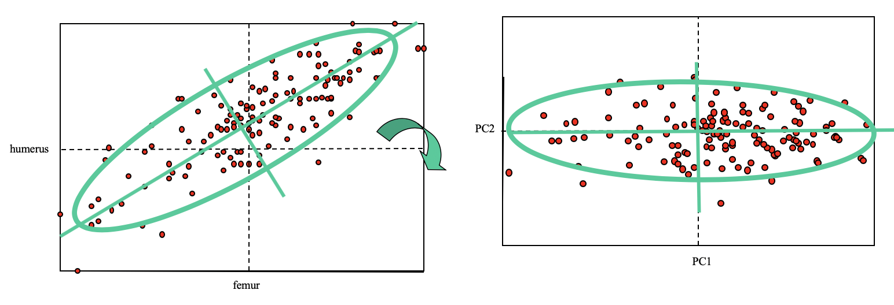

```{r setup, include=FALSE}
knitr::opts_chunk$set(echo = FALSE)

rm(list=ls())
library(tidyverse)
library(stats)  # for PCA

###  To install ggbiplot
#install.packages("devtools")
#library(devtools)
#install_github("vqv/ggbiplot")

library(ggbiplot) #For graphing PCA's in ggplot style.
  #nice library, but must get it from github (see notes below)


sparrow <- read_csv("../data/sparrow.csv")


```
---


## Readings

\textbf{Required for class:}

  - NA

\bigskip\textbf{Optional:}

- [\textcolor{teal}{Hayden, L. (2018)  Principal Components Analysis in R.}](https://www.datacamp.com/community/tutorials/pca-analysis-r)

    -  Good reference for customizing ggbiplots.

- [\textcolor{teal}{Lever, J. and Krzywinski, M. and Altman, N. (2017)  Principle component analysis. PCA helps you interpret your data, but will not always find the important patterns. \textit{Nature Methods}.}](https://www.nature.com/articles/nmeth.4346.pdf?origin=ppub)


## Multivariate Analysis


There are several ways to look at multivariate patterns from a matrix of **Y**'s.

1.  Linear models: MANOVA/regression to test patterns

2.  **Ordination: PCA, nMDS, etc to visualize patterns**

3.  Permutation tests: PERMANOVA to test patterns


## Principal Componants Analysis (PCA)

PCA is another form of dimension reduction. You take your original dataset of many Y's and simplify it by turning the original variables into a smaller number of "principal components".

- Principal components are the underlying structure of the data, and are in the directions where most of the variance lies. So in PCA we create new axes that are *linear combinations* of the original data that explain most of the variance.

  - You linearly transform your dataset so the first PCA coordinate or axis explains most of the variance.
  - Each subsequent axis is orthogonal (perpendicular) to the last axis and explains less variance. This makes the axes uncorrelated.
  
- When a lot of variables are highly correlated, they will all contribute to the same principal component axis.


## Understanding PCA

PCA rotates data so main axis of variation explained (PC1) is horizontal.  Then subsequent PC axis is orthogonal, and is ordered to explain less variation.

- You are trying to explain more variation with fewer dimensions.


```{r, out.width='100%', fig.align='center', fig.cap='thanks to Dr. Dean Adams for this figure'}

```

## Understanding PCA

**Step 1:** Start with data matrix (**Y**).

**Step 2:** Obtain covariance matrix (**S**) or correlation matrix (**R**) from **Y**.

**Step 3:** Run eigenanalysis on **S** to find orthogonal vectors.

- An *eigenvector* is a vector of the transformed matrix that points in the direction of variance explained, while the corresponding *eigenvalue* tells you how much variance there is in the data in that direction.
  - The eigenvector with the largest eigenvalue is PC1.

**Step 4:** Project data onto the vectors to get PC scores for you rows of data (sites, individuals, etc).


## Correlation vs Covariance

Because variables in the **Y** matrix with high variation can have a lot of influence on the PCA, it's better to use a correlation matrix (**R**).

- Correlation values are between 0 and 1.

\bigskip

If you use a covariance matrix (**S**), then you should scale the variables in **Y**.


## PCA Interpretation Notes

- PCA preserves Euclidean distances among rows of data.

- If original data variables are uncorrelated, then PCA is not helpful in reducing dimensionality of data.

- PCA does not *find* a particular factor to be significant. It identifies the direction of the most variation, which *may* be interpretable as a factor, but it may not.

- Be careful interpreting all PC axes as biologically meaningful. PC axes are constrained to be orthogonal, biological variability is not.
  
- *Make sure your data are scaled and/or centered * 

  - If you see strange patterns in your PCA (e.g. horseshoe shape, very linear trends), something may be up with scaling. 
  - Variables in **Y** with high variation unduly influence the PCA. 
  - If you don't scale the data, use correlation matrix (**R**) - between 0 an 1.


## Sparrow Data

Data from Bumpus (1898) - where he measured ~136 sparrows after a bad February storm.  Half the birds were dead.  Bumpus wanted to investigate natural selection and determine if there was a difference between dead or alive birds.

```{r, out.width='90%', fig.align='center', fig.cap=''}

```


## Sparrow Data

Data includes: sex, age, survived (TRUE/FALSE), total length (TL), wing extent (AE), mass (WT), beak-head length (BHL), humerus length (HL), femur length (FL), tibiotarsal length (TTL), skull weight (SW), sternum-keel length (SKL).

\bigskip
\tiny
```{r, eval=TRUE, echo=TRUE, warning=FALSE, message=FALSE, fig.height=6}
sparrow
```

## PCA

Let's look again at our **Y** from the sparrow data to see how variables are correlated and create hypotheses about how sex and survival influence a bird's body size. 
  
- Common functions for running PCA are `prcomp()` - [\textcolor{teal}{documentation here}](https://www.rdocumentation.org/packages/stats/versions/3.6.2/topics/prcomp), and `princomp()` - [\textcolor{teal}{documentation here}](hhttps://www.rdocumentation.org/packages/stats/versions/3.6.2/topics/princomp).

\bigskip
\tiny
```{r, eval=TRUE, echo=TRUE, warning=FALSE, message=FALSE, fig.height=6}

sparrow.pca <- prcomp(sparrow[, -c(1:3)], center = TRUE, scale = TRUE)
summary(sparrow.pca)
```


\scriptsize
So PC1 explains 59\% of the variation, PC2 explains 11\% of the variation, PC3 explains 7\% of the variation, and so on. We can explain ~70\% of the variaiton from just two axes!

***Note:*** You get as many PC axes as you have columns in your **Y**, and the proportion of variance explained by all sums to 1.


## Plotting

Plot the PCA using `library(ggbiplot)`, installed from github.

\tiny
```{r, eval=FALSE, echo=TRUE, warning=FALSE, message=FALSE, fig.height=6}
library(devtools)
install_github("vqv/ggbiplot")
```

\tiny
```{r, eval=TRUE, echo=TRUE, warning=FALSE, message=FALSE, fig.height=2.75}
ggbiplot(sparrow.pca)
```

## Interpreting - Figures

The data columns are the arrows from the center, and their direction indicates which axes (that are plotted) they relate to. 

  
\tiny
```{r, eval=TRUE, echo=FALSE, warning=FALSE, message=FALSE, fig.height=2.75}
ggbiplot(sparrow.pca)
```

## Variable Loadings

Loadings for each Y variable show how well each variable corresponds to each PC axis.

- Absolute values gives relationship, +/- gives direction.

\bigskip
\tiny
```{r, eval=TRUE, echo=TRUE, warning=FALSE, message=FALSE, fig.height=4}
sparrow.pca$rotation
```


## Dimension Reduction with PC Scores

You can extract PC scores that tell you where on each PC axis each row of your data (here, individual bird) fall. 

- This is useful for collapsing lots of columns of correlated Y's into just a few transformed Y variables.

\bigskip
\scriptsize
```{r, eval=TRUE, echo=TRUE, warning=FALSE, message=FALSE, fig.height=2.5}
sparrow.pca$x[1:12, 1:4]
```


## Fun With Plotting

Add plot names with `labels` (this may be useful sometimes, not in this case).

\tiny
```{r, eval=TRUE, echo=TRUE, warning=FALSE, message=FALSE, fig.height=2.75}
ggbiplot(sparrow.pca, labels = rownames(sparrow))
```


## Fun With Plotting

Add groups (like dead or alive birds) with `groups`.

\tiny
```{r, eval=TRUE, echo=TRUE, warning=FALSE, message=FALSE, fig.height=2.75}
ggbiplot(sparrow.pca, ellipse = TRUE, groups = sparrow$survived)+
  theme_bw()+
  theme(text = element_text(size=12))
```


## Fun With Plotting

Add groups (try sex of bird) with `groups`.

\tiny
```{r, eval=TRUE, echo=TRUE, warning=FALSE, message=FALSE, fig.height=2.75}
ggbiplot(sparrow.pca, ellipse = TRUE, groups = sparrow$sex)+
  theme_bw()+
  theme(text = element_text(size=12))
```


## Fun With Plotting

Try plotting PC3 and PC4 with `choices`.


\scriptsize
```{r, eval=TRUE, echo=TRUE, warning=FALSE, message=FALSE, fig.height=2.5}
ggbiplot(sparrow.pca, ellipse = TRUE, choices = c(3,4), 
         groups = sparrow$sex)+
  theme_bw()+
  theme(text = element_text(size=8))
```


## Fun With Plotting

You can remove the arrows with `var.axes`.

\bigskip
\scriptsize
```{r, eval=TRUE, echo=TRUE, warning=FALSE, message=FALSE, fig.height=2.5}
ggbiplot(sparrow.pca, ellipse = TRUE, var.axes = FALSE, 
         groups = sparrow$sex)+
  theme_bw()+
  theme(text = element_text(size=8))
```


## What is PCA (and ordination in general) good for??

1.  Visualization

\bigskip

2.  Hypothesis creation

\bigskip

3.  Dimension reduction 
  
  - Use PC scores as variables in other univariate models to account for correlated data


