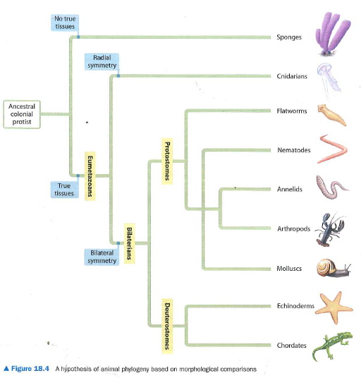
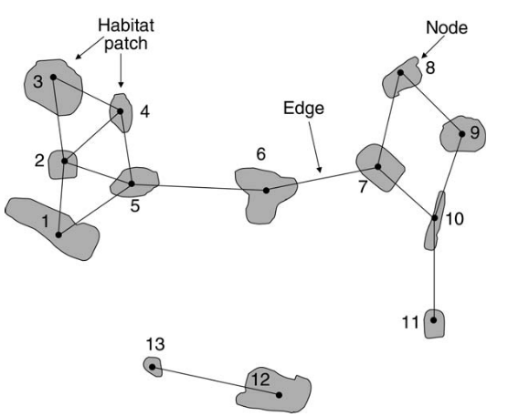

```{r setup, include=FALSE}
knitr::opts_chunk$set(echo = FALSE)

rm(list=ls())
library(tidyverse)
library(vegan)  # for distance matrices
library(goeveg)  # for dim checks
library(stats)  # for PCA, kmeans and hierarchcial clustering
library(car)  #for Anova()
library(clue)  ## for kmedoids()
library(lpSolve) ## for kmedoids()
library(igraph)   #for graph theory stuff.
library(reshape2)


lipo <- read_csv("../data/lipo.csv")
artfri <- read_csv("../data/plant_coords.csv")

colors <- c("#009E73", "#D55E00", "#CC79A7")

```
---


## Readings

\textbf{Required for class:} 
  
  - NA

\bigskip\textbf{Optional:}

- [\textcolor{teal}{Holmes, S. and Huber, W.  Modern Statistics for Modern Biology - Chapter 5: Clustering. ](http://web.stanford.edu/class/bios221/book/Chap-Clustering.html) 

- [\textcolor{teal}{Pathak, M. (2018) Hierarchcial Clustering in R}](https://www.datacamp.com/community/tutorials/hierarchical-clustering-R) 


## Clustering

An important part of multivarite statistics is to find groups within our data, so we can group our data that are similar to try to find patterns. We have already talked about a few ways to do this through ordination, where you have treatment variables and you want to see if the data cluster by those treatment variables. However what do you do if you have less prior information about where the clusters should be forming?

\bigskip

We will be talking about **unsupervised** clustering, where groups are allowed to form.

1.  *k*-means, *k*-medoids
2.  Hierarchical clustering
3.  Graph clustering


## *k*-means, *k*-medoid Clustering

An iterative process that attempts to find the shortest distance from all points to the number of group centers (k).

**Step 1:** Start with your **Y** data matrix with only the columns of data you are interested in.

**Step 2:** Randomly pick *k* cluster centers out of the number of observations (or cells) in your dataset.

**Step 3:** Assign the rest of the data observations to a group with the closest center.

**Step 4:** For each group, replace the selected center with the arithmetic mean of the cluster.
    
- If using *k*-medoid, then choose a center of the cluster so distance to all points are minimized.

\bigskip

Repeat steps 3 and 4 until the clusters stabilize.


## Data Example

Let's look back at our metabolomics dataset, where rows are accessions and columns are metabolites within the tissues of each accession.

\bigskip
\scriptsize
```{r, eval=TRUE, echo=FALSE,  warning=FALSE,  message=FALSE, fig.height=7}
lipo[, 1:6]

```


## *k*-means Clustering 

This method requires coordinate data, so you need to create your distance matrix, and then pull out the points.


- I will do this with nMDS as an option, but this can be done with any ordination method.
  
\bigskip
\scriptsize
```{r, eval=TRUE, echo=FALSE,  warning=FALSE, results = "hide", message=FALSE, fig.height=6}
set.seed(25)
lipo.tot <- decostand(lipo[,-1], "total")
lipo.mds2 <- metaMDS(lipo.tot, k = 2, distance = 'canberra', 
                    autotransform = F, expand = F)

plot(lipo.mds2, disp = "sites", cex = 2)
```


## *k*-means Clustering 

You can also get the nMDS scores using `scores()` and plot by hand.
  
\bigskip
\scriptsize
```{r, eval=TRUE, echo=TRUE,  warning=FALSE,  message=FALSE, fig.height=6}
scores <- as_tibble(scores(lipo.mds2, choices, display = "sites"))
scores
```


## *k*-means Clustering 

\scriptsize
```{r, eval=TRUE, echo=TRUE,  warning=FALSE,  message=FALSE, fig.height=5}
 ggplot(scores, aes(x = NMDS1, y = NMDS2))+
   geom_point(cex = 2)+
   theme_bw()+
   theme(text = element_text(size=18))+
   labs(x = "NMDS1", y = "NMDS2")
```


## *k*-means Clustering with `kmeans()`

Now run your *k*-means clustering.
  
\bigskip
\scriptsize
```{r, eval=TRUE, echo=TRUE,  warning=FALSE,  message=FALSE, fig.height=5}
lipo <- cbind(lipo, scores)
set.seed(100)
lipo.c.kmns <- kmeans(lipo[,45:46], centers = 5, nstart = 10)
str(lipo.c.kmns)
```


## *k*-means Clustering with `kmeans()`

\tiny
```{r, eval=TRUE, echo=TRUE,  warning=FALSE,  message=FALSE, fig.height=5}
lipo.c.kmns
```

## Plotting *k*-means Clusters

Add the clusters to your dataset and plot.

\bigskip
\scriptsize
```{r, eval=TRUE, echo=FALSE,  warning=FALSE,  message=FALSE, fig.height=7}
lipo$clusters_kmns <- as_factor(lipo.c.kmns$cluster)

ggplot(lipo, aes(x = NMDS1, y = NMDS2, color = clusters_kmns))+
   geom_point(cex = 2)+
   theme_bw()+
   theme(text = element_text(size=18))+
   labs(x = "NMDS1", y = "NMDS2")

```


## The *k*-medoids Clustering option

\scriptsize
```{r, eval=TRUE, echo=FALSE,  warning=FALSE,  message=FALSE, fig.height=6}

set.seed(100)
lipo.c.kmds <- kmedoids(lipo[,45:46], k = 5)
lipo$clusters_kmds <- as_factor(lipo.c.kmns$cluster)

ggplot(lipo, aes(x = NMDS1, y = NMDS2, color = clusters_kmds))+
   geom_point(cex = 2)+
   theme_bw()+
   theme(text = element_text(size=18))+
   labs(x = "NMDS1", y = "NMDS2")

```


## Deciding your *k*

Here's a function from [\textcolor{teal}{Luiz Fonseca}](https://towardsdatascience.com/clustering-analysis-in-r-using-k-means-73eca4fb7967) to help you determine what *k* to use based on sums of squares within groups.


\tiny
```{r, eval=TRUE, echo=TRUE,  warning=FALSE,  message=FALSE, fig.height=5}

wssplot <- function(data, nc=15, seed=123){
               wss <- (nrow(data)-1)*sum(apply(data,2,var))
               for (i in 2:nc){
                    set.seed(seed)
                    wss[i] <- sum(kmeans(data, centers=i)$withinss)}
                plot(1:nc, wss, type="b", xlab="Number of groups",
                     ylab="Sum of squares within a group")}

wssplot(lipo[,45:46], nc = 10)

```


## Hierarchical Clustering

Helps you cluster points into hierarchical groups. This algorithm repeatedly tries to combine the two nearest clusters into a larger cluster.

\bigskip

**Step 1:** Calculate the distance between each pair of points.

**Step 2:** Put all points in their own cluster.

**Step 3:** Merge closest pairs based on distances until your number of clusters goes down by 1.

**Step 4:** Repeat steps 2 and 3 until everything is merged into a single cluster.


## Hierarchical Clustering

It can be helpful to visualize this type of clustering as a dendrogram or tree. Each smaller cluster merges until there is a single cluster at the base of the tree.


```{r, out.width='60%', fig.align='center', fig.cap=''}

```


## Hierarchical Clustering with `hclust()`

You want to use a distance matrix for hierarchical clustering, and you want to make sure your data is scaled appropriately.

  - Here, we have already standardized our data by site totals.
  - You need to [\textcolor{teal}{specify the linkage method}](https://www.rdocumentation.org/packages/stats/versions/3.6.2/topics/hclust) with `method=`.
  
\bigskip
\scriptsize
```{r, eval=TRUE, echo=TRUE,  warning=FALSE,  message=FALSE, fig.height=5}
lipo.cb <- vegdist(lipo.tot, method = "canberra")
set.seed(143)
lipo.hclust <- hclust(lipo.cb, method = "average")
lipo.hclust

```


## Plotting the Hierarchical Clusters


\scriptsize
```{r, eval=TRUE, echo=TRUE,  warning=FALSE,  message=FALSE, fig.height=6}
plot(lipo.hclust)

```

## Cutting the Tree

You can cut the tree to get the desired number of clusters.

\bigskip
\scriptsize
```{r, eval=TRUE, echo=TRUE,  warning=FALSE,  message=FALSE, fig.height=7}
lipo.cut.5 <- cutree(lipo.hclust, k = 5)
lipo.cut.5

```

\bigskip
\scriptsize
```{r, eval=TRUE, echo=TRUE,  warning=FALSE,  message=FALSE, fig.height=7}
lipo.cut.3 <- cutree(lipo.hclust, k = 3)
lipo.cut.3

```

## Graph Clustering

Graph clustering uses a graph theoretic framework to select points that are similar based on various criteria

- nearest neighbors
- distance cutoff

\bigskip
```{r, out.width='50%', fig.align='center', fig.cap='Minor and Urban 2008 Conservation Biology'}

```


## Graph Clustering

I had plant locations in a prairie, and I was trying to sample seeds from mother plants across the prairie but I wanted to group them in an un-biased way and select from those groups.

\bigskip
\scriptsize
```{r, eval=TRUE, echo=FALSE,  warning=FALSE,  message=FALSE, fig.height=6}

ggplot(artfri, aes(x = plant_easting, y = plant_northing))+
   geom_point(cex = 2)+
   theme_bw()+
   theme(text = element_text(size=18))+
   labs(x = "Easting (m)", y = "Northing (m)")


```

## Graph Clustering

First I made a distance matrix with Euclidean distance (because it was physical distance between plants).

\bigskip
\scriptsize
```{r, eval=TRUE, echo=TRUE,  warning=FALSE,  message=FALSE, fig.height=5.5}

artfri.e <- vegdist(as.matrix(artfri[,7:8]), method = "euclidian")
hist(artfri.e)


```


## Graph Clustering

I picked a quantile cutoff from the histogram of neighbor distances of 10\%, to create network elements that are all within the closest 10\% of distances to each other.

\bigskip
\bigskip
\scriptsize
```{r, eval=TRUE, echo=TRUE,  warning=FALSE,  message=FALSE, fig.height=5.5}

quantile(artfri.e, 0.1)

```

## Graph Clustering

`igraph()` can do a lot of things, and here I will use an edge list (a dataframe that describes the distance between each set of points) to create the graph clusters.

\bigskip
\scriptsize
```{r, eval=TRUE, echo=TRUE,  warning=FALSE,  message=FALSE, fig.height=5.5}

#first making a dataframe out of the distance matrix
df<-data.frame(as.matrix(artfri.e))

#making sure that rows and columns are labeled the same with a new 
#     variable called "id"
names(df)<-artfri$id
df$id<-artfri$id

#melting it so it looks like an edge list (where the connections are)
df_melt<-melt(df, id="id")
```


## Graph Clustering with `igraph()`

Next create your graph using the distance cutoff we determined before (the nearest 10\% of neighbors).

\bigskip
\tiny
```{r, eval=TRUE, echo=TRUE,  warning=FALSE,  message=FALSE, fig.height=5.5}

#making a network based on a neighborhood based on a quantile distance
g<-graph.edgelist(as.matrix(subset(df_melt, value <= quantile(artfri.e, .1))[,1:2]), 
                  directed=FALSE )

#removing self-loops
g<-simplify(g)
g

```


## Graph Clustering 

Then create your clusters based on this graph.

\bigskip
\scriptsize
```{r, eval=TRUE, echo=TRUE,  warning=FALSE,  message=FALSE, fig.height=5.5}

#create clusters
clusters<-cluster_fast_greedy(g)
network_clusters<-data.frame(as.matrix(membership(clusters)))

#organize your naming
names(network_clusters)<-"cluster"
network_clusters$id<-rownames(network_clusters)
head(network_clusters)


```


## Graph Clustering 

\bigskip
\scriptsize
```{r, eval=TRUE, echo=FALSE,  warning=FALSE,  message=FALSE, fig.height=7}


#merging back into data
merged_clusters<-merge(network_clusters, artfri, by="id")

#plotting
ggplot(merged_clusters)+
geom_point(aes(x = plant_easting, y = plant_northing, 
               colour = as.factor(cluster)), cex = 2)+
   theme_bw()+
   theme(text = element_text(size=18))+
   labs(x = "Easting (m)", y = "Northing (m)")


```


## Quiz

Please complete quiz 11.2 on Canvas. Then continue on to the next lecture.
 


