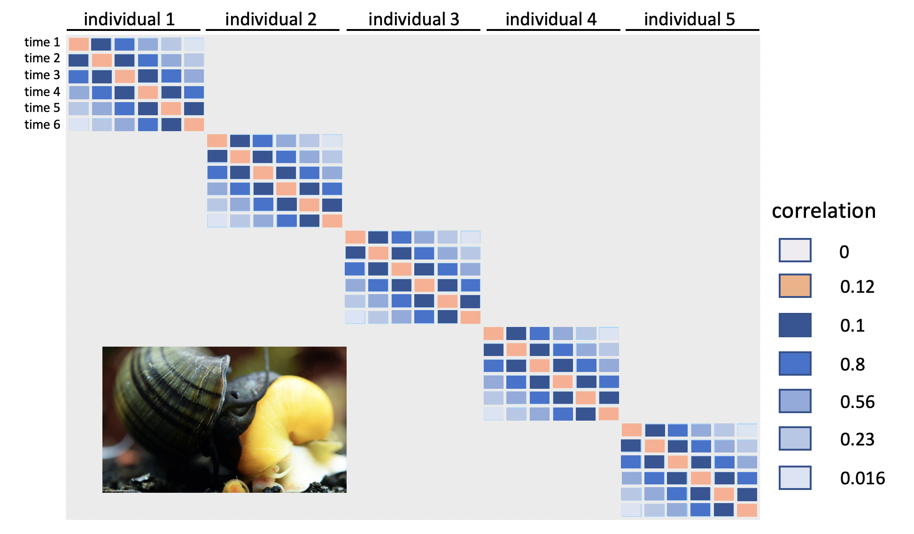
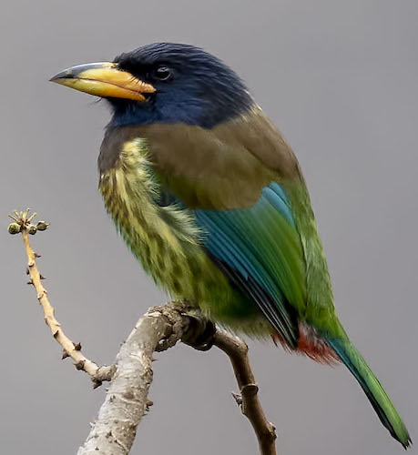

```{r setup, include=FALSE}
knitr::opts_chunk$set(echo = FALSE)

rm(list=ls())
library(tidyverse)
library(ape)   ##for phylogenetic trees.
library(nlme)   #for linear models
library(geiger)  #for phylogenetic trees
library(phytools) #for plotting phylogenetic trees
library(car)


barbet <- read.csv("../data/Barbetdata.csv", header=TRUE, row.names=1)
barbet_tree <- read.nexus("../data/BarbetTree.nex")
snails <- read_csv("../data/snails.csv", show_col_types = FALSE)


```
---


## Readings

\textbf{Required for class:} 
  
  - NA

\bigskip\textbf{Optional:}

- [\textcolor{teal}{Latin American Macroevolution Workshop (2017) Phylogenetic generalized least squares regression.}](http://www.phytools.org/Cordoba2017/ex/4/PGLS.html) 

- [\textcolor{teal}{Pinheiro, J. C. and Bates, D. M. (2000) Mixed-Effects Models in S and S-Plus - Correlation }](https://link.springer.com/book/10.1007/b98882https://link.springer.com/book/10.1007/b98882)


## More Complicated Correlation Structure

Sometimes when runinng linear models (and generalized linear models) you want to account for a correlation structure that is more complicated than simple autocorrelation in one dimension (e.g. space/time).  

-  You may want to include an entire correlation matrix (or distance matrix).

      -  In essence, you are using this matrix as a random effect of sorts.
      
- For example, you may want to control for the phylogenetic relationship of all of your species or individuals to each other.

These models tend to be a lot more "custom-build", and deviate quickly from the basic ways to structure your [\textcolor{teal}{correlation argument}](https://www.rdocumentation.org/packages/nlme/versions/3.1-131/topics/lme) in `lme()` as we did with spatial/temporal autocorrelation, but we will go over some basic examples.


## Autocorrelation Reminder

Looking back at our Mystery Snail example, we remember that there were 6 measurements of biomass consumption through time per individual. It may be more likely that the measurements closer in time are more likely to be more similar to each other than those farther in time.


```{r, out.width='90%', fig.align='center', fig.cap=''}

```


## Autocorrelation Reminder

\tiny
```{r, eval=TRUE, echo=TRUE, warning=FALSE, message=FALSE, fig.height=5}
mod_corr <- lme(biomass ~ sex + month, 
                data = snails, 
                random = ~1|individual,
                correlation = corAR1(form = ~month))
summary(mod_corr)
```


## Correlation Structure with a Matrix


```{r, out.width='90%', fig.align='center', fig.cap=''}

```


## Phylogenetic Data Example

We will be looking at an example of Asian Barbets, used in this [\textcolor{teal}{macroevolution workshop}](http://www.phytools.org/Cordoba2017/ex/4/PGLS.html). These scientists were interested in understanding the factors associated with the evolution of song in these birds. 


\bigskip
\scriptsize
```{r, eval=TRUE, echo=TRUE, warning=FALSE, message=FALSE, fig.height=5}
barbet[1:10,1:4]
```


## Phylogenetic Data Example

We need to take into account the possible correlations among traits in closely related species.

\bigskip
\scriptsize
```{r, eval=TRUE, echo=FALSE, warning=FALSE, message=FALSE, fig.height=6.5}
plot(barbet_tree)
```


## Data Needs to Match

You need to make sure you have the same species and spellings across your tree and your dataset. You can use `name.check()` for this.


\bigskip
\scriptsize
```{r, eval=TRUE, echo=TRUE, warning=FALSE, message=FALSE, fig.height=6}
obj<-name.check(barbet_tree, barbet)
obj
```

You see there are 9 species in the tree that are not in the dataset, so we can drop them using `drop.tip()`, and then check the names again.

\bigskip
\scriptsize
```{r, eval=TRUE, echo=TRUE, warning=FALSE, message=FALSE, fig.height=6}
barbet_cuttree <- drop.tip(barbet_tree, obj$tree_not_data)
name.check(barbet_cuttree, barbet)
```


## Phylogenetic Least Squares Model

This is equivalent to a linear model with the correlation structure that matches the phylogeny assuming Brownian motion.  

\bigskip
First, let's create the correlation matrix.

\bigskip
\scriptsize
```{r, eval=TRUE, echo=TRUE, warning=FALSE, message=FALSE, fig.height=6}
bm<-corBrownian(1, barbet_cuttree)
bm
```


## Phylogenetic Least Squares Model

Now run the model with `gls()` assuming Brownian motion.  This is a general least squares model.


\bigskip
\tiny
```{r, eval=TRUE, echo=TRUE, warning=FALSE, message=FALSE, fig.height=6}
mod1 <- gls(Lnote ~ Lnalt, data = barbet, correlation = bm)
summary(mod1)
```

## Phylogenetic Least Squares Model

What about if we assume Pagel's $\lambda$ model?  This method stretches tip branches relative to internal branches.

\bigskip
\tiny
```{r, eval=TRUE, echo=TRUE, warning=FALSE, message=FALSE, fig.height=6}
mod2 <- gls(Lnote ~ Lnalt, data = barbet, 
            correlation = corPagel(1, barbet_cuttree))
summary(mod2)

#compare them
anova(mod1, mod2)
```


<!-- ## Phylogenetic Mixed Effects Model -->

<!-- What about with a mixed effects model with `lme()`? -->


<!-- \bigskip -->
<!-- \scriptsize -->
<!-- ```{r, eval=TRUE, echo=TRUE, warning=FALSE, message=FALSE, fig.height=6} -->
<!-- mod3 <- lme(Lnote ~ Lnalt, -->
<!--                 data = barbet, -->
<!--                 random = ~1|Habitat, -->
<!--                 correlation = bm) -->
<!-- Anova(mod3, test.statistic = "F") -->
<!-- ``` -->


