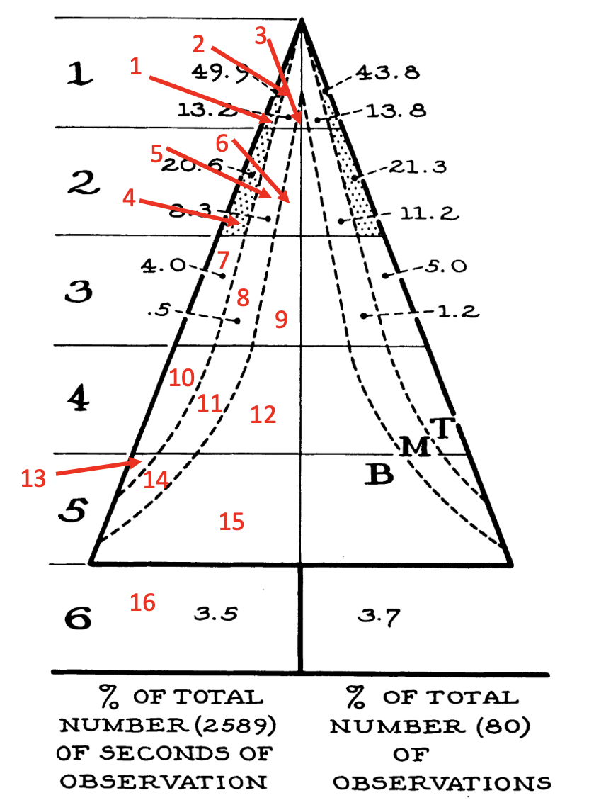

# {.tabset .tabset-pills .tabset-fade}

## MacArthur's Warblers

### Background

```{r, eval=TRUE, echo=TRUE, message=FALSE, warning=FALSE}

###############
#
# 09 PROBLEM SET
# 
# DUE:        April 29, 2022
# 
# CREATED BY: Lauren Sullivan
# FILES:      "warblers.csv"
#
###############


########### setup
rm(list=ls())


library(tidyverse)
library(vegan)  #for standardization, distance matrices and nmds
library(goeveg)


########### data
birds <- read_csv("../data/warblers.csv")


```

We will be examining data from: MacArthur 1956. [Population ecology of some warblers of Northeastern coniferous forests](https://esajournals.onlinelibrary.wiley.com/doi/abs/10.2307/1931600). \textit{Ecology}. This is a foundational paper in Ecology, as it was part of the inital work on how to define a species' niche width and breadth.


MacArthur was trying to understand a set of 5 species of warblers in Maine. People believed that these species were an "exception" to the concept of the niche, which at the time stated that species needed to differ in their resource use in order to coexist.  These species were seen as an exception because they all seemed nearly identical in where they lived and what they ate.  However in his paper, MacArthur determined that these species utilized different parts of trees for foraging, and that they ate different resources at different times and thus were able to coexist.  


In this homework, we will focus on the observations he made of the different warbler species in different areas of trees. MacArthur studied 16 sites within trees, which are labeled in Figure 1. There are 6 heights (1-6) on the tree, which I flipped so the tallest height is 6 and the shortest height is 1. There are also three "zones" including bare zones at the base of the trunk (B) that are often covered in lichen, middle zones (M) with old needles, and terminal zones (T) with new needles or buds. We will be using the data on the right side of these tree figures that indicates the number of observations of each of the 5 studied warblers within each of the 16 sites (I have converted the data into # of observations, not % of total observations).Our goal will be to figure out what we can learn from this data using multivariate statistics - which was not a method used frequently in the 50's.


\bigskip

```{r, eval=TRUE, echo=TRUE, out.width='90%', fig.align='center', fig.cap='Figure adapted from MacArthur 1958 showing the 16 sites where he studied bird abundance.'}

```


**Q1** Let's start by examining the data. Look at the data and explain how the dataset is structured. What are the rows? What are the columns?  Pay special attention to the species data.  How is it organized?

```{r, eval=TRUE, echo=TRUE, message=FALSE, warning=FALSE}
birds

# Each row is a site on the tree, so you have 16 sites, thus 16 
#   rows.  You have columns for various environmental information
#   such as site name, and the type of zone each site is.  And the
#   species data are organized where each species is a column, and the
#   number of observations of each species can be found in the cells 
#   within each site.

```

**Q2** Let's visualize the data. Create barplots for each of the warblers in each zone and see if you can visually see a difference betwen the birds and where they spend most of their time. Does it look like the birds use different habitats?


```{r, eval=TRUE, echo=TRUE, message=FALSE, warning=FALSE}

birds.g <- pivot_longer(birds, cols = cape_may_warbler:baybreasted_warbler, names_to = "warbler", values_to  = "observations") 

birds.g

ggplot(birds.g, aes(x = site, y = observations))+
  geom_bar(stat="identity")+
  facet_wrap(~warbler)+
  theme_bw()+
  theme(text = element_text(size=18))+
  labs(x = "site", y = "# Observations")

# It is possible the birds use different habitat types based on
#   the bar chart.

```

## Distance Matrices

**Q3** To understand how different these 16 sites are within the tree, we need to create distance matrices to represent the dissimilarity between each site.  The first step to this is standardizing the data. Create three standardized data matrices using `decostand()`, standardizing for site total, site max, and presence/absence.  Compare these outcomes.


```{r, eval=TRUE, echo=TRUE, message=FALSE, warning=FALSE}
birds.sub <- birds[,c(2:6)]

birds.tot <- decostand(birds.sub, "total")
birds.tot

birds.max <- decostand(birds.sub, "max")
birds.max

birds.pa <- decostand(birds.sub, "pa")
birds.pa

# The matrices are fairly similar, except the maximum values
#   are really different with the different standardizations.
#   And the presence/absence standardization just gives 1's 
#   and 0's.

```

**Q4** Now let's create a distances matrix for our data.  It does not make sense to use either Euclidean or Manhattan distance because these points do not have a physical distance between the two.  So similar to other community abundance datasets, let's try creating a Bray-Curtis distance matrix, as well as a Jaccard distance matrix to really upweight rare events. Make sure to use the datset that is standardized by site totals for the Bray-Curtis distance matrix, and the dataset that is standardized by presence/absense for the Jaccard distance matrix.


```{r, eval=TRUE, echo=TRUE, message=FALSE, warning=FALSE}

birds.b <- vegdist(birds.tot, "bray")
birds.b

birds.j <- vegdist(birds.pa, "jaccard")
birds.j


```


**Q5** Using both of your distance matrices, what is the distance between sites 1 and 7, sites 3 and 4, sites 13 and 16? Explain what you see between the two distance measures for those between sites 1 and 7.

```{r, eval=TRUE, echo=TRUE, message=FALSE, warning=FALSE}

#                   bray      jaccard
#sites 1 and 7      0.308     0
#sites 3 and 4      0.498     0.4     
#sites 13 and 16    1         1


# Sites 1 and 7 have are slightly dissimilar with Bray-Curtis
#   because their abundances are slightly different. However, 
#   when you use Jaccard, you are converting to 1's and 0's. So
#   while sites 1 and 7 have abundance differences, they have all
#   the same species in them, and thus their dissimilarity is 0.
#   This demonstrates how it changes things to upweight rare species.
```


**Q6** Using the standardized data by site totals and the `metaMDS()` function with Bray-Curtis distance, create three metaMDS objects, with dimensions `k=1`, `k=2`, and `k=3`. Create the plot that looks at stress for those three dimensions, and describe the patterns and stress you see for each metaMDS object. What is the approximate stress for each dimension? Based on these results, which dimension would you choose and why?

```{r, eval=TRUE, echo=TRUE, message=FALSE, warning=FALSE}

birds.mds1 <- metaMDS(birds.tot, k = 1, distance = 'bray', autotransform = F,
expand = F)
birds.mds2 <- metaMDS(birds.tot, k = 2, distance = 'bray', autotransform = F,
expand = F)
birds.mds3 <- metaMDS(birds.tot, k = 3, distance = 'bray', autotransform = F,
expand = F)


plot(1:3,
     c(birds.mds1$stress, birds.mds2$stress, birds.mds3$stress),
     type='b', ylim=c(0,birds.mds1$stress), xlab='# dimensions', 
     ylab='Stress')

# As you might expect, you see a decrease in stress as you increase
#   the number of dimensions used in the metaMDS. You see ~18% stress
#   for 1 dimension, ~10% stress for 2 dimensions, and ~3% stress for
#   3 dimensions. Based on this, I would choose 2 dimensions because 
#   it has a low stress value (~10%) and is easy to visualize in 2D

```

**Q7**  There's also a nice function in the `goeveg` library called `dimchecksMDS()` that helps you explore the number of dimensions vs the stress.  Check out this function, create the dimension v stress plot and see how your results compare to above.

```{r, eval=TRUE, echo=TRUE, message=FALSE, warning=FALSE}
dimcheckMDS(birds.tot, distance = "bray", k = 6, trymax = 20, 
            autotransform = FALSE)

```


## NMDS

**Q8** Create a plot that shows the metaMDS results from `k=2`. Make sure to label the plots and birds. What does this plot tell you? Are there some birds that appear to inhabit more similar plots and some that appear to inhabit different plots?  If so, which ones?

```{r, eval=TRUE, echo=TRUE, message=FALSE, warning=FALSE}
plot(birds.mds2, type = "t")

# Plots 15, 16, and 13 seem to be really different from the rest
#   of the other plots. Also, the myrtle_warbler seems the most
#   different in terms of habitat use as opposed to the other birds,
#   and the blackburnian, blackthroated green, and baybreasted
#   warblers are the most similar to each other.
```


**Q9** Create the same plot as for 7, but with a jaccard distance matrix (same dimenion level, using the presence/absence standardized data).  Describe the difference between this plot and that from Question 7. How does a different standardization and distance method affect the nMDS visualization outcome?

```{r, eval=TRUE, echo=TRUE, message=FALSE, warning=FALSE}
birds.mds2j <- metaMDS(birds.pa, k = 2, distance = 'jaccard', autotransform = F,
expand = F)

plot(birds.mds2j, type = "t")

# Here, plots 16 and 13 are still different from the rest of the plots
#   but all the birds tend to cluster together and seem to be occupying the
#   same habitat type. This is occuring because when you simply use if a
#   bird is present or not in a site, it is upweighting rare events and 
#   making the equivalent to common ones, and thus makes it seem like all 
#   sites are equally occupied by all birds. So what this means is that
#   all birds go to most of the same habitats at least once, but they
#   may not spend most of their time there.

```

## Environmental Fit

**Q10** Going back to the visualization from Question 7, where we used Bray-Curtis distance and `k=2`. Create an environmental fit (using `envfit()`) for the last 2 columns in the original dataset that describe the zone and height that the birds inhabit.

```{r, eval=TRUE, echo=TRUE, message=FALSE, warning=FALSE}
birds.env <- birds[,7:8]
birds.env

birds.efit <- envfit(birds.mds2, birds.env, na.rm=TRUE)

```

**Q11** Create a triplot for this environmental fit.  Describe the figure and the direction of the two environmental variables.

```{r, eval=TRUE, echo=TRUE, message=FALSE, warning=FALSE}
plot(birds.mds2, disp = "sites")
plot(birds.efit)

## Taller parts of the tree tend to be at the bottom left of
#   the graph, whereas lower parts of the tree at are the upper
#   right. And the "under" zone is at the top of the figure, and
#   the rest of the zones are clustered toward the bottom.

```

**Q12** Create a triplot that shows the surface for the Cape May warbler, and describe the figure.

```{r, eval=TRUE, echo=TRUE, message=FALSE, warning=FALSE}
ordisurf(birds.mds2, birds$cape_may_warbler)

# The highest concentration of Cape May Warblers is at the 
#   left side of the graph, where the circle is, and it decreases
#   to the right.

```

**Q13** Create a triplot that shows the convex hulls for each zone and describe the figure.

```{r, eval=TRUE, echo=TRUE, message=FALSE, warning=FALSE}
plot(birds.mds2, disp = "sites")
ordihull(birds.mds2, birds.env$zone, label = T)

# From this figure, it seems that the base of the tree has the 
#   most different bird communities because this hull is the 
#   largest and thus the plots are the most different.
#   The mid and terminal areas have more similar bird communities 
#   because the hulls are smaller. Finally, a very different bird 
#   community is found under the tree.

```


**Q14** For practice, also create a triplot that shows the spider diagrams for each zone and each height in separate figures.

```{r, eval=TRUE, echo=TRUE, message=FALSE, warning=FALSE}
plot(birds.mds2, disp = "sites")
ordispider(birds.mds2, birds.env$zone, label = T)

plot(birds.mds2, disp = "sites")
ordispider(birds.mds2, birds.env$height, label = T)
```
